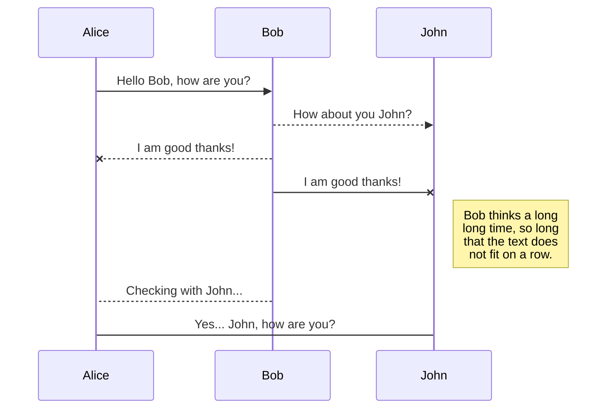
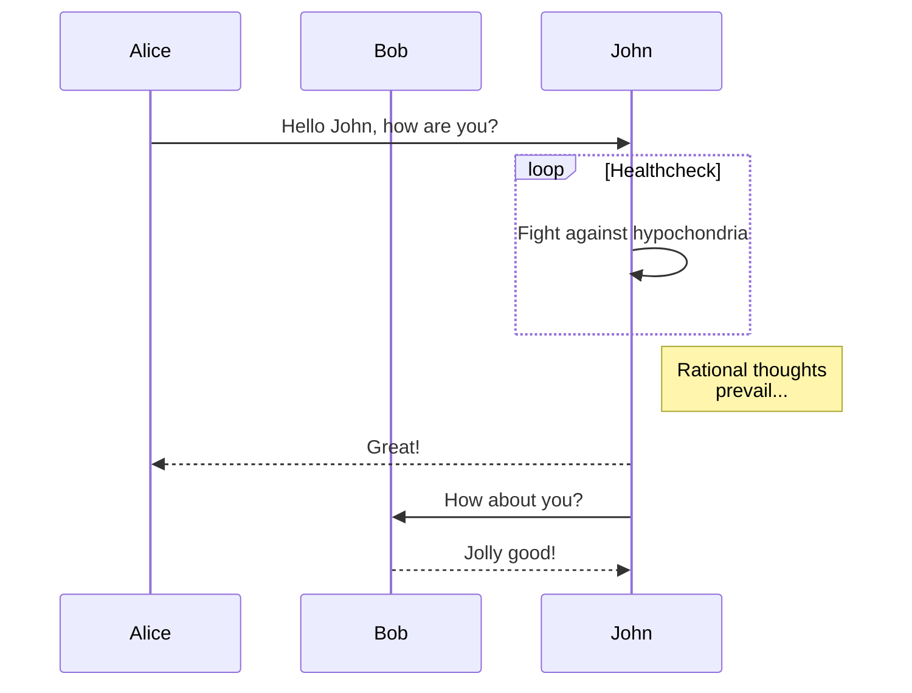
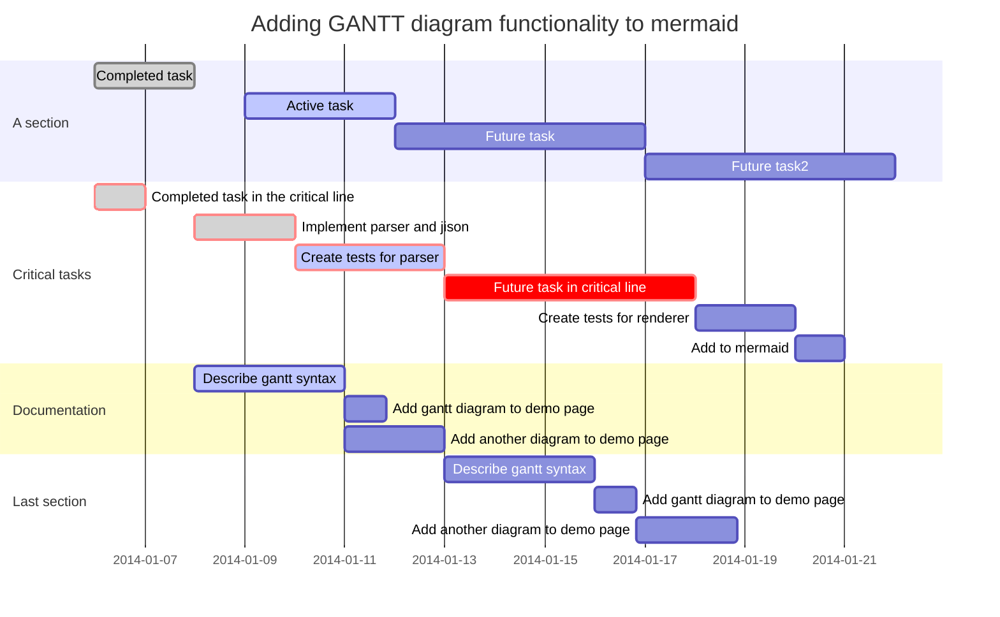
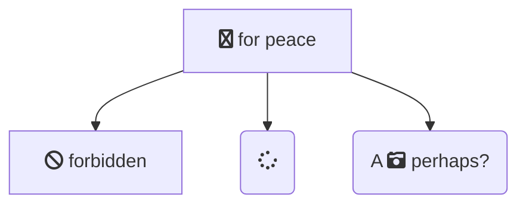

title: 傅里叶变换理论与应用
speaker: VVD
plugins:

 - echarts: {theme: infographic}
 - mermaid: {theme: forest}
 - katex

<slide class=" aligncenter" image="https://101.43.39.125/HexoFiles/vvd_pc_upload/202212022030498.jpg">

### Fourier Transform

# 傅里叶变换理论与应用


By VVD {.text-intro}


<slide :class="fullscreen aligncenter">

:::card

## 傅立叶变换

> Fourier transform

- 傅立叶变换是一种分析信号的方法, 用正弦波作为信号的成分。

- 对于自然界存在的所有波，我们可以利用所谓的傅立叶级数展开法将它们分解为有限或无限个不同频率不同振幅的正弦、余弦波的集合。

---


:::

<slide :class="size-40 aligncenter">

### 核心命令

---

```shell
# create a new slide with an official template
$ nodeppt new slide.md

# create a new slide straight from a github template
$ nodeppt new slide.md -t username/repo

# start local sever show slide
$ nodeppt serve slide.md

# to build a slide
$ nodeppt build slide.md
```

<slide :class="size-60 aligncenter">

### 控制快捷键

---

-   Page\: ↑/↓/←/→ Space Home End
-   Fullscreen\: F
-   Overview\: -/+
-   Speaker Note\: N
-   Grid Background\: Enter


<slide :class="size-50 aligncenter" >

### 添加注释

---

```
:::note

## Note here

:::
```

<slide :class="size-200 aligncenter">

### 字体

---

#### Landings {.text-landing}

`.text-landing`

#### Create a simple web presence. {.text-intro}

`.text-intro`

#### subtitle{.text-subtitle}

`.text-subtitle`

#### **Landings** {.text-landing.text-shadow}

`.text-landing.text-shadow` 

4,235,678 {.text-data}

`.text-data`

<slide :class="size-200 aligncenter">

### 双栏

---

`.text-cols (2 columns)`

::::div {.text-cols}

**Why WebSlides?** There are excellent presentation tools out there. WebSlides is about sharing content, essential features, and clean markup. **Each parent &lt;slide&gt;**  in the #webslides element is an individual slide.

**WebSlides help you build a culture of innovation and excellence**. When you're really passionate about your job, you can change the world. How to manage a design-driven organization? Leadership through usefulness, openness, empathy, and good taste.

::::

<slide :class="size-200 aligncenter">

### 多栏

---

:::flexblock {.metrics}

:fa-phone:

Call us at 555.345.6789

----

:fa-twitter:

@username

----

:fa-envelope:
Send us an email
:::

<slide :class="size-200 aligncenter">

### 混排

---

:::flexblock {.specs}
::fa-wifi::

## Ultra-Fast WiFi

Simple and secure file sharing.

---

::fa-battery-full::

## All day battery life

Your battery worries may be over.

---

::fa-life-ring::

## All day battery life

We'll fix it or if we can't, we'll replace it.

:::

<slide :class="size-200 aligncenter">

### 背景

---

### Corporate Backgrounds

:::flexblock {.blink.border}

#### .bg-primary {..bg-primary}

\#44d

---

#### .bg-secondary {..bg-secondary}

\#67d

---

#### .bg-light {..bg-light}

\#edf2f7

---

#### body

\#f7f9fb

:::

---

### General Colors

:::flexblock {.blink.border}

#### .bg-black {..bg-black}

\#111

---

#### .bg-black-blue {..bg-black-blue}

\#123

---

#### .bg-white {..bg-white}

\#fff
:::

<slide :class="size-200 aligncenter">

### 背景

---

## Colorful

:::flexblock {.border.blink}

## .bg-red {..bg-red}

\#c23

---

## .bg-green {..bg-green}

\#077

---

## .bg-blue {..bg-blue}

\#346

---

## .bg-purple {..bg-purple}

\#62b

:::

---

### Transparent Backgrounds

:::flexblock {.border.blink}

## .bg-trans-dark {..bg-trans-dark}

rgba(0, 0, 0, 0.5)

---

## .bg-trans-light {..bg-trans-light}

rgba(255, 255, 255, 0.2)

:::

<slide class="bg-gradient-h size-200 aligncenter">

### 渐变背景

---

Horizontal

`.bg-gradient-h`

<slide class="bg-gradient-v size-200 aligncenter">

### 渐变背景

---

Vertical

`.bg-gradient-v`

<slide class="bg-gradient-r size-200 aligncenter">

### 渐变背景

---

Radial

`.bg-gradient-r`

<slide class="bg-black aligncenter" video="https://101.43.39.125/HexoFiles/win11-mt/20210909141136.mp4 .dark">

### 视频背景

`<slide class="bg-black aligncenter" video="https://101.43.39.125/HexoFiles/win11-mt/20210909141136.mp4 .dark">`

<slide image="https://webslides.tv/static/images/iphone-hand.png .right-bottom">

:::{.content-left}

### 背景位置

`.right-bottom`

:::flexblock {.specs}
::fa-wifi::

## Ultra-Fast WiFi

Simple and secure file sharing.

---

::fa-battery-full::

## All day battery life

Your battery worries may be over.

---

::fa-life-ring::

## All day battery life

We'll fix it or if we can't, we'll replace it.

:::

<slide :class="size-50 aligncenter">

### Shadowbox 控件

`:::shadowbox`

---

:::shadowbox

## We're web people.

There're excellent presentation tools out there. WebSlides is about telling the story, and sharing it in a beautiful way. Hypertext and clean code as narrative elements.

---

## Work better, faster.

Designers, marketers, and journalists can now focus on the content. Simply [choose a demo](https://webslides.tv/demos) and customize it in minutes.

:::

<slide :class="size-80 aligncenter" >

### Card 控件

---

:::card

## Card

.card-50.bg-white

[Unsplash](http://Unsplash.com) is a really cool resource. It is a collection of Creative Commons Zero licensed photos that are really great. {.text-intro}

-   :Role\::{.text-label} Frontend
-   :client\::{.text-label} Acme
-   :year\::{.text-label} 2018
    {.description}

---


:::

<slide class="fullscreen aligncenter">

:::card


---

## 全屏

:::

<slide class="aligncenter">

### 弹性块 

:::flexblock

## :fa-bar-chart: Purpose

Businesses that people love5

---

## :fa-bar-chart: Purpose

Businesses that people love6

---

## :fa-balance-scale: Purpose

Businesses that people love7

---

## :fa-cog: Purpose

Businesses that people love8

:::

<slide class="aligncenter">

### 弹性块

`{.blink.border}`

:::flexblock {.blink.border}

## :fa-bar-chart: Purpose

Businesses that people love1

---

## :fa-bar-chart: Purpose

Businesses that people love2

---

## :fa-balance-scale: Purpose

Businesses that people love3

---

## :fa-cog: Purpose

Businesses that people love4

:::

<slide class="aligncenter">

## 弹性快

`{.clients}`

:::flexblock {.clients}

{.blacklogo}

### Interfaces

Collaboration with the Acme team to design their mobile apps.

---

 {.blacklogo}

### Interfaces

Collaboration with the Acme team to design their mobile apps.

---

{.blacklogo}

### Interfaces

Collaboration with the Acme team to design their mobile apps.

---

{.blacklogo}

### Interfaces

Collaboration with the Acme team to design their mobile apps.

:::

<slide :class="size-70 aligncenter">

### 画廊

`:::gallery`

---

:::gallery


## A

AAA

---


## B

BBB

---


## C

CCC

---

<video id="video_item" style="position: relative;" muted="muted" src="https://101.43.39.125/HexoFiles/win11-mt/20210909141136.mp4" autoplay="autoplay" loop="loop" width="100%" height="auto"></video>
<video id="video_item" style="position: relative;" muted="muted" src="https://101.43.39.125/HexoFiles/win11-mt/20210909140933.mp4" autoplay="autoplay" loop="loop" width="100%" height="auto"></video>
:::

<slide class="bg-red frame aligncenter">

### 排版

`:::cta`

:::cta

::^\$^40::

---

## Watch TV shows anytime, anywhere

.frame.bg-red

:::

<slide class="bg-black-blue aligncenter">

### 排版

`:::column`

:::column

### **:fa-line-chart: Design**

Design for growth. We've built a team of world-class designers, developers, and managers.

---

### **:fa-film: Videos**

We connect your audience needs, business goals, and brand values into a strategy.

---

### **:fa-users: Users**

We offer personalized services with deep expertise in design and technology.

---

### **:fa-graduation-cap: Teams**

We train teams to help organizations succeed in the digital age.
:::

<slide :class="aligncenter">

### 动画

---


1. **bounce**{.bounce.slow}
2. **swing**{.swing.slow}
3. **flash**{.flash.slow}
4. **pulse**{.pulse.slow}
5. **shake**{.shake.slow}
6. **bounceIn**{.bounceIn.slow}
7. **wobble**{.wobble.slow}
8. **fadeInLeft**{.fadeInLeft.slow}
9. **flipInX**{.flipInX.slow}
10. **tada**{.tada.slow}
11. **slideInUp**{.slideInUp.slow}
12. **jello**{.jello.slow}
13. **heartBeat**{.heartBeat.slow}
14. **fadeInUp**{.fadeInUp.slow}
15. **lightSpeedIn**{.lightSpeedIn.slow}

<slide class="bg-black aligncenter" image="https://101.43.39.125/HexoFiles/vvd-dell-2021-win-10/20210812235004.jpg .anim">

### 滚动背景

.background.anim

<slide class="slide-top">

### 对齐方式

---

:::{.content-left}

### 1/9 left top

Put content wherever you want. Have less. Do more. Create beautiful solutions.

`.slide-top and .content-left`


<slide class="slide-top">
:::{.content-center}

### 2/9 center top

In a village of La Mancha, the name of which I have no desire to call to mind,

`.slide-top and .content-center`

<slide class="slide-top">
:::{.content-right}

### 3/9 right top

there lived not long since one of those gentlemen that keep a lance in the lance-rack, an old buckler, a lean hack, and a greyhound for coursing.

`.slide-top and .content-right`


<slide>
:::{.content-left}

### 4/9 left top

An olla of rather more beef than mutton, a salad on most nights, scraps on Saturdays,

`.content-left`

<slide>
:::{.content-center}

### 5/9 center top

lentils on Fridays, and a pigeon or so extra on Sundays, made away with three-quarters of his income.

`.content-center`

<slide>
:::{.content-right}

### 6/9 right top

he rest of it went in a doublet of fine cloth and velvet breeches and shoes to match for holidays,

`.content-right`


<slide class="slide-bottom">
:::{.content-left}

### 7/9 left bottom

while on week-days he made a brave figure in his best homespun.

`.slide-bottom` and `.content-left`


<slide class="slide-bottom">
:::{.content-center}

### 8/9 center bottom

He had in his house a housekeeper past forty, a niece under twenty, and a lad for the field and market-place,

`.slide-bottom` and `.content-center`

<slide class="slide-bottom">
:::{.content-right}

### 9/9 right bottom

who used to saddle the hack as well as handle the bill-hook.

`.slide-bottom` and `.content-right`

<slide class="bg-black slide-bottom" image="https://source.unsplash.com/RSOxw9X-suY/">

:::div {.content-left}
:fa-tree large:

### 排版对齐示例

### 内容直接从左下角开始对齐.

:::

<slide :class="size-50">

### 布局

---

### **What is Stendhal Syndrome?**

Beauty overdose. `.text-pull-right` {.text-intro}

Imagine that you are in Florence. If you suddenly start to feel that you literally cannot breathe, you may be experiencing Stendhal Syndrome.

Psychiatrists have long debated whether it really exists. {.text-pull-right}

The syndrome is not only associated with viewing a beautiful place, but also good art.

The beauty of Italian art has a concentrated perfection and transcendent sensuality that is incredibly addictive.

<slide>

:::{.aligncenter}

### 简单的 CSS 对齐方式

Put content wherever you want.
:::

:::footer
Footer: logo, credits... (.alignleft) {.alignleft}

[:fa-twitter: @username .alignright](){.alignright}

:::

:::header
Header (logo) :.alignright:{.alignright}
:::

<slide :class="size-80 aligncenter">

### 代码高亮

```html
<article id="webslides">
  <!-- Slide 1 -->
  <section>
    <h1>Design for trust</h1>
  </section>
  <!-- Slide 2 -->
  <section class="bg-primary">
    <div class="wrap">
      <h2>.wrap = container (width: 90%) with fadein</h2>
    </div>
  </section>
</article>
```

<slide class="bg-black-blue" :class="size-60">

### 引用

---

> I have always appreciated designers who dare to reinterpret fabrics and proportions, so I follow the Japanese and Belgian designers.
> ==Zaha Hadid==
> {.text-quote}

<slide image="https://webslides.tv/static/images/satya.png .left-bottom">

:::div {.content-right}

> "There is something only a CEO uniquely can do, which is set that tone, which can then capture the soul of the collective."
> ==Satya Nadella, CEO of Microsoft.==
> :::


<slide>
:::card {.quote}


---

> “WebSlides helped us build a culture of innovation and excellence.”
> ==Leonardo da Vinci==

<slide class="size-80 aligncenter">

### echarts 支持

```echarts {style="height:100%;width:100%;"}
{
    tooltip: {
        trigger: 'item',
        formatter: "{a} <br/>{b}: {c} ({d}%)"
    },
    legend: {
        orient: 'vertical',
        x: 'left',
        data:['直达','营销广告','搜索引擎','邮件营销','联盟广告','视频广告','百度','谷歌','必应','其他']
    },
    series: [
        {
            name:'访问来源',
            type:'pie',
            selectedMode: 'single',
            radius: [0, '30%'],

            label: {
                normal: {
                    position: 'inner'
                }
            },
            labelLine: {
                normal: {
                    show: false
                }
            },
            data:[
                {value:335, name:'直达', selected:true},
                {value:679, name:'营销广告'},
                {value:1548, name:'搜索引擎'}
            ]
        },
        {
            name:'访问来源',
            type:'pie',
            radius: ['40%', '55%'],
            label: {
                normal: {
                    formatter: '{a|{a}}{abg|}\n{hr|}\n  {b|{b}：}{c}  {per|{d}%}  ',
                    backgroundColor: '#eee',
                    borderColor: '#aaa',
                    borderWidth: 1,
                    borderRadius: 4,
                    // shadowBlur:3,
                    // shadowOffsetX: 2,
                    // shadowOffsetY: 2,
                    // shadowColor: '#999',
                    // padding: [0, 7],
                    rich: {
                        a: {
                            color: '#999',
                            lineHeight: 22,
                            align: 'center'
                        },
                        // abg: {
                        //     backgroundColor: '#333',
                        //     width: '100%',
                        //     align: 'right',
                        //     height: 22,
                        //     borderRadius: [4, 4, 0, 0]
                        // },
                        hr: {
                            borderColor: '#aaa',
                            width: '100%',
                            borderWidth: 0.5,
                            height: 0
                        },
                        b: {
                            fontSize: 16,
                            lineHeight: 33
                        },
                        per: {
                            color: '#eee',
                            backgroundColor: '#334455',
                            padding: [2, 4],
                            borderRadius: 2
                        }
                    }
                }
            },
            data:[
                {value:335, name:'直达'},
                {value:310, name:'邮件营销'},
                {value:234, name:'联盟广告'},
                {value:135, name:'视频广告'},
                {value:1048, name:'百度'},
                {value:251, name:'谷歌'},
                {value:147, name:'必应'},
                {value:102, name:'其他'}
            ]
        }
    ]
}

```

<slide class="aligncenter">

### mermaid 序列图 {.aligncenter}





<slide :class="size-60">

### mermaid 消息图{.aligncenter}



<slide :class="size-80">

### mermaid 甘特图{.aligncenter}




<slide :class="size-60">

### mermaid 流程图 {.aligncenter}



<slide :class="size-60">

### 公式支持 KaTex {.aligncenter}

| equation                                                     | description                                                  |
| ------------------------------------------------------------ | ------------------------------------------------------------ |
| $\nabla \cdot \vec{\mathbf{B}}  = 0$                         | divergence of $\vec{\mathbf{B}}$ is zero                     |
| $\nabla \times \vec{\mathbf{E}}\, +\, \frac1c\, \frac{\partial\vec{\mathbf{B}}}{\partial t}  = \vec{\mathbf{0}}$ | curl of $\vec{\mathbf{E}}$ is proportional to the rate of change of $\vec{\mathbf{B}}$ |
| $\nabla \times \vec{\mathbf{B}} -\, \frac1c\, \frac{\partial\vec{\mathbf{E}}}{\partial t} = \frac{4\pi}{c}\vec{\mathbf{j}}    \nabla \cdot \vec{\mathbf{E}} = 4 \pi \rho$ | _wha?_                                                       |


<slide :class="size-80">

::: {.content-left}

### 按钮

[.button](){.button} [.button.radius](){.button.radius}

[.button.ghost](){.button.ghost} [:fa-github: svg-icon](){.button}
:::

::: {.content-left}

### 头像

{.avatar-40}
{.avatar-48}
{.avatar-56}
{.avatar-64}
{.avatar-72}
{.avatar-80}

 (80, 72, 64, 56, 48, and 40).
:::

<slide :class="aligncenter size-50">

### 列表

----

* Niubility！
* WebSlides
* Webpack build in
* Markdown-it
* Posthtml
* Prismjs

<slide :class="size-50">

### 表格

| Left-aligned | Center-aligned | Right-aligned |
| :----------- | :------------: | ------------: |
| git status   |   git status   |    git status |
| git diff     |    git diff    |      git diff |
| git status   |   git status   |    git status |

<slide  :class="size-50 aligncenter">

## 演讲者模式

Click **Url + [?mode=speaker](./?mode=speaker){.bg-primary style="font-size:120%"}** to show Speaker Mode.

<slide  :class="size-60 frame">

## More Demos{.text-serif.aligncenter}

\* \* \* {.text-symbols}

<nav class="aligncenter">
* [:fa-th-large: Layout](./layout.html)
* [:fa-tv: Background](./background.html)
* [:fa-magic: Animation](./animation.html)
* [:fa-cube: Component](./component.html)
* [:fa-youtube: Media](./media.html)
{.no-list-style}


</nav>

<slide class="bg-black-blue aligncenter" image="https://cn.bing.com/az/hprichbg/rb/PragueChristmas_EN-AU8649790921_1920x1080.jpg .dark">

## U work so hard, **but** 干不过 write PPTs {.animated.tada}

快使用 [nodeppt](https://github.com/ksky521/nodeppt) 轻松搞定高大上 PPT<br/> nodeppt 助力你的人生逆袭之路！ {.text-into.animated.delay-800.fadeIn}

[:fa-cloud-download: Github](https://github.com/ksky521/nodeppt){.button.animated.delay-1s.fadeInUp}