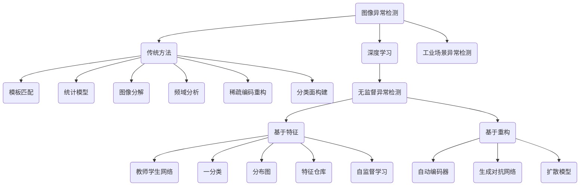

title: 异常检测调研报告

speaker:   张逸为

css:
 - css/style.css

plugins:
 - echarts: {theme: infographic}
 - mermaid: {theme: forest}
 - katex

<slide class=" bg-apple aligncenter" >

### Anomaly Detection Research Report{.text-intro}

# 异常检测调研报告{.text-landing}

---

---

张逸为

2023.12.29

<slide class="bg-apple alignleft">

### 目录{.text-subtitle}

本文调研2023年12月以前的图像异常检测技术, 主要调研目标：

---

:::shadowbox

技术由来

---

常用数据集

---

评价指标

---

**技术方向**

---

**代表工作**

---

总结当前技术现状

---

**分析、展望工业应用场景**

<slide class="bg-white aligncenter">

:::{.content-left}

## 定义{.text-landing}

---

**异常**  又被称为离群值, 是一个在数据挖掘领域中常见的概念, Hawkins等将异常定义为与其余观测结果完全不同, 以至于怀疑其是由不同机制产生的观测值.

**异常检测**（Outlier Detection / Anomaly Detection）： 识别与正常数据不同的数据, 与预期行为差异大的数据. 

:::

:::{.content-right}

!

:::

<slide class="bg-apple alignleft">

### **特点**{.text-subtitle}

从功能和定位上与其他技术领域的区别, 主要概况为以下几点：

:::shadowbox
#### **识别偏差**
异常检测的核心是识别数据点或行为模式的偏差, 这些偏差显著地不符合已知的、预期的或“正常”的模式. 这种偏差可以是统计上的、结构上的或基于特定领域的规则. 

---

#### **探索未知**

异常检测通常涉及探索未知或未预期的模式. 与预先定义的规则或模式匹配的方法不同, 异常检测往往需要识别先前未被观察或定义的行为或数据点. 

---

#### **基于正常数据**

与其他技术一样，异常检测是一种数据驱动的决策过程. 不同的是异常检测通常依赖于正常数据.

---

#### **平衡灵敏度和特异性**

异常检测的一个关键挑战是平衡灵敏度（检测到尽可能多的真实异常）和特异性（减少错误报警）. 这通常涉及在避免漏检和误报之间寻找最佳平衡点. 

---

#### **决策支持**

在许多情况下, 异常检测的目的不仅仅是识别异常, 更是为决策提供支持. 无论是在商业智能、网络安全还是公共安全等领域, 异常检测都被用作决策支持工具, 帮助识别潜在的问题、风险或机会. 

:::

<slide class="bg-white slide-bottom">

### **异常类别**{.text-subtitle}

一般情况下, 会将常见的异常样本分为3个类别：**点异常**、**上下文异常**和**集群异常**.

:::column

#### **点异常**

- 一般表现为某些严重偏离正常数据分布 范围的观测值, 如上图所示的二维数据点, 其中偏离了正常样本点的分布区域$(N_1, N_2)$的点 $(O_1, O_2,O_3)$ 即为异常点.

---

#### **上下文异常**

- 则表现为该次观测值虽然在正常数 据分布范围内, 但联合周围数据一起分析就会表现 出显著的异常. 如上图所示, $t_2$ 点处的温度值虽 然依然在正常范围内, 但联合前后两个月的数据就能发现该点属于异常数据.

---

#### **集群异常**

- 又称为模式异常, 是由一系列观 测结果聚合而成并且与正常数据存在差异的异常类型. 该类异常中, 可能单独看其中任意一个点都不 属于异常, 但是当一系列点一起出现时就属于异常, 如上图箭头所指区域内单独看每一个点的值都 在正常范围内, 但这些点聚合在一起就形成了与正 常信号模式完全不同的结构.

:::

:::note

 这些异常模式没有严格的边界区分

:::

<slide class="bg-white alignright">

### **理论依据**{.text-subtitle}

异常检测中绝大部分工作没有使用有监督学习, 这是由异常检测的使命决定的, 在很多场景中我们无法定义出所有可能的异常情况, 那么以不变应万变, 定义何为“正常”, 然后如果数据落入“正常”范围内, 则不是异常, 如果落入“正常”范围之外, 则判定为异常. {.text-intro}

:::column

#### **本质**{.text-subtitle}

异常检测的本质是将数据 **映射** 到一个可度量的空间中, 根据训练样本 **定义 “正常”** 数据在该空间中的区域（数据驱动）. 执行异常检测时通过某种 **度量** 手段判断测试数据是否落入此“正常”范围内. 

---

#### **数学工具**{.text-subtitle}

常用的会用到的方法有：

1. **统计模型和概率分布**： 这是最直接的定义方式, 因为“异常”本质就是“小概率”, 定义概率分布模型则可以直接判定是否存在异常

2. **特征距离度量**：本质是对数据进行了空间映射, 将“正常”数据映射到正常的特征上, 此定义方法一般会配套距离度量技术使用, 将特征空间中存在的正常特征所在位置定义为“完全正常”, 异常检测时, 检索与测试特征距离最近的正常特征, 根据二者之间的距离判断是否为异常. 

   > 相当于所有“正常”特征是空间中互通的“虫洞”, 都映射到空间原点, 将空间中其他位置到其所在距离最近的“虫洞”的距离映射为异常的概率, 超过一定阈值为异常

3. **假设检验**： 本质是使用某种技术为测试数据进行假设检验, 数据通过模型得到一组针对该数据的假设, 随后判断该假设是否成立来判断是否存在异常

<slide class="bg-apple alignleft">

### **前提假设**{.text-subtitle}

:::note

 

用数学工具也好, 定义区域也好, 如果我们有了数据该如何定义“正常”？凭什么定义“正常”？

没有任何知识和前提假设约束则正常无从定义, 异常更是无本之末, 以下是一些通用的异常检测前提, 一个应用场景需要符合这些基本的假设才能用异常检测技术：

:::

---

:::shadowbox

#### **数据的一致性**

假设工业视觉图像中的正常对象或场景在形状、颜色、纹理等方面具有一致性, 从而使得任何偏离这种一致性的情况都可以被视为异常. 

---

#### **异常的稀有性**

异常情况相对于正常情况来说是罕见的. 这意味着异常检测算法通常是在大量正常数据的基础上进行训练的, 以识别那些不符合正常模式的情况. 

---

#### **异常的显著性**

假设异常在视觉上足够显著, 以至于可以通过图像分析技术检测到. 这意味着异常具有可区分的视觉特征, 如不寻常的颜色、形状或纹理. 

---

#### **环境条件的稳定性**

为了有效地检测异常, 通常假设拍摄工业视觉图像的环境条件（如光照、角度等）是相对稳定的. 这有助于算法更准确地区分正常和异常情况. 

---

#### **技术限制的考虑**

在设计异常检测系统时, 还需要考虑到实际应用中的技术限制, 如图像分辨率、处理能力和实时性要求. 

:::

<slide class="bg-apple alignright">

### “正常”的来源{.text-subtitle}

:::note

 

定义“正常”是复杂和有风险的, 事实上大多数时候我们很难找到模型可以完全、精确、快速地区分数据正常和异常情况, 但是尽可能提高模型对正常的建模能力和精度、提高运行速度是我们使用、研究异常检测技术的目标和方向, 而这些目标最根本来说是从如何定义“正常”开始的, 一般在异常检测中定义某种情况为“正常”通常依赖于以下几个方面：

:::

---

:::shadowbox

#### **历史数据和经验** 

通常, 正常的情况是根据历史数据和经验来定义的. 如果大多数观测值遵循某种特定的模式或行为, 这种模式或行为就可以被视为正常. 

---

#### **领域知识** 

专业的领域知识是定义正常情况的关键因素. 在特定领域内, 专家能够根据其知识和经验确定哪些情况被视为正常. 

---

#### **统计标准** 

在某些情况下, 正常可以根据统计标准来定义. 例如, 假设数据遵循正态分布, 则位于平均值附近的数据点可能被视为正常, 而远离平均值的数据点可能被视为异常. 

---

#### **用户或业务需求** 

在特定的应用中, 什么是正常可能由用户或业务需求来决定. 

---

#### **共识和标准化** 

在某些领域, 正常的定义可能来自于行业共识或标准化组织. 这些定义通常基于广泛的研究和专业共识. 

:::

<slide class="bg-apple alignleft">

### 应用场景{.text-subtitle}

:::shadowbox

#### **故障检测** 

主要监控系统, 在故障发生时识别出故障并且指出故障的种类及发生的位置. 

---

#### **医疗日常监测** 

医疗应用中数据由各种设备收集, 如磁共振成像（MRI）扫描、正电子发射断层扫描（PET）、心电图（ECG）时间序列等. 这些数据中异常的模式反映疾病的状况. 

---

#### **网络入侵检测** 

在许多计算机系统中会收集 操作系统调用、网络流量、用户操作等数据. 在有恶意活动发生时, 该类指标可能发生突变, 反映异常行为, 此类活动称为入侵检测. 

---

#### **欺诈检测** 

信用卡欺诈越来越普遍, 因为信用卡号码等敏感信息更容易被泄露. 在许多情况下, 未经授权使用信用卡可能表现出不同的模式, 例如从特定地点疯狂购买或进行非常大的交易. 这种模式可用于检测信用卡交易数据中的异常值. 

---

#### **工业异常检测** 

工业异常检测是一种用于监测和识别工业过程或系统中异常情况的技术. 它的主要目标是在生产、制造、运营或其他工业领域中及时发现和处理异常情况, 以确保生产质量、安全性和效率. 

---

#### **时间序列异常检测** 

时间序列异常检测是一种用于监测和识别时间序列数据中异常模式或异常事件的技术. 时间序列数据是按照时间顺序记录的数据集, 通常包括在不同时间点上观察到的数值或测量值. 时间序列异常检测的主要目标是发现与正常时间序列行为不符的异常点, 以及在必要时采取适当的行动. 

---

#### **视频异常检测**  

视频异常检测是一种用于检测视频流中异常事件或异常模式的技术. 它通常用于监控和安全领域, 例如视频监控系统、交通监测、制造业质量控制等. 视频异常检测的主要目标是从连续的视频帧中识别那些与正常情况不符的异常事件或行为. 

:::

<slide class="bg-apple alignleft">

### **图像异常检测**{.text-landing}

---

:::column

#### **任务分类**{.text-subtitle}

图像异常检测任务根据异常的形态可以分为**定性异常** (image level) 的分类和**定量异常** (pixel level) 的定位两个类别.

- **定性异常** 

  类似于传统图像识别任务中 的图像分类任务, 即整体地给出是否异常的判断, 无需准确定位异常的位置.{.text-intro}

- **定量异常** 

  类似于目标检测或者图像分割任务, 需要得到异常区域的位置信息.{.text-intro}

---

#### **方法分类**{.text-subtitle}

按照实现异常检测对数据标签的要求和使用, 大致分为有监督、无监督、半监督三类

- **有监督**  

  训练集的正例和反例均有标签{.text-intro}

- **无监督** 

  训练集无标签{.text-intro}

- **半监督**  

  在训练集中只有正例, 异常实例不参与训练{.text-intro}

:::

:::note

图像中每一个像素点上的像素值就对应着一个观测结果, 由于图像内像素值的多样性, 仅仅分析某一个点的像素值很难判断其是否属于异常.  所以在大部分图像异常检测任务中, 需要联合分析 图像背景以及周围像素信息来进行分类, 检测的异常也大多属于上下文或者模式异常.

 大多数论文中将异常检测归结到无监督训练过程中, 事实上其中大多数情况是指训练过程用的仅有正常样本, 也就是严格意义上的半监督

:::

<slide class="bg-white aligntop" >

## 公开数据集

| Dataset                     | Class  | Normal   | Abnormal | Total    | Annotation Level      | Real or Synthetic |
| --------------------------- | ------ | -------- | -------- | -------- | --------------------- | ----------------- |
| AITEX                       | 1      | 140      | 105      | 245      | Segmentation mask     | Real              |
| BTAD                        | 3      | -        | -        | 2830     | Segmentation mask     | Real              |
| DAGM                        | 10     | -        | -        | 11500    | Segmentation mask     | Synthetic         |
| DEEPPCB                     | 1      | -        | -        | 1500     | Bounding box          | Synthetic         |
| Eycandies                   | 10     | 13250    | 2250     | 15500    | Segmentation mask     | Synthetic         |
| Fabric dataset              | 1      | 25       | 25       | 50       | Segmentation mask     | Synthetic         |
| GDXray                      | 1      | 0        | 19407    | 19407    | Bounding box          | Real              |
| KolektorSDD                 | 1      | 347      | 52       | 399      | Segmentation mask     | Real              |
| KolektorSDD2                | 1      | 2979     | 356      | 3335     | Segmentation mask     | Real              |
| MIAD                        | 7      | 87500    | 17500    | 105000   | Segmentation mask     | Synthetic         |
| MPDD                        | 6      | 1064     | 282      | 1346     | Segmentation mask     | Real              |
| MTD                         | 1      | -        | -        | 1344     | Segmentation mask     | Real              |
| **MVTec AD**                | **15** | **4096** | **1258** | **5354** | **Segmentation mask** | **Real**          |
| MVTec 3D-AD                 | 10     | 2904     | 948      | 3852     | Segmentation mask     | Real              |
| MVTec LOCO-AD               | 5      | 2347     | 993      | 3340     | Segmentation mask     | Real              |
| NanoTwice                   | 1      | 5        | 40       | 45       | Segmentation mask     | Real              |
| NEU surface defect database | 1      | 0        | 1800     | 1800     | Bounding box          | Real              |
| RSDD                        | 2      | -        | -        | 195      | Segmentation mask     | Real              |
| Steel Defect Detection      | 1      | -        | -        | 18076    | Image                 | Real              |
| Steel Tube Dataset          | 1      | 0        | 3408     | 3408     | Bounding box          | Real              |
| VisA                        | 12     | 9621     | 1200     | 10821    | Segmentation mask     | Real              |

<slide class="bg-white alignleft" >

## 评价指标

:::column

#### 符号说明

| 符号  | 说明                                       |
| ----- | ------------------------------------------ |
| $TP$  | True Positive                              |
| $FP$  | False Positive                             |
| $FN$  | False Negative                             |
| $TN$  | True Negative                              |
| $P$   | Precision                                  |
| $R$   | Recall                                     |
| $TPR$ | True Positive Rate                         |
| $FPR$ | False Positive Rate                        |
| $p$   | Predicted abnormal pixels                  |
| $C$   | Defect ground truth regions (Segmentation) |
| $N$   | Total ground truth number                  |
| $s$   | Corresponding saturation thresholds        |
| $H$   | Prediction                                 |
| $G$   | Ground truth                               |
| $t$   | Threshold                                  |

---

#### 常用指标

| 指标                                                         | 公式                                                       | 相性 |
| ------------------------------------------------------------ | ---------------------------------------------------------- | ---- |
| Precision                                                    | $P = T P/(T P + F P )$                                     | ↑    |
| Recall                                                       | $R = T P/(T P + F N )$                                     | ↑    |
| True Positive Rate                                           | $T P R = T P/(T P + F N )$                                 | ↑    |
| False Positive Rate                                          | $F P R = F P/F P + T N )$                                  | ↓    |
| **Area Under the Receiver Operating Characteristic curve (AU-ROC)** | **$\int^1_0(TPR)d(FPR)$**                                  | ↑    |
| **Area Under Precision-Recall (AU-PR)**                      | **$\int^1_0(P)d(R)$**                                      | ↑    |
| Per-Region Overlap (PRO)                                     | $\frac{1}{N}\sum_i\sum_k \frac{p_i\cap C_{i,k} }{C_{i,k}}$ | ↑    |
| **Area Under Per-Region Overlap (AU-PRO)**                   | **$\int^{+\infty}_{-\infty}(PRO)d(t)$**                    | ↑    |
| Saturated Per-Region Overlap (sPRO)                          | $\frac{1}{m} \sum^m_{i=1}\min(\frac{C_i\cap p}{s_i},1)$    | ↑    |
| F1 score                                                     | $2(P · R)/(P + R)$                                         | ↑    |
| Intersection over Union (IoU)                                | $(H ∩ G)/(H ∪ G)$                                          | ↑    |

<slide class="bg-white alignbottom">

### **技术路线**

---

近年来传统机器学习方 法已经在图像异常检测领域有了较多的应用, 而随 着深度学习技术的发展, 越来越多的方法尝试结合 神经网络来实现图像异常检测. 根据在模型构建阶 段有无神经网络的参与, 现有的图像异常检测方法可以分为**基于传统方法**和**基于深度学习方法**两大类别, 总体来看可以将图像异常检测技术路线归结为以下方向: {.text-intro}

<slide class="bg-blue alignleft" video=" poster='https://webslides.tv/static/images/working.jpg' .light">

## **传统方法异常检测技术**

基于传统方法的异常检测技术大致包含6个类别

:::shadowbox

#### 基于模板匹配

---

#### 基于统计模型

---

#### 基于图像分解

---

#### 基于频域分析

---

#### 基于稀疏编码重构

---

#### 基于分类面构建

:::

<slide class="bg-white alignbottom">

:::header
:**传统方法异常检测**:{.alignright}
:::

:::column

### **基于模板匹配 (template matching)**{.text-landing}

在图像异常检测任务中, 最理想的情况是所有 的正常图像都高度相似, 且异常图像与正常图像之间只会在小部分区域出现区别. 此时, 模板匹配是非常有效的一类异常检测方法. 得到待测图像和模板图像之间的对应关系后, 比较两者之间的差异即可实现异常检测.

模板匹配的方法一般适用于图像采集环境稳定且可控的场景, 如晶圆表面的异常检测, 虽然结构复杂但内容基本保持不变. 而更多的情况下, 即便是正常图像之间都会存在着较多的差异, 难以通过模板匹配实现异常检测.

#### **技术本质**

假设检验：使用模板匹配的技术完成了对测试数据做的很强的假设, 之后再去判断匹配后的结果与测试数据之间能否通过检验. 

---

<slide class="bg-white alignright">

:::header
:**传统方法异常检测**:{.alignright}
:::

### **基于统计模型 (statistical model)**{.text-landing}

这一类方法通常是利用统计模型来描述正常图像中像素值或者特征向量的分布情况, 而对于一些远离该分布的图像区域则认定为存在异常.

此类方法为了估计模型的参数需要一定数量的正常样本, 而且这些方法都预先对图像数据的分布做了假设, 这在一定程度上降低了该方法的通用性. 对于普通图像类型而言, 统计模型的方法在一些背景较为简单的图像中有较好的检测效果, 但是结构更为复杂的图像往往难以预先假设其数据分布, 在模型参数的估计上也有较高的难度, 无法保证检测效果.

#### **技术本质**

统计模型和概率分布： 将数据映射到一个已知的分布模型中, 根据其概率密度判断是否发生了低概率事件. 

---

:::column

---

<slide class="bg-white alignleft">

:::header
:**传统方法异常检测**:{.alignright}
:::

### **基于图像分解 (image decomposition)**{.text-landing}

---

:::column

基于图像分解的方法大多针对的是周期性纹理表面小面积异常区域的检测任务. 由于异常区域一般是随机出现的, 其周期性较弱, 这一特点使其可以与周期性的背景纹理进行区分.

较为常用的方法主要利用了周期性背景纹理低秩性的特点, 采用低秩分解将原始待检测图像分解成为代表背景的低秩矩阵和代表着异常区域的稀疏矩阵. 

优点在于完全不需要任何训练样本, 直接可以在待检图像上进 行异常区域的检测. 不过这一类方法由于涉及到优化过程, 计算量较大, 其检测速度相对较慢, 难以进行实时检测. 

由于其对背景图像的低秩性假设, 这一类方法适用于周期纹理的图像数据, 对于无周期性或者纹理更加复杂的普通图像并不适用.

#### **技术本质**

特征距离度量, 假设图像低秩分解后残余能量低

---

:::

<slide class="bg-white alignleft">

:::header
:**传统方法异常检测**:{.alignright}
:::

### **基于频域分析 (frequency domain analysis)**{.text-subtitle}

基于频域分析的方法主要针对的也是规则纹理表面异常区域的检测. 不过这一类方法主要是对图像的频谱信息进行编辑, 尝试消除周期性背景纹理以凸显异常区域. 其中常用的方法包含**背景频谱消除**和**纯相位傅里叶变换** (Phase only fourier transform, POFT) 法两类, 前者通过消除背景的频谱信息来凸显异常区域, 而后者则尝试在逆傅里叶变换时仅利用相位谱以消除重复背景.

:::column

#### **背景频谱消除**{.text-subtitle}

---

#### **纯相位傅里叶变换**{.text-subtitle}

采用 POFT 来消除背景区域. POFT 在对图像进行傅里叶变换 之后, 抛弃了幅度谱的信息而仅采用其相位谱信息来进行逆傅里叶变换, 此过程中能够去除原始图像中全部的周期性纹理部分而保留异常区域：
$$
\begin{array}{c}

F=\mathcal{F}(I) \text{   }\text{   }\text{   }
F'(u,v)=\frac{F(u,v)}{M(u,v)}\text{   }\text{   }\text{   }
I'=\mathcal{F}^{-1}(F')

\end{array}
$$

POFT比背景频谱消除的方法更为便捷, 但对于长线条或划痕这种面积较大且具有周期性的缺陷 却无法进行检测.

:::

 相比于别的方法, 基于频域分析的异常检测方法其优点在于计算速度快, 而且不需要事先构建模型, 直接可以在待测图像上进行检测. 这使得该方法非常适合实时性要求较高的场景. 这一类方法对有周期性且纹理较为简单的图像有较好的检测效果.

<slide class="bg-white alignleft">

:::header
:**传统方法异常检测**:{.alignright}
:::

### **基于稀疏编码重构 (sparse coding reconstruction)**{.text-subtitle}

这一类方法通常是借助稀疏编码的方式对图像进行重构, 并在此过程中学习一个字典来表示正常图像, 然后在测试阶段从重构差异和稀疏度等角度进行异常检测.

:::column

稀疏编码在模型训练阶段需要学习一个过完备的字典来存储有代表性的特征, 并通过线性组合字 典中存储的元素来重构输入图像. 其特点在于, 需要尽可能地选择少的元素的线性组合来表示正常样 本, 即:
$$
\min_{D,\alpha}\frac{1}{2}|| D\mathbf{\alpha}-x ||^2_2+\lambda||\alpha||_1
$$
其中 $D$ 是字典, $\mathbf{\alpha}$ 是线性组合中的系数向量, 其一阶范数近似描述了其稀疏度, $x$ 为训练集中正常样本, $|| D\mathbf{\alpha}-x ||_2$ 为重构误差. 

训练时字典学习的过程一般会先将原始问题转换成凸优化问题再进行求解, 过程中字典存储各种用来描述正常样本特征的元素以有效地对正常样本进行重构, 而在测试阶段, 用学习到的字典对异常 样本进行重构时, 由于字典仅学习了正常图像的表 示方法, 对于异常样本就会体现出较大的重构差异, 编码向量的稀疏性也较弱. 以此作为稀疏编码重构进行异常检测的依据. 

基于稀疏编码的方法相比于前几种方法而言, 不需要预先对数据的分布做假设, 仅使用足够的样本就能很好地学习到正常图像的表示方法, 这使得稀疏编码比之前的方法拥有更为广泛的应用场景. 在检测各类周期性图像的同时, 也能处理具有随机结构的图像. 

---

不过这类方法依然存在一些不足之处. 首先, 稀疏编码的效率较为低下. 在测试阶段由于需要通过迭代优化的方式寻找最优的编码向量; 其次, 稀疏编码需要较多的空间来保存字典. 为了获得稀疏的编码向量, 一般字典都是过完备的, 即字典中元素的数量要超过样本的维度. 但对于图 像数据而言, 无论是局部图像区域还是特征向量其 维度都比较高, 过大的字典不仅会占用较多的存储 空间, 也会降低算法的运行速度.

:::

<slide class="bg-white alignleft">

:::header
:**传统方法异常检测**:{.alignright}
:::

### **基于分类面构建 (classification surface construction)**{.text-subtitle}

基于分类面构建的方法大多是希望能够在正常 图像分布区域外构建一个足够紧致的分类面以区分 正常样本和潜在的异常样本. 较为常用的两类方法 为单类支持向量机方法(One-class support vector machines, OC-SVM) 和支持向量数据描述方 法(Support vector data description, SVDD). 

OC-SVM通过在高维空间创建超平面来分割正常 样本和潜在异常样本, 而SVDD则创建超球面来包 裹绝大部分正常样本以实现异常检测.

:::column

上图分别展示了OC-SVM和SVDD构建分类面的示意图, 其中实心与空心的点分别代表已知的正常样本和潜在的异常样本.

---

#### **OC-SVM**

OC-SVM采用的策略是将原始数据映射到核函数 对应的特征空间之后, 在创建分类超平面时最大化 超平面到原点的距离并确保大部分正常样本都落在 超平面的另一侧. 而在检测阶段, 落在超平面靠近 原点一侧的图像就对应着异常样本.

#### **SVDD**

OC-SVM仅考虑构建一个超平面来进行异常检测, 这样一个半开放的决策边界并没有很好地包围正常样本的分布区域, 这限制了OC-SVM 对于异常样本的检出能力. 因此另外一类常用方法, SVDD在分类面的构建过程中进行了更强的约束. SVDD的基本思想为, 利用一个超球面来包裹住全部或者绝大部分的正常样本, 并且希望该超球面的半径越小越好. 

:::

基于分类面构建的方法, 其优点在于对待测图 像类型没有如图像分解或频谱分析那样较高的限制, 能够适用于各种类型的图像, 而且计算复杂度的问题也有相关的文献工作给出了解决思路. 不过也存在一些问题, 在处理复杂图像时, 核函数的选择可能会成为一个问题. 而且本质上本类方法属于图像分 类算法, 无法直接实现异常区域的定位, 更适合于 一些识别定性异常的场景, 面对定量异常, 大多需 要通过区域划分的方式进行定位, 反而降低了算法 的处理效率.

<slide class="bg-white alignleft">

:::header
:**传统方法异常检测**:{.alignright}
:::

### **传统方法各类技术总结**{.text-subtitle}

| 方法类别     | 设计思路                                                     | 优点                                                      | 缺点                                                         |
| ------------ | ------------------------------------------------------------ | --------------------------------------------------------- | ------------------------------------------------------------ |
| 模板匹配     | 建立待测图像和模板图像之间的对应关系, 通过比较得到异常区域   | 方法简单有效,  对于采集环境高度可控的场景有很高的检测精度 | 不适用于多变的场景或目标                                     |
| 统计模型     | 通过统计学方法构建背景模型                                   | 具有详实的理论基础和推导过程, 检测速度快                  | 需要大量的训练样本, 且仅适用于一些简单背景下的异常检测       |
| 图像分解     | 将原始图像分解成代表背景的低秩矩阵和代表异常区域的稀疏矩阵   | 具有详实的理论基础且无需训练过程                          | 速度较慢, 而且不适合在结构复杂的图像中进行异常检测           |
| 频域分析     | 通过编辑图像的频谱信息来消除图像中重复的背景纹理部分以凸显异常区域 | 无需训练过程, 检测速度很快                                | 还需更详实的理论论证, 且仅适用于一些有重复性纹理的图像, 通用性较差 |
| 稀疏编码重构 | 借助稀疏编码和字典学习等方式学习正常样本的表示方法, 从重构误差和稀疏度等角度检测异常 | 适用于各种类型的图像,  通用性很好                         | 检测时间长, 而且需要额外的空间保存过完备的字典               |
| 分类面构建   | 建立分类面将现有的正常样本和潜在的异常样本进行区分           | 通用性较好, 且速度较快                                    | 各项参数的选择过程较为复杂                                   |

<slide class="bg-apple " video=" poster='https://webslides.tv/static/images/working.jpg' .light">

## **深度学习异常检测技术**{.text-subtitle}

深度学习图像异常检测技术此处按照使用场景分为两大类：{.text-intro}

1. 无监督异常检测{.text-intro}
2. 工业场景异常检测{.text-intro}

---

过程中对于每个技术路线, 按照如下方面进行介绍：{.text-intro}

:::shadowbox

#### 原理本质

---

#### 优缺点分析

---

#### 训练方法

---

#### 代表性工作

---

#### 工业应用分析

:::

<slide class="bg-apple">

:::header
:**深度学习异常检测**:{.alignright}
:::

### **无监督异常检测**{.text-subtitle}

无监督是异常检测的主流路数, 仅使用 OK 数据用于训练, OK 和 NG 的数据用于测试, 是一种 OOD(out-of-distribution) 的任务. 

---

在此类别下涌现出大量优秀工作, 但总体来说可以分为两个大类别: 

:::shadowbox

#### 基于特征 (feature-embedding)

---

#### 基于重构 (reconstructed-based)

:::

<slide :class="bg-apple">

:::{.alignleft}

## 基于特征 (feature embedding){.text-subtitle}

将数据映射到其他特征空间中, 在映射的空间中通过某种手段区分正常特征和异常特征. 

:::

<slide class="bg-white align-top">

:::header
:**基于特征的异常检测**:{.alignright}
:::

### **教师学生网络 (Teacher-Student Architecture)**{.text-subtitle}

:::flexblock {.specs}

该方法通常选择一个预先在大规模数据集上进行预训练的骨干网络的部分层作为固定参数的教师模型, 之后用知识蒸馏的方法训练一个在正常样本上具有和教师近似泛化能力的学生模型, 我们期待学生模型在遇到正常样本输入时具有和教师类似的特征表现, 在遇到异常样本时和教师输出相差很远. 测试时通过比对两个模型对输入数据的特征反应评判是否存在异常. 

---

通过比较两个网络生成的特征图, 可以生成具有相同大小的异常分数图. 然后, 通过将异常分数图放大到与输入图像相同的比例, 可以获得各种输入图像位置的异常分数, 由此确定测试图像是否异常. 

---

然而, 它的效果很大程度上取决于教师网络的质量和两个网络之间的知识转移效率, 而且该知识转移需要将对正常数据的拟合能力完全传达, 同时异常数据的拟合能力最好没有, 这对于一个复杂的神经网络来说并不是很容易实现的事情, 在实际应用中需要针对特定的应用场景进行仔细的调整和优化. 

:::

<slide class="bg-apple alignleft size-70">

:::header
:**教师学生网络**:{.alignright}
:::

:::{.content-center}

### **方法优缺点**

---

:::

#### **优点**{.text-subtitle}

1. #### **原理简洁**

   此方法的优势在于能够在标注数据有限的情况下有效学习, 同时保持较低的部署成本和较快的推理速度. 

---

#### **缺点**{.text-subtitle}

1. #### **知识转移的不确定性**

   在教师-学生网络中, 学生网络是通过模仿教师网络的输出来学习的. 但是, 这种方法并不能保证学生网络学到的是对异常检测有用的信息. 学生网络可能只是学会复制教师网络对特定数据的响应, 而不是理解背后的概念. 

2. #### **教师网络的过度教导**

   如果教师网络在过多的数据上进行了训练, 可能会使得学生过于接近教师网络的能力, 导致其对真正的异常也能模仿教师的行为从而降低异常检测性能. 

3. #### **教导的不足**

   相反, 如果教师网络的训练数据不足或质量不高, 它可能无法有效地捕捉到正常情况下的关键特征, 从而导致学生网络学习到的信息不足以进行有效的异常检测. 

4. #### **异常检测的特殊性**

   异常检测通常需要模型能够识别出非常细微的差异, 特征层面经常难以识别小区别，这种方法在处理高度复杂或细微的异常时可能效果不佳. 

<slide class="bg-apple alignleft">

:::header
:**教师学生网络**:{.alignright}
:::

## 训练、推断

---

:::shadowbox

#### **训练**

在**训练**过程中, 教师模型向学生模型传授提取正常样本特征的知识, 教师通过知识蒸馏的形式向学生传递信息. 

| 损失函数 | 定义                                                         | 分析                                                         |
| -------- | ------------------------------------------------------------ | ------------------------------------------------------------ |
| MSE      | $\mathrm{MSE} = \frac{1}{n}\sum_{i=1}^{n}\left(Y_{i}-\hat{Y_{i}}\right)^ 2$ | 1. 方法简单直观, 总体趋势符合我们对该损失函数的要求 2. 但当异常区域与正常区域颜色接近但结构不同时 MSE 难以区分 3. 轻微的边缘误差也可能影响真正的异常定位 |
| SSIM     | $\mathrm{SSIM}(\mathbf{x},\mathbf{y})=[l(\mathbf{x},\mathbf{y})]^{\alpha}[c(\mathbf{x},\mathbf{y})]^{\beta}[s(\mathbf{x},\mathbf{y})]^ \gamma$ | 需要将图像分为小 Patch 增加了尺寸超参 相比于 MSE 损失, 该损失函数更能找到视觉上的差异 但该方法对于**位移、缩放、旋转** 等非结构性失真的情况无法有效运作 |
| 监督MSE  | $maximum((x_{abnormal}-x'_{abnormal})^2-(x_{normal}-x'_{normal})^2)$ | 如果存在异常数据可以用该方法重构正常样本的同时破坏异常样本的重建 |

---

#### **推断**

在**推断**过程中, 教师网络和学生网络从测试集中提取的正常图像的特征是接近的, 而异常图像的特征则明显不同

给定某种度量教师和学生的特征输出的方法, 度量特征距离可以得到测试图像的异常得分, 定位异常可以根据该度量结果也可以使用总Loss 进行一次梯度回传以确定最异常的部分. 

:::

<slide class="bg-white ">

:::header
:**教师学生网络**:{.alignright}
:::

:::{.content-center}

## **STPM**

:::

| 项目                | 内容                                                         |      |
| ------------------- | ------------------------------------------------------------ | ---- |
| 方法名称            | STPM                                                         |      |
| 论文题目            | Student-Teacher Feature Pyramid Matching for Anomaly Detection |      |
| 论文连接            | https://arxiv.org/pdf/2103.04257v3.pdf                       |      |
| 开源代码            | https://github.com/hcw-00/STPM_anomaly_detection             |      |
| 发表时间            | 2021.10.28                                                   |      |
| 方法类别            | 深度学习 -> 基于特征 -> 教师学生网络                         |      |
| Detection AU-ROC    | 95.5%                                                        |      |
| Segmentation AU-ROC | 97.0%                                                        |      |
| Segmentation AU-PRO | -                                                            |      |
| FPS                 | -                                                            |      |
| 核心思想            | 预训练的骨干网络作为固定参数的教师模型, 用知识蒸馏的方法训练学生模型, 利用学生模型在正常样本和异常样本输入时和教师的不同特征表现实现异常检测. |      |

<slide class="bg-white aligncenter ">

:::header
:**教师学生网络**:{.alignright}
:::

:::column

#### **学生网络训练阶段** {.text-subtitle}

- 教师、学生网络仅使用 Backbone 即可
- 在教师 Forward 操作过程中保留金字塔特征 $F_t$, 不更新参数
- 学生网络保留同样位置的特征 $F_s$, 设计 Loss 函数, 更新参数
- 每个特征值的损失函数：

$$
\ell^{l}\left(\mathbf{I}_{k}\right)_{i j}=\frac{1}{2}\left\|\hat{F}_{t}^{l}\left(\mathbf{I}_{k}\right)_{i j}-\hat{F}_{s}^{l}\left(\mathbf{I}_{k}\right)_{i j}\right\|_{\ell_{2}}^{2}
$$

- 其中：

$$
\hat{F}_{t}^{l}\left(\mathbf{I}_{k}\right)_{i j}=\frac{F_{t}^{l}\left(\mathbf{I}_{k}\right)_{i j}}{\left\|F_{t}^{l}\left(\mathbf{I}_{k}\right)_{i j}\right\|_{\ell_{2}}}, \hat{F}_{s}^{l}\left(\mathbf{I}_{k}\right)_{i j}=\frac{F_{s}^{l}\left(\mathbf{I}_{k}\right)_{i j}}{\left\|F_{s}^{l}\left(\mathbf{I}_{k}\right)_{i j}\right\|_{\ell_{2}}}
$$

---

- 每个金字塔特征层的损失为该层中所有特征损失之和：

$$
\ell^{l}\left(\mathbf{I}_{k}\right)=\frac{1}{w_{l} h_{l}} \sum_{i=1}^{w_{l}} \sum_{j=1}^{h_{l}} \ell^{l}\left(\mathbf{I}_{k}\right)_{i j}
$$

- 总损失为所有金字塔特征层的损失之加权和：

$$
\ell(\mathbf{I}_k) = \sum_{l=1}^{L} {\alpha_l }{\ell}^l(\mathbf{I}_k)
$$

- 权重 $\alpha_l$​ 为非负数

:::

<slide class="bg-white aligncenter " image="https://uipv4.zywvvd.com:33030/HexoFiles/vvd_files/202312271024233.png .right">

:::header
:**教师学生网络**:{.alignright}
:::

:::{.content-left}

### **测试阶段**

---

- 测试阶段, 教师、学生网络Forward 得到金字塔特征
- 特征归一化
- 逐层特征计算逐个值的损失, 在 Channel 维度求和得到金字塔层级数量的损失 map
- 将各层 map 上采样到原始图像大小
- 将上采样的特征逐元素求乘积（有的源码实现时采用的求和策略）

$$
\Omega ( J ) = \prod _ { t = 1 } ^ { L } U _ { p s a m p l e } \Omega ^ { l } ( J )
$$

- 得到最终异常检测 Map

{.aligncenter}

<slide class="bg-white alignleft">

:::header
:**教师学生网络**:{.alignright}
:::

### **工业应用**{.text-subtitle}

| 项目{.text-intro}               | 内容{.text-intro}                                            | 打分{.text-intro} |
| ------------------------------- | ------------------------------------------------------------ | ----------------- |
| 精度{.text-intro}               | 基于两个模型特征表达的差异实现异常检测, 精度有限{.text-intro} | 7{.text-intro}    |
| 占用资源{.text-intro}           | 核心运算在于两个模型推导, 原理清晰, 内存占用少, 运算量少, 易于部署{.text-intro} | 9{.text-intro}    |
| 迁移能力（适应性）{.text-intro} | 遇到新的数据集需要重新训练学生网络, 否则会出现较多过检, 从工作量上看, 该方法难以迁移{.text-intro} | 4{.text-intro}    |
| 自我更新（可扩展）{.text-intro} | 遇到数据种类需求变更时需要重新训练学生网络, 或者微调学生网络, 但是需要小心之前的性能受到更新的影响, 原始数据与扩展数据存在较强的耦合性, 增加了自我更新的风险{.text-intro} | 5{.text-intro}    |
| 数据质量要求{.text-intro}       | 方法利用了骨干网络提取特征的能力, 允许原始数据质量差一些{.text-intro} | 8{.text-intro}    |
| 数据数量要求{.text-intro}       | 该方法需要从随机初始化训练一个学生网络, 且训练该网络时需要仅保留其对正常样本的泛化能力, 因此数据量过少、过多都会带来风险{.text-intro} | 6{.text-intro}    |
| 可解释性{.text-intro}           | 原理简单, 但网络对用户来说是黑盒 , 产生的特征不易解释{.text-intro} | 6{.text-intro}    |
| 适用场景{.text-intro}           | 对速度要求高、数据质量不佳、数据变化不大、要求精度不高的情形{.text-intro} |                   |

<slide class="bg-white alignleft">

:::header
:**基于特征的异常检测**:{.alignright}
:::

## **一分类 (One-Class Classification)**

{.aligncenter}

一分类区别于监督学习中的二分类、多分类, 属于异常检测的范畴, 数据分类的结果要么是已知类别, 要么属于未知类别. 此类方法将异常检测看做是一个一分类问题, 也就是判断样本是否属于模型熟悉的类别, 也就是说模型会设置一个空间, 在空间内的是正常样本, 除此之外在空间之外都是异常样本. {.text-intro}

既然分类就需要对数据提取特征, 因此该方法属于基于特征的方法, 再根据定义, 一分类需要划分已知类别和未知类别, 那么可以理解为该方法为数据特征框定了一个范围, 落在范围内的数据为同类别数据（正常）, 落在范围外的数据为其他类别（异常）. . {.text-intro}

如何准确地框定正常样本在特征空间中的区域是该方法需要重点关注的问题. . {.text-intro}

<slide class="bg-apple ">

:::header
:**一分类**:{.alignright}
:::

### 方法优缺点{.aligncenter}

---

:::shadowbox

#### **优点**{.text-subtitle}

原理清晰, 易于实施, 可解释性强. {.text-intro}

---

#### **缺点**{.text-subtitle}

对于负样本数量很少的情况, 如果不加额外限制, 该方法容易使得网络坍缩崩溃{.text-intro}

技术路线单一, 大部分工作在 SVDD 基础上完成, 即单一球体假设, 该假设很强, 可能会影响模型性能{.text-intro}

可能出现过拟合问题{.text-intro}

:::

<slide class="bg-apple ">

:::header
:**一分类**:{.alignright}
:::

### 训练、推断{.aligncenter}

---

:::shadowbox

#### **训练**{.text-subtitle}

绝大多数一分类的工作基于 SVDD 和交叉熵损失进行模型优化. {.text-intro}

这个方法在训练期间找到一个超球面, 以区分正常样本特征和异常样本特征.{.text-intro}

由于训练集不包含异常样本, 一些方法会人工创建异常样本以提高超球面的准确性. 

---

#### **推断**{.text-subtitle}

在推断阶段, 该方法根据测试样本特征与超球面的相对位置来确定样本是否异常. {.text-intro}

<slide class="bg-white ">

:::header
:**一分类**:{.alignright}
:::

### **DeepSvdd**{.text-subtitle}

---

- 论文：[Deep One-Class Classification](https://proceedings.mlr.press/v80/ruff18a/ruff18a.pdf)  {.text-intro}
- 开源代码：https://github.com/lukasruff/Deep-SVDD-PyTorch  {.text-intro}

基于核的单分类异常检测方法难以处理高维样本特征而且计算效率低, 因此论文中对此类方法进行优化提出了深度 Deep SVDD 模型. 主要想法是利用神经网络训练来最小化计算样本特征空间的划分超球面, 然后根据球心和测试样本点间的距离来判定样本点是否是异常.  {.text-intro}

<slide class="bg-white ">

:::header
:**一分类**:{.alignright}
:::

### **训练**{.text-subtitle}

假设输入样本空间$X\subseteq\mathbb{R}^d$,输出$\mathcal{F}\subseteq\mathbb{R}^p$,神经网络的特征映射函数为 $\phi(\cdot;W):\mathcal{X}\to\mathcal{F}$, 对应的参数为 $\mathcal{W}=\{\overline{ { W }^1},\ldots,{W^L}\}$, 对于样本$x\in\mathcal{X}$的特征表示为$\phi(x;\mathcal{W})$, Deep  SVDD 的目标是使输出特征空间中的样本点在最小的体积的超球面中, 超球面可以使用球心 $c$ 和半径 $R$ 进行表示. {.text-intro}

对于给定的训练样本点集合 $\mathcal{D}_n=\{x_1,\ldots,x_n\}$,定义 Deep SVDD 的 soft-boundary 的优化函数为：{.text-intro}

$$
\min\limits_{R,\mathcal{W}}\quad R^2+\frac{1}{\nu n}\sum\limits_{i=1}^n\max\left\{0,\left\|\phi\left({x}_i;\mathcal{W}\right)-{c}\right\|^2-R^2\right\}+\frac{\lambda}{2}\sum\limits_{\ell=1}^L\left\|{W}^\ell\right\|_F^2
$$
这种范式下训练数据中既可以存在正样本也可以存在负样本, 和传统 SVDD 相差不大. 第一项表示最小化超球面体积；第二项表示位于超球面外的惩罚项, 其中超参数 $v$ 来平衡边界；第三项表示网络权重正则化防止过拟合. {.text-intro}

由于训练数据中大部分样本点都是正常的, 因此论文对目标函数进行简化提出 One-Class Deep SVDD 范式{.text-intro}
$$
\min_{\mathcal{W}}\frac{1}{n}\sum_{i=1}^{n}\left\|\phi\left({x}_{i};\mathcal{W}\right)-{c}\right\|^{2}+\frac{\lambda}{2}\sum_{\ell=1}^{L}\left\|{W}^{\ell}\right\|_{F}^{2}
$$

- One-Class Deep SVDD直接利用SGD进行优化. {.text-intro}

  

<slide class="bg-white ">

:::header
:**一分类**:{.alignright}
:::

### **推断**{.text-subtitle}

对于测试样本点 $x\in X$, 可以定义异常分数为输出空间中样本点到超球面球心的距离{.text-intro}
$$
s({x})=\left\|\phi\left({x};\mathcal{W}^*\right)-{c}\right\|^2
$$
$\mathcal{W}^*$ 表示训练后模型权重, 将该结果与 $R$ 进行比较即可得出结果. {.text-intro}

---

### **优化**{.text-subtitle}

权重是全０的话, 网络产生一个常数函数映射到超球中心, 导致超球崩溃, 因为超球半径为０, 因此网络权重不可以为 0. {.text-intro}

网络中的隐藏层有偏移项 bias, 将会学习到一个常数函数映射导致超球崩溃{.text-intro}
$$
{z}^\ell({x})=\sigma^\ell\left({W}^\ell\cdot{z}^{\ell-1}({x})+{b}^\ell\right),
$$

具有有界激活函数的网络单元, 会在后续层中模拟偏移项,  因此在 Deep SVDD 中应首选无界激活函数如 ReLU, 以避免由于“学习”偏移项导致的超球崩溃. {.text-intro}

<slide class="bg-white ">

:::header
:**一分类**:{.alignright}
:::

### **PatchSVDD**{.text-subtitle}

- 论文：[Patch SVDD: Patch-level SVDD for Anomaly Detection and Segmentation](https://arxiv.org/pdf/2006.16067v2.pdf)

- 开源代码：https://github.com/nuclearboy95/Anomaly-Detection-PatchSVDD-PyTorch

改进 deep SVDD, 提高异常检测能力与添加瑕疵定位能力, 输出异常位置的热力图. {.text-intro}

#### **Patch 级中心**{.text-subtitle}

将 Deep 的整图输入改为 Patch 输入, 如果将图片划分为多个块, 有的块是背景有的块是物体, 那么将这些块映射到一个超球空间是不合理的, 本文提出将空间相近的块给映射到一起.  {.text-intro}

但这样会引入一个新问题, 那么空间相近的块就会倾向提取出相似的特征, 本文利用自学习方法让编码器提出的特征具备位置可分特性. {.text-intro}

优化损失函数为：{.text-intro}
$$
\mathcal{L}_{\mathrm{SVDD'}}=\sum_{i,i'}\|f_\theta(\mathbf{p}_i)-f_\theta(\mathbf{p}_{i}')\|_2
$$
$p_i$ 为轮训图片的一个 Patch, $p_{i}'$ 为 $p_i$ 的空间临近点. {.text-intro}

该 Loss 强行拉近位置相近 patch 特征的距离, 可能会损坏 patch 的信息, 文章假设提取出的特征能够分辨出位置信息, 那么可以认为该体特征依然保留了有用的特征信息. {.text-intro}

<slide class="bg-white ">

:::header
:**一分类**:{.alignright}
:::

### **自监督学习**{.text-subtitle}

{.aligncenter}

确定好 patch 的大小后, 随机在图片中选择一个patch, 作为中心位置, 画一个9宫格, 那么对应的位置分别1-8.$C_\phi$ 代表分类网络Classifier, $P_{1}$为中心点, $P_{2}$是8个位置的任意一点, 分类器需要识别 $P_{2}$ 是哪一个位置. {.text-intro}

自监督学习 Loss 定义：{.text-intro}

$$
\mathcal{L}_{\mathrm{SSL}}= \mathrm{Cross- entropy}\left ( y, C_{\phi}\left ( f_{\theta}( \mathbf{p} _{1}) , f_{\theta}( \mathbf{p} _{2}) \right ) \right )
$$

总的 Loss 定义为：{.text-intro}

$$
\mathcal{L}_{\mathrm{Patch~SVDD}}=\lambda\mathcal{L}_{\mathrm{SVDD}}+\mathcal{L}_{\mathrm{SSL}}.
$$

该 SSL loss 会提升对象类的图像的异常检测性能, 对于纹理类的图像性能收益不大. 因为纹理中很难识别到位置信息, 而且理论上纹理存在很多重复部分, 提取的特征本来就具备相似性. 

<slide class="bg-apple size-70">

### **推断**{.text-subtitle}

---

训练好encoder 后, 提取并保留所有训练数据中的 Patch 特征, 给定一个查询图像 $x$, 其中的每个 Patch 通过编码器提取特征, 每个Patch 特征在训练特征中距离最新的特征距离为该 Patch 的异常得分. {.text-intro}
$$
\mathcal{A}_\theta^{\mathrm{patch}}(\mathbf{p})\doteq\min_{\mathbf{P}_{\mathrm{normal}}}\left\|f_\theta(\mathbf{p})-f_\theta(\mathbf{p}_{\mathrm{normal}})\right\|_2
$$
该推断过程在 MVtec 数据集中需要 0.5s. {.text-intro}

<slide class="bg-apple alignleft">

### 工业应用

:::header
:**一分类**:{.alignright}
:::

| 项目{.text-intro}               | 内容{.text-intro}                                            | 打分{.text-intro} |
| ------------------------------- | ------------------------------------------------------------ | ----------------- |
| 精度{.text-intro}               | 当前一分类性能最佳的模型在 MVTec AD 数据集上 DetAUROC 排名 70, 性能一般{.text-intro} | 5{.text-intro}    |
| 占用资源{.text-intro}           | 模型运算量不大, 部分方法需要保留训练特征并搜索计算距离, 占用内存和算力都很高{.text-intro} | 3{.text-intro}    |
| 迁移能力（适应性）{.text-intro} | 遇到新的数据集需要重新训练模型, 难以直接迁移{.text-intro}    | 3{.text-intro}    |
| 自我更新（可扩展）{.text-intro} | 遇到数据种类需求变更时需要调整模型, 调整过后需要重新提取特征计算一分类边界, 基本相当于重新训练了{.text-intro} | 3{.text-intro}    |
| 数据质量要求{.text-intro}       | 使用 Encoder 提取数据特征, 对数据质量要求不那么高{.text-intro} | 7{.text-intro}    |
| 数据数量要求{.text-intro}       | 该方法需要少量数据就可以生成一组分类边界{.text-intro}        | 8{.text-intro}    |
| 可解释性{.text-intro}           | 原理简单, 但网络对用户来说是黑盒 , 产生的特征不易解释{.text-intro} | 6{.text-intro}    |
| 适用场景{.text-intro}           | 数据量很少, 异常定义不清晰, 需求不明确, 性能要求不高时的临时异常检测方案{.text-intro} |                   |

<slide class="bg-apple" image="https://uipv4.zywvvd.com:33030/HexoFiles/vvd_files/202312131718143.png .right">

:::header
:**基于特征的异常检测**:{.alignright}
:::

## 分布图 (Distribution Map)

:::column

基于分布图的方法需要选择某种映射方法, 将数据映射到可解释的概率分布中, 根据得到的分布图评判是否存在异常. {.text-intro}

密度估计方法首先估计正常图像或特征的概率分布模型, 然后通过与已建立的分布进行测试来检测和识别新观察到的图像是异常还是正常. 基于密度估计的方法通常假定, 如果测试图像或图像特征不符合与正常图像样本估计的概率分布模型, 那么它将被分类为异常. 具体来说, 密度估计方法首先对正常图像或特征的概率分布进行建模, 然后通过估计测试图像与已建立分布之间的似然概率或得分来判断测试图像是否正常或异常. {.text-intro}

---

---

<slide class="bg-apple ">

:::header
:**分布图**:{.alignright}
:::

### 方法优缺点{.aligncenter}

---

:::shadowbox

#### **优点**{.text-subtitle}

**直观性**：理论优雅, 输出结果可解释, 异常通常表现为偏离主要数据分布的点. 

---

#### **缺点**{.text-subtitle}

**不易构建**： 构建完善的理论模型比较困难

<slide class="bg-apple">

:::note

近年分布图更加流行的是基于 Flow 理论构建的工作（性能更佳）, 通过训练Flow模型, 天然可以得到原始数据在某个概率空间中的分布

:::

:::header
:**分布图**:{.alignright}
:::

### 训练、推断{.aligncenter}

---

:::shadowbox

#### **训练**{.text-subtitle}

通过构建映射函数, 将数据映射到一个已知的分布中, 这个分布通常是多元高斯(MVG)分布. 这种类型的方法首先使用一个强大的预训练网络来提取正常图像的特征, 然后使用映射模块将提取的特征映射到高斯分布中. 在评估过程中, 异常图像的特征会导致这个分布发生偏差. 根据偏差程度, 可以计算异常概率. 

---

#### **推断**{.text-subtitle}

通过训练好的模型推断测试数据, 根据概率图的概率大小判定是否存在异常（概率密度低于某阈值判定为异常）

<slide class="bg-white ">

:::header
:**分布图**:{.alignright}
:::

### **fastflow**{.aligncenter}

| 项目 {.text-intro}                | 内容 {.text-intro}                                           |      |
| --------------------------------- | ------------------------------------------------------------ | ---- |
| 方法名称 {.text-intro}            | fastflow {.text-intro}                                       |      |
| 论文题目 {.text-intro}            | FastFlow: Unsupervised Anomaly Detection and Localization via 2D Normalizing Flows {.text-intro} |      |
| 论文连接 {.text-intro}            | https://arxiv.org/pdf/2111.07677v2.pdf {.text-intro}         |      |
| 开源代码 {.text-intro}            | https://github.com/gathierry/FastFlow {.text-intro}          |      |
| 发表时间 {.text-intro}            | 2021.11.16 {.text-intro}                                     |      |
| 方法类别 {.text-intro}            | 深度学习 -> 基于特征 -> 分布图 {.text-intro}                 |      |
| Detection AU-ROC {.text-intro}    | 99.4% {.text-intro}                                          |      |
| Segmentation AU-ROC {.text-intro} | 98.5% {.text-intro}                                          |      |
| Segmentation AU-PRO {.text-intro} | -                                                            |      |
| FPS {.text-intro}                 | 21.8 {.text-intro}                                           |      |
| 核心思想 {.text-intro}            | 通过训练标准化流将正常样本的数据映射到一个简单的分布上, 当映射建立好之后, 正常的数据会在该分布上以较高的概率出现, 反之异常概率的数据映射得到的概率较低, 依此判断是否存在异常.  {.text-intro} |      |

<slide class="bg-white ">

:::header
:**分布图**:{.alignright}
:::

文章将标准化流应用到图像异常检测中, 利用流的分布拟合能力构建正常图像特征的分布, 通过输出概率图的概率密度大小实现异常检测. 

---

### **特征提取**{.text-subtitle}

文章使用 ResNet 或 VIT 提取图像特征, 文章认为把握全局信息是异常检测的关键, 因此, 当使用VIT作为特征提取器, 文章只使用其中一个确定的层的特征图, 因为 VIT 具有很强的抓住局部patchs和全局特征关系的能力. {.text-intro}

使用交替的大小卷积来构建流模型, 这使得端到端的推理更快. {.text-intro}

<slide class="bg-white aligntop">

:::header
:**分布图**:{.alignright}
:::

### **Flow Model**{.text-subtitle}

使用 **Real-NVP** Flow 模型构建Flow层, 将输入数据 $x$ 映射为 $z$, 对应概率分布的双射：正常图像分布$x \in p_X(x)$ 到隐变量 $z \in p_Z(z)$ . 根据标准化流的限制, 概率分布变换满足：{.text-intro}
$$
p_X(x)=p_Z(z)\left|\mathbf{det}(\frac{\partial z}{\partial x})\right|
$$
因此我们可以用 $p_Z$ 估计输入数据 $x$ 的对数似然:{.text-intro}
$$
\begin{aligned}
\log p_{X}(x)& =\log p_Z(z)+\log\left|\mathbf{det}(\frac{\partial z}{\partial x})\right|  \\
&=\log p_Z(f_\theta(x))+\log\left|\mathbf{det}(\frac{\partial f_\theta(x)}{\partial x})\right|
\end{aligned}
$$
其中 $p_Z$ 为标准高维高斯分布：{.text-intro}
$$
z\sim\mathcal{N}(o,I)
$$
<slide class="bg-white ">

:::header
:**分布图**:{.alignright}
:::

:::column

### **训练**{.text-subtitle}

训练时, 核心思路为最大化正常数据的似然概率, 即：{.text-intro}
$$
\mathcal{L}=-\sum_{i=1}^N(\log p_Z(f_\theta(x_i))+\log|\det J_{f_\theta}(x_i)|)
$$
对于 $p_Z(f_\theta(x))$ 的计算, 由于目标分布是多维高斯, 可以直接套用其概率密度公式计算概率密度：{.text-intro}
$$
p_Z(z)=\frac1{(2\pi)^{d/2}}\exp\left(-\frac12f_\theta(x)^Tf_\theta(x)\right)
$$

通过训练, 可以获得输入数据到一个标准高斯分布的映射关系. 

---

### **推断**{.text-subtitle}

推理过程中, 异常图像的特征应该处于分布之外, 因此对应的似然值应低于正常图像, 似然值可以用作异常分数. {.text-intro}

具体而言, 我们将每个通道的二维概率求和, 得到最终的概率图, 并使用双线性插值将其上采样到输入图像的分辨率（概率求和 -> 概率图 -> 上采样至图像分辨率大小）. {.text-intro}

<slide class="bg-white ">

:::header
:**分布图**:{.alignright}
:::

### 工业应用{.aligncenter}

| 项目{.text-intro}               | 内容{.text-intro}                                            | 打分{.text-intro} |
| ------------------------------- | ------------------------------------------------------------ | ----------------- |
| 精度{.text-intro}               | 当前分布图性能最佳的模型 MSFlow 在 MVTec AD 数据集上 DetAUROC 排名第6, 分割效果也优秀, 是比较能打的结果了{.text-intro} | 9{.text-intro}    |
| 占用资源{.text-intro}           | 模型在提取特征后需要执行多次幂运算、雅可比矩阵运算, 运算量较大{.text-intro} | 5{.text-intro}    |
| 迁移能力（适应性）{.text-intro} | 遇到新的数据集需要重新训练模型, 难以直接迁移{.text-intro}    | 3{.text-intro}    |
| 自我更新（可扩展）{.text-intro} | 遇到数据种类需求变更时相当于原始数据分布变化, 可以在原始模型上进行微调以适应新的数据分布{.text-intro} | 5{.text-intro}    |
| 数据质量要求{.text-intro}       | 使用 Encoder 提取数据特征, 对数据质量要求不那么高, 不需要瑕疵样本{.text-intro} | 7{.text-intro}    |
| 数据数量要求{.text-intro}       | 该方法需要正常数据来构建分布, 数据量需求较大{.text-intro}    | 5{.text-intro}    |
| 可解释性{.text-intro}           | 原理相对复杂, 但产生的结果是概率图 , 可以解释{.text-intro}   | 7{.text-intro}    |
| 适用场景{.text-intro}           | 正常数据量很多, 异常定义不清晰时可以使用该方法{.text-intro}  |                   |

<slide class="bg-white">

:::header
:**基于特征的异常检测**:{.alignright}
:::

### 特征仓库 (Memory Bank){.text-subtitle}

:::column

基于特征库的方法通常不需要训练时的损失函数, 并且可以快速构建模型. 它们的性能是通过强大的预训练网络和额外的内存空间来保证的. 此类方法大多数不需要训练, 仅需要采样和进行特征映射. 通过对正常图像的特征提取, 将正常图像的特征保存到特征库中. 

推断时, 提取测试图像的特征, 与特征库中的特征比对, 计算最近的特征距离, 如果这个距离越大, 则该测试图像越可能是异常样本. 

本质上类似于一分类异常检测, 都需要对正常数据进行特征建模, 区别是特征仓库会构建很多个正常样本在特征空间中的球体, 在推断时需要测试特征在特征仓库中寻找距离自己最新的特征, 计算距离给出异常得分. 

基于特征仓库的方法很多, 该方法有效的前提是异常特征不会出现在正常特征所在的区域附近, 这**对特征映射和原始数据提出了一定要求**：

1. 异常数据的特征不能出现在正常数据集中, 否则可能会当成正常特征留存到仓库中
2. 特征映射函数需要将正常数据映射到一定区域中, 异常数据特征远离正常数据
3. 正常样本特征量巨大, 比较好的方法会做特征筛选留存到特征仓库中, 因此需要映射函数将正常特征映射到集中的区域

---

<slide class="bg-apple" >

:::header
:**特征仓库**:{.alignright}
:::

### **方法优缺点**{.aligncenter}

---

:::shadowbox

#### **优点**{.text-subtitle}

**灵活性**： 方法核心为构建具有代表性的特征仓库, 那么这个仓库就是可增减、可设定类别的, 而且调整仓库对整体算法性能的影响不大{.text-intro}

**可解释性**： 算法比较容易理解, 提取特征后就是特征距离的度量和筛选, 可以追溯到算法依赖的仓库特征进而解释其行为{.text-intro}

---

#### **缺点**{.text-subtitle}

**依赖特征质量**： 大多数方法不训练模型, 那么就严重依赖预训练网络对当前数据集的特征提取能力, 而这往往不容易控制{.text-intro}

**性能风险**： 需要在特征仓库中作特征查找, 需要便利整个仓库寻找可以用于做决策的特征集合, 如果设计不合理会带来巨大运算量{.text-intro}

**特征映射风险**： 和特征质量类似, 方法要求特征映射时区分正常数据与异常数据, 而这个距离和边界总是有限的, 在必要情况下需要结合实际使用场景精心实现特征映射{.text-intro}

<slide class="bg-apple" >

:::header
:**特征仓库**:{.alignright}
:::

### **训练、推断**{.aligncenter}

---

:::shadowbox

#### **训练**{.text-subtitle}

数据准备：大多此类方法仅使用正常样本的数据, 大多都会拆分成 patch 用于后续流程{.text-intro}

特征提取：大多数方法在此步骤不涉及训练, 少部分方法会调整特征提取网络, 提取数据特征{.text-intro}

特征筛选：特征提取完毕后处理特征数据, 并筛选出有代表性的特征集合{.text-intro}

构建仓库：将特征结合收集起来放入特征仓库{.text-intro}

---

#### **推断**{.text-subtitle}

特征提取：预处理测试数据, 用训练好的模型提取特征{.text-intro}

参考特征：从特征仓库中选择和当前特征相近的特征作为参考{.text-intro}

异常得分：通过某种度量手段度量测试特征和参考特征的距离作为异常得分{.text-intro}

<slide class="bg-white" >

:::header
:**特征仓库**:{.alignright}
:::

### **PathchCore**{.aligncenter}

---

| 项目                | 内容                                                         |
| ------------------- | ------------------------------------------------------------ |
| 方法名称            | PathchCore                                                   |
| 论文题目            | Towards Total Recall in Industrial Anomaly Detection         |
| 论文连接            | https://arxiv.org/pdf/2106.08265v2.pdf                       |
| 开源代码            | https://github.com/amazon-science/patchcore-inspection       |
| 发表时间            | CVPR 2022                                                    |
| 方法类别            | 深度学习 -> 基于特征 -> 特征仓库                             |
| Detection AU-ROC    | 99.6%                                                        |
| Segmentation AU-ROC | 98.2%                                                        |
| Segmentation AU-PRO | 93.5%                                                        |
| 核心思想            | 1. 提取输入图像块的特征, 构建特征仓库 (类似与过完备的特征字典) 2. 推断时提取测试图像特征, 将其与输入特征进行比对, 将最大-最小特征距离作为图像的异常分数用于图像异常检测 |

<slide class="bg-white" >

:::header
:**特征仓库**:{.alignright}
:::

### **实现框架**{.aligncenter}

---

1. 提取输入图像块的特征, 构建特征仓库 (类似与过完备的特征字典)
2. 推断时提取测试图像特征, 将其与输入特征进行比对, 将最大-最小特征距离作为图像的异常分数用于图像异常检测

<slide class="bg-apple aligntop" >

:::header
:**特征仓库**:{.alignright}
:::

### **提取特征**{.aligncenter}

#### 特征级别{.text-subtitle}

---

- 用预训练模型 Backbone 提取图像特征

- 以 Resnet50 为例, 原文放弃了局部正常特征数据较少、偏向于分类任务的深层特征, 采用第 [2, 3] 层特征作为图像特征

---

#### Patch 特征{.text-subtitle}

---

- 将图像分为 $p\times p$ 的小块提取图像的 patch特征, 这个特征带有周围数据的信息

- 以每个 patch 中间位置 $h,w$ 为中心, 取边长为 $p$ 的正方形区域

$$
\begin{aligned} \mathcal{N}_{p}^{(h, w)}=\{(a, b) \mid a& \in[h-\lfloor p / 2\rfloor, \ldots, h+\lfloor p / 2\rfloor] \\ b &\in[w-\lfloor p / 2\rfloor, \ldots, w+\lfloor p / 2\rfloor]\} \end{aligned}
$$

- 围绕这些点计算的特征图上的点为

$$
\phi_{i, j}\left(\mathcal{N}_{p}^{(h, w)}\right)=f_{\mathrm{agg}}\left(\left\{\phi_{i, j}(a, b) \mid(a, b) \in \mathcal{N}_{p}^{(h, w)}\right\}\right)
$$

- 一幅图像的 patch 特征集合为：

$$
\mathcal{P} _ {s, p} \left (\phi _ {i, j} \right) = \left\{\phi _ {i, j} \left(\mathcal{N} _ {p} ^ {(h, w)}\right) | h, w \text{ mod } s=0, h < h ^ { *}, w< w^{ *}, h, w \in \mathbb{N}\right\}
$$

<slide class="bg-white" >

:::header
:**特征仓库**:{.alignright}
:::

### **构建 Memory Bank**{.aligncenter}

:::column

#### Memory Bank{.text-subtitle}

将收集到的正常图像 Patch 特征放入 MemoryBank

$$
\mathcal{M}=\bigcup_{x_{i} \in \mathcal{X}_{N}} \mathcal{P}_{s, p}\left(\phi_{j}\left(x_{i}\right)\right)
$$

---

#### Reduce memory bank{.text-subtitle}

通过稀疏采样在尽可能保持特征表达能力的情况下, 使得 MemoryBank 稀疏化（为了防止过拟合、加快算法运行速度）

在确定目标Bank 特征数量后通过优化以下目标实现稀疏化

$$
\mathcal{M}_{C}^{*}={\arg \min  }_{\mathcal{M}_{C} \subset \mathcal{M}} \max_{m \in \mathcal{M}} \min _{n \in \mathcal{M}_{C}}\|m-n\|_{2}
$$

含义为找到一个特征集合 $\mathcal {M}_ {C}$, 使得 $\mathcal{M}$  中任意特征距离 $\mathcal{M}_{C}$ 中最近的特征的距离的最大值最小

之后用一些选择特征的策略获取稀疏化 Memory Bank

:::

{.aligncenter}

<slide class="bg-white" >

:::header
:**特征仓库**:{.alignright}
:::

### **异常检测**{.text-subtitle}

构建 Memory Bank 相当于使用正常数据进行模型训练、构建

之后输入待检测的图像进行异常检测, 相当于推断过程

### **推断流程**{.text-subtitle}

提取 Patch 特征：
$$
\mathcal{P}\left(x^{test}\right) = \mathcal{P}_{s, p}\left(\phi_{ j}(x^{test})\right)
$$

对于每个 Patch 特征选择 $\mathcal{M}_{C}$ 中距离最近的特征 $m^*$
$$
\begin{aligned} m^{\text {test }*}, m^{*} &={\arg \max }_{{m^{\text {test }} \in \mathcal{P}\left(x^{\text {test }}\right)}} {\arg \min }_{m \in \mathcal{M}}\left\|m^{\text {test }}-m\right\|_{2} \\ s^{*} &=\left\|m^{\text {test }, *}-m^{*}\right\|_{2} . \end{aligned}
$$

- 公式 $\arg \min \left || \mathrm{m}^{\text {test }}-\mathrm{m}\right ||$ 计算的是 点 $\mathrm{m}^{\text {test }}$ 到集合 $\mathrm{M}$ 的距离, 选择距离最远的异常值

- 距离最远的点为图像的异常值分数

文中强调为了提升算法鲁棒性, 采用一个公式更新了异常值 $s^*$
$$
s=\left(1-\frac{\exp \left\|m^{\text {test }, *}-m^{*}\right\|_{2}}{\sum_{m \in \mathcal{N}_{b}\left(m^{*}\right)} \exp \left\|m^{\text {test }, *}-m\right\|_{2}}\right) \cdot s^{*}
$$

- 我的理解为：对于特征稀疏的区域倾向于判定为异常, 反之给予异常值一定的削减

- 每个点的异常值拼接起来即可获得图像的异常热力图

<slide class="bg-white" >

:::header
:**特征仓库**:{.alignright}
:::

### **工业应用**{.aligncenter}

---

| 项目               | 内容                                                         | 打分 |
| ------------------ | ------------------------------------------------------------ | ---- |
| 精度               | 很长一段时间异常检测榜首方法是被特征仓库类的方法霸榜的, 当下性能最高的特征仓库异常检测方法排名第四 | 9    |
| 占用资源           | 需要构建特征仓库, 如果不精心设计可能会占用内存和检索时间, 如果注意此方面也可以获得高性能算法 | 7    |
| 迁移能力（适应性） | 遇到新的场景需要重新提取特征, 重新构建特征仓库               | 3    |
| 自我更新（可扩展） | 如果特征提取 方法不变, 那么可以通过提取新数据特征加入特征仓库的方法扩展异常检测能力, 对以往特征影响可控 | 8    |
| 数据质量要求       | 使用 Encoder 提取数据特征, 对数据质量要求不那么高, 可不需要瑕疵样本 | 7    |
| 数据数量要求       | 如果数据模式不复杂, 仅需少量数据即可构建勉强可用的特征仓库, 对数据量需求不迫切 | 7    |
| 可解释性           | 提取特征构建仓库, 检索过程可以追溯, 相对来说可解释性较强     | 7    |
| 适用场景           | 该技术路线适用于大多数数据质量相对稳定的工业场景             |      |

<slide class="bg-white" >

:::header
:**基于特征的异常检测**:{.alignright}
:::

### **自监督学习 (Self-supervised classification)**{.text-subtitle}

{.aligncenter}

:::

**核心思想**：通过自监督训练, 模型可以学习正常样本的独特和更显著的特征和特点. 为目标对象学习到的表示不仅反映它们的颜色、纹理和其他低级特征, 还反映高级特征, 如位置、形状、位置和方向. 通过仅从正常样本中学习这些特征, 模型可以有效地识别那些没有这些特征的异常样本. 

自监督学习基本会基于一个代理任务, 这个代理任务会让模型学习到有利于异常检测的特征表示. 

本质上, 通过自监督学习, 使得模型更加适应当前数据集的同时, 掌握此数据集的一些特点, 它通过解决监督代理任务来从数据中学习可概括的表示, 该任务通常与目标任务无关, 但可以帮助网络学习更好的嵌入空间. 最终达到在特征空间中区分正常数据与异常数据特征的目的. 

<slide class="bg-apple" >

:::header
:**自监督学习**:{.alignright}
:::

### 方法优缺点{.align-center}

---

:::shadowbox

#### **优点**{.text-subtitle}

**不需要负样本**： 仅利用真实数据的正样本即可训练

**特征表示更强**：经过自监督学习训练的模型对数据有更好的适应性, 同时特征表示能力也更强

**无限伪标签数据**： 通常代理任务中的负样本由特定的图像处理流程随机生成得到, 这种情况下样本完全随机, 且 GT 已知

**模块化**： 该方法旨在用于优化模型的特征提取能力, 可以作为组件和其他异常检测方法结合使用

---

#### **缺点**{.text-subtitle}

**启发式代理任务**：代理任务大多是人为拍脑袋设定的几种类型, 用于训练的代理任务对异常检测效果提升有多大影响事实上不得而知

**泛化能力退化风险**：一般代理任务在预训练的模型上使用自己的数据集进行微调, 这样可能会降低模型在大规模数据集上学习到的泛化能力

<slide class="bg-apple" >

:::header
:**自监督学习**:{.alignright}
:::

### 训练、推断{.align-center}

---

:::column

#### **训练**{.text-subtitle}

自监督学习用于异常检测主要有两个技术方向：

1. 自我预测

   该路线一般通过某些变换作用于现有数据集上, 然后让模型预测加入的变换类型或者重构原始输入. 

   仅需要正常样本即可训练. 

   

2. 对比学习

   训练时需要成对的数据, 依赖于对比损失或三元损失进行训练. 

   常用的手段是为输入数据加入不同的几何变换增强作为与该数据同类的样本对, 训练时需要在特征空间中拉近同类的样本, 远离异类的样本. 

---

#### **推断**{.text-subtitle}

经过自监督学习, 模型可以捕获数据中的重要信息, 但还不知道如何进行异常检测, 毕竟他没有受到异常检测的训练. 需要定义与当前数据、模型匹配的评分方法. 常用的异常检测评估指标是：异常得分和重构误差. 

<slide class="bg-apple" >

:::header
:**自监督学习**:{.alignright}
:::

### CutPaste{.aligncenter}

---

| 项目                | 内容                                                         |      |
| ------------------- | ------------------------------------------------------------ | ---- |
| 方法名称            | CutPaste                                                     |      |
| 论文题目            | CutPaste:Self-Supervised Learning for Anomaly Detection and Localization[^23] |      |
| 论文连接            | https://arxiv.org/pdf/2104.04015v1.pdf                       |      |
| 开源代码            | https://github.com/Runinho/pytorch-cutpaste                  |      |
| 发表时间            | CVPR 2021                                                    |      |
| 方法类别            | 深度学习 -> 基于特征 -> 自监督学习                           |      |
| Detection AU-ROC    | 96.1%                                                        |      |
| Segmentation AU-ROC | 96%                                                          |      |
| Segmentation AU-PRO | -                                                            |      |
| 核心思想            | 1. 将图像中的随机一部分切下来, 执行颜色变换后随机贴到另一个区域, 为变换前后的数据赋予标签训练分类网络 2. 采用带参数的高斯核密度估计计算异常得分 3. 使用 Patch-level 的方式实现异常定位 4. 从特征分布层面解释方法的有效性 |      |

<slide class="bg-white alignright size-70" >

:::header
:**自监督学习**:{.alignright}
:::

### 基本框架{.aligncenter}

---

文章提出了一个两阶段的无监督异常检测方法：

1. 构建分类器区分正常样本与异常样本, 作为代理任务学习特征表示
2. 根据训练好的网络提取特征, 用于检测异常. 

{.aligncenter}

<slide class="bg-white aligntop" >

:::header
:**自监督学习**:{.alignright}
:::

### **复制粘贴——自监督学习**

---

文章认为简单的变换增强可以让模型学到语义信息, 但是图像纹理上的规律（连续性、平滑性）学到的有限, 作者期望一种变换策略可以打破数据原有的规律, 然后交给模型训练, 使其学到分辨规律被打破的能力. {.text-intro}

<slide class="bg-white" >

:::header
:**自监督学习**:{.alignright}
:::

### **复制粘贴——自监督学习**

---

作者发现简单的 Cutout 对于纹理数据可以起到异常检测的效果, 随后作者将任务变难, 改变 Cutout 区域的颜色, 最后变为复制粘贴, 性能逐步提升. 

{.aligncenter}

在复制粘贴基础上, 进行颜色变化, 得到 CutPaste-Scar 类别的数据, 使用原始数据、CutPaste数据、CutPaste-Scar数据进行三分类训练网络, 完成自监督学习. 

<slide class="bg-apple size-80" >

:::header
:**自监督学习**:{.alignright}
:::

### **异常得分**

---

文章使用带参数的高斯密度估计计算异常得分:
$$
\log p_{\mathrm{gde}}(x)\propto\left\{-\frac12(f(x)-\mu)^\top\Sigma^{-1}(f(x)-\mu)\right\}
$$
其中, 均值和雅阁比矩阵从训练数据中学习得到. 

---

---

### **Patch-Level**

---

为了精确的定位, 使用Patch-level的方式, 使用patch级的图像块作为输入. 训练前先从原始图像随机裁剪一个图像块作为输入, 然后剩下的操作与之前一样. 对于每个图像块, 得到异常分数后, 使用高斯平滑（Gaussian Smoothing）将分数传递到每个像素点上. 

<slide class="bg-white" >

:::header
:**自监督学习**:{.alignright}
:::

### **cutpaste 和异常的相似性**

---

文章分析该方法成功的原因, 在于构造的异常图像保留了大部分正常图像的信息, 而且异常区域也和正常图像同源, 对模型来说准确分类更具有挑战性. 那么为了验证 cutpaste 创造的图像是否真的模拟了异常图像的特征分布, 文章展示了经过 t-SNE 降维的数据特征（从训练完成的模型中输出）：

{.aligncenter}

虽然 cutpaste 的结果在特征空间中没有和异常图像完全重合, 但是模型学到的表示也足够区分正常、异常的数据了. 

<slide class="bg-white" >

:::header
:**自监督学习**:{.alignright}
:::

### **工业应用**{.aligncenter}

| 项目               | 内容                                                         | 打分 |
| ------------------ | ------------------------------------------------------------ | ---- |
| 精度               | 纯粹的自监督学习方法目前精度没有达到最高的程度               | 6    |
| 占用资源           | 自监督用于更新特征提取网络权重, 推断期间不占用额外资源       | 9    |
| 迁移能力（适应性） | 遇到新数据集需要重新自监督训练模型                           | 3    |
| 自我更新（可扩展） | 遇到数据种类需求变更时需要重新训练或者微调网络, 但是需要小心之前的性能受到更新的影响, 原始数据与扩展数据存在较强的耦合性, 增加了自我更新的风险 | 5    |
| 数据质量要求       | 对数据质量要求不高                                           | 8    |
| 数据数量要求       | 需要微调网络, 同时学习新数据的特征, 需要较大的数据量         | 5    |
| 可解释性           | 训练时的数据是自己构造的, 可以解释, 推断时就是正常的骨干网络, 看后续如何使用 | 7    |
| 适用场景           | 数据场景稳定, 需要提升模型对当前数据的适应性和特征获取能力的情况下使用 |      |

<slide class="bg-white aligntop" >

#### **基于重构 (reconstruction-based)**

:::header
:**无监督学习异常检测**:{.alignright}
:::

:::column

基于重构的方法主要通过自我训练编码器和解码器来重构图像, 用于异常检测, 这使它们对预训练模型的依赖较小, 并增强了它们检测异常的能力. 

在训练过程中, 正常或异常图像被送入重构网络, 使用重构损失函数来引导重构网络的训练. 最终, 重构网络可以以与原始正常图像类似的方式还原重构图像. 在推断阶段, 比较模型将原始图像与重构图像进行比较以生成预测. 

基于重构的方法在像素级别上表现优于特征嵌入方法, 因为它们能够通过像素级别的比较来识别异常. 

---

事实上, 这个基于重构误差的朴素思路在应用中并不总是有效的, 存在两种**重构误差失灵**情况. 

1. 由于模型对正常样本的泛化能力不足, 可能由于训练不充分或数据量不足, 无法准确重构出正常部分的数据, 导致过检. 
2. 由于模型的泛化能力过强, 即在训练时解码器获得了很好的特征提取能力, 编码器也获得了很好的重建能力, 这导致测试时模型不仅能很好地重构正常样本, 异常样本也能被很好的重构出来. 这样, 正常样本和异常样本的重构误差就没有那么泾渭分明了, 从而导致混淆. 

:::

 

因此基于重构的异常检测依赖模型的重构泛化性, 既要良好地构建正常图像, 又要避免对异常数据的重建, 需要精心训练模型. 

<slide class="bg-white" >

:::header
:**基于重构**:{.alignright}
:::

### **自动编码器 (Autoencoder)**

---

基于重构的思想最朴素的方法就是 AE ( AutoEncoder ) 也就是自动编码器, 他是神经网络的一种, 经过训练后能尝试将输入复制到输出. 自编码器内部有一个隐藏层, 可以产生编码（code）表示输入. 

该网络可以看作由两部分组成：一个由函数表示的**编码器**（Encoder）和一个生成重构的**解码器**（Decoder） . 

Encoder 提取输入图像的 latent code, 可以理解为一个在低维空间中的高级语义编码, 它与输入图像之间存在映射. 而Decoder负责根据 latent code 进行图像重构, 使得重构后的图像与输入尽可能一致. 整体过程如下所示：

 

之所以叫做编码器, 因为 Encoder 会把原始数据压缩至维度低很多的特征空间, 该特征去除了大量原始数据的冗余信息, 仅保留数据的核心内容, 有些类似于传统方法中的稀疏编码, 将冗余信息放到解码器中根据核心解码重构图像, 达到去除噪声的效果. 放到异常检测场景中, 由于异常场景在训练时出现频率低或者从未出现过, 我们期望异常的模式不会被信息量本就不足的编码空间保留, 因此在网络重构时预期网络无法正确重构出异常的结构, 依此实现异常检测. 

<slide class="bg-apple" >

:::header
:**自动编码器**:{.alignright}
:::

### 方法优缺点{.aligncenter}

---

:::shadowbox

#### **优点**{.text-subtitle}

自编码器是基于重构的异常检测的基础方法, 开辟了异常检测的一个分支方向. 

方法清晰简单, 推断时占用资源较少

---

#### **缺点**{.text-subtitle}

网络泛化能力不易控制

方法需要训练网络重构当前输入数据, 需要数据用于模型训练, 对数据需求量较大

<slide class="bg-apple" >

:::header
:**自动编码器**:{.alignright}
:::

### 训练、推断{.aligncenter}

---

:::shadowbox

#### **训练**{.text-subtitle}

自动编码器的训练过程属于自监督学习, 输入和目标均为输入图像（有的工作会在输入图像中执行一些图像变换操作）, 常用的损失函数为 MSE 和 SSIM. 

之后训练网络完成重建任务. 

---

#### **推断**{.text-subtitle}

将测试样本输入AE, 比较重构后的图像与输入图像之间的差异`L2 loss`（大多数情况下）, 根据差异确定图像的异常得分. 

<slide class="bg-white" >

:::header
:**自动编码器**:{.alignright}
:::

### DSR{.aligncenter}

| 项目                | 内容                                                         | 备注 |
| ------------------- | ------------------------------------------------------------ | ---- |
| 方法名称            | DSR                                                          |      |
| 论文题目            | DSR -- A dual subspace re-projection network for surface anomaly detection[^24] |      |
| 论文连接            | https://arxiv.org/pdf/2208.01521v2.pdf                       |      |
| 开源代码            | https://github.com/vitjanz/dsr_anomaly_detection             |      |
| 发表时间            | 2022.08.02                                                   |      |
| 方法类别            | 深度学习 -> 基于重构 -> 自编码器                             |      |
| Detection AU-ROC    | 98.2%                                                        |      |
| Segmentation AU-ROC | -                                                            |      |
| Segmentation AU-PRO | -                                                            |      |
| 核心思想            | 1. 通过从自然图像中提取到的特征码本辅助构建两种 AE 2. 构建异常检测模块用于获取异常 mask 3. 通过在特征空间中的微调人工构建异常样本用于辅助训练 |      |

<slide class="bg-white aligncenter size-70" >

:::header
:**自动编码器**:{.alignright}
:::

 

### 算法框架{.alignleft}

{.aligncenter}

DSR 的 Encoder 将图像映射到一个量化的隐空间中, 随后用两种 Decoder 重构输入图像, 将两个重构图像送入异常检测模块得到图像级检测结果, 将结果上采样到原始图像大小得到像素级异常检测结果. {.alignleft}

<slide class="bg-white" >

:::header
:**自动编码器**:{.alignright}
:::

 

#### **量化隐空间编码器**

---

{.aligncenter}

该方法基于一组特征字典 $K$, 该字典由解码器在大量复杂的自然图像高清重建任务中训练得到, 保留了很多重要的自然图像信息. 

量化隐空间编码器首先用 ResNet 网络接受图像 $I$ 作为网络输入, 将其映射到特征空间 $F$ 中, 然后所谓量化特征表示（Q）是通过用 $K$ 替换 $F$ 中的特征得到的, 该量化操作名字叫做 $VQ$（vector quantization）：
$$
Q_{i,j}=q(F_{i,j})={{\mathrm{argmin}}}_{\mathbf{e}_l\in\mathbf{K}}\left(||\mathbf{F}_{i,j}-\mathbf{e}_l||\right).
$$
在实现过程中, 会使用低、高两种分辨率构成的字典 $K_{lo}$ 和 $K_{hi}$, 对应得到两组 $Q_{lo}$ 和 $Q_{hi}$, 二者分别是原始图像下采样 8 倍和 4 倍的尺寸. 

<slide class="bg-white" >

:::header
:**自动编码器**:{.alignright}
:::

 

#### **通用物体解码器**

---

将 $Q_{lo}$ 上采样并和 $Q_{hi}$ 拼接起来, 接两个 ResNet Block 和两个上采样卷积, 得到 $I_{gen}$ 用于重构 $I$. 

#### **特定对象解码器**

---

{.aligncenter}

该解码器的任务是将输入图像中的可见异常重建为正常图像, 思路是将图像的特征子空间限制在正常图像的范围内, 实现架构如上图所示. 

将  $Q_{lo}$ 和 $Q_{hi}$ 通过网络转换为非量化的特征子空间, $\tilde{\mathbf{F}}_{\mathrm{lo}},\tilde{\mathbf{F}}_{\mathrm{hi}}$ , 随后再次用 $K$ 对该特征进行量化, 得到 $\tilde{\mathbf{Q}}_{\mathrm{lo}},\tilde{\mathbf{Q}}_{\mathrm{hi}}$ , 通过对这两组特征的下采样两次、上采样四次得到重构的特定对象图 $I_{spc}$, 部分重构效果如下图所示：

{.aligncenter}

<slide class="bg-white" >

:::header
:**自动编码器**:{.alignright}
:::

 

#### **异常检测模块**

---

该模块的目的是定位异常, 以 $I_{gen}$ 和 $I_{spc}$ 作为输入, 将二者在通道维度上连接起来, 通过一个 Unet 结构解码成一个分割 Mask $M$, 该结果作为异常的像素级结果. 

为了得到图像级的异常得分, 将 $M$ 进行大规模平滑后通过 GlobalMaxPooling 层得到一个得分作为图像异常分数. 

---

#### **异常生成模块**

---

上采样模块需要知道异常的 GT 才能训练, 文中将部分 Q 的特征计算过程添加一些扰动, 即不去选择距离当前特征最近的码本特征, 而是选择次优或其他随机分位数距离的特征作为异常特征 $Q_a$, 那么用 $Q_a$ 生成的 $M$ 的异常 GT 为被扰动的特征所在的位置. 

---

#### **上采样模块**

---

$M$ 的分辨率低于输入图像, 文章采用 Unet 类似的结构进行上采样, 输入为 $I$ 和 $M$, 输出最终的异常 mask  $M_r$

<slide class="bg-white" >

:::header
:**自动编码器**:{.alignright}
:::

 

#### **量化隐空间编码器训练**

---

该模块是 DSR 训练的第一阶段, 使用 ImageNet 数据集训练网络以学习自然图像的特征子空间, 训练损失函数为：
$$
\mathcal{L}_{\text{st}1}=L_{2}(\mathbf{I},\mathbf{I}_{\text{gen}} ) + L _ { 2 }(sg[\mathbf{F}],\mathbf{Q})+\lambda_{1}L_{2}(\mathbf{F},sg[\mathbf{Q}])
$$
$L_2$ 是欧式距离, $sg[·]$ 表示梯度停止操作. 训练完成之后, 隐空间编码器、码本 $K$ 和通用对象外观解码器被固定. 

---

#### **异常检测训练**

---

训练的第二阶段, 构建了一种基于子空间的异常自监督代理任务：

输入正常图像, 提取特征 $Q$, 生成异常 Mask 作为 $M_{gt}$；同时生成以一个均匀分布的概率用 $K$ 中的其他特征替换 $Q$ 中的每一个特征, 得到人工异常特征 $Q_a$,  使用 $Q_a$ 生成 Mask $M$. 

该阶段损失函数由 $M$ 与 $M_{gt}$ 的 focal loss, $\tilde{\mathbf{F}}$ 和 $Q$ 的 L2 loss 以及原始图像 $I$ 和重构图像 $I_{spc}$ 的 L2 loss 组成：
$$
\mathcal{L}_{\mathrm{st}2}=\mathcal{L}_{\mathrm{foc}}(\mathrm{M}_{\mathrm{gt}},\mathrm{M})+\lambda_2L_2(\tilde{\mathbf{F}},\mathbf{Q})+\lambda_3L_2(\mathbf{I},\mathbf{I}_{\mathrm{spc}}).
$$
---

#### **上采样模块训练**

---

根据构造的异常图像, 可以知道异常区域的 GT, 用于训练 mask 的上采样模块. 

<slide class="bg-apple" >

:::header
:**自动编码器**:{.alignright}
:::

### 工业应用{.aligncenter}

---

| 项目               | 内容                                                         | 打分 |
| ------------------ | ------------------------------------------------------------ | ---- |
| 精度               | 基于 AE 的方法在重构异常检测中比较基础, 精度不算高           | 5    |
| 占用资源           | 基础的 AE 模型简单, 上采样可能占用部分资源, 总体来说消耗不大 | 7.5  |
| 迁移能力（适应性） | 遇到新数据集需要重新自训练AE模型                             | 3    |
| 自我更新（可扩展） | 遇到数据种类需求变更时需要重新训练或者微调网络, 但是需要小心之前的性能受到更新的影响, 原始数据与扩展数据存在较强的耦合性, 增加了自我更新的风险 | 4    |
| 数据质量要求       | 对数据质量要求不高                                           | 8    |
| 数据数量要求       | 需要学习数据的重构方法, 需要较大的数据量                     | 4    |
| 可解释性           | 整体而言是重构的黑盒, 解释性较差                             | 4    |
| 适用场景           | 正常样本数据量大, 需要尝试基于重构的方法, AE 可以作为基线方法作为尝试 |      |

<slide class="bg-white" >

:::header
:**基于重构**:{.alignright}
:::

### 生成对抗网络 (Generative Adversarial Networks)

---

基于生成对抗网络（GAN）的重建模型的稳定性不如自动编码器（AE）的稳定性好, 但判别网络在某些情景下效果更佳. 

{.aligncenter}

用正常数据训练生成器和判别器, 推断时利用生成器生成尽可能和输入图像接近的数据, 再经过判别器进行判断是否异常. 

本质上是利用对抗学习的手段获得仅能生成正常样本的生成器, 构建将隐变量映射为正常样本的映射关系, 同时获得可以区分真实数据和生成数据的判别器. 

<slide class="bg-apple" >

:::header
:**生成对抗网络**:{.alignright}
:::

### 方法优缺点

---

:::shadowbox

#### **优点**{.text-subtitle}

**描述分布**：GAN 擅长将数据与分布进行关联映射, 利用这个能力可以学习到原始数据的分布, 进而作为异常检测的基础

**结构灵活**：基于生成器、判别器的架构, 可以衍生出很多变化多端的网络结构和应用场景

---

#### **缺点**{.text-subtitle}

**训练困难**： GAN 训练过程相对来说复杂且不够稳定, 可能出现模型无法收敛或模式崩溃的现象

**重构质量不佳**： 相比与直接监督重构图像的异常检测架构来说, GAN 的重构质量没有得到充分挖掘

**解释性差**：GAN 的生成模型和判别模型都是黑盒, 决策过程难以解释

<slide class="bg-apple" >

:::header
:**生成对抗网络**:{.alignright}
:::

### 训练、推断

---

:::shadowbox

#### 

#### **训练**{.text-subtitle}

GAN 的核心在于对抗训练, 生成网络生成一幅和输入图像相同尺寸的图像, 判别网络用分类网络的结构对二者加以区分：
$$
\min_{G}\max_{D}V(D,G)=\mathbb{E}_{x\sim p_\text{cata }(x)}\left[\log D(x)\right]+\mathbb{E}_{z\sim p_x(z)}\left[\log(1-D(G(z)))\right]
$$
---

#### 

#### **推断**{.text-subtitle}

核心的推断方式还是依赖于 GAN 的原理, 输入一个隐变量由生成器生成正常样本的图像, 判别器判断图像是否为正常图像样本. 

具体而言由于 GAN 的结构灵活, 可以有各种可用于异常检测的用法, 实际上的推断方式依具体方法而定. 

<slide class="bg-apple" >

:::header
:**生成对抗网络**:{.alignright}
:::

### AnoGAN{.aligncenter}

---

| 项目                | 内容                                                         |      |
| ------------------- | ------------------------------------------------------------ | ---- |
| 方法名称            | AnoGAN                                                       |      |
| 论文题目            | Unsupervised Anomaly Detection with Generative Adversarial Networks to Guide Marker Discovery[^16] |      |
| 论文连接            | https://arxiv.org/pdf/1703.05921.pdf                         |      |
| 开源代码            | https://github.com/seungjunlee96/AnoGAN-pytorch              |      |
| 发表时间            | 2017.05.17                                                   |      |
| 方法类别            | 深度学习 -> 基于重构 -> 生成对抗网络                         |      |
| Detection AU-ROC    | -                                                            |      |
| Segmentation AU-ROC | -                                                            |      |
| Segmentation AU-PRO | -                                                            |      |
| 核心思想            | 1. 用正常样本训练 GAN 2. 推断时利用生成器和对抗训练的方法重构出和输入数据接近的图像用于异常检测 |      |

<slide class="bg-white" >

:::header
:**生成对抗网络**:{.alignright}
:::

#### **训练阶段**

---

对抗训练, 从一个噪声向量Z通过几层反卷积搭建的生成器G学习生成正常数据图像. 

---

#### **测试阶段**

---

随机采样一个高斯噪声向量 $z$, 想要通过已经训练好的G生成一幅和测试图像 $x$ 对应的正常图像 $G(z)$. $G$ 的参数是固定的, 它只能生成落在正常数据分布的图像. 但是此时生成的只是一个正常图像, 和我们当前要检测的测试图像可能会有很大不同. 

因此仍需进行训练, 把 $z$ 看成待更新的参数, 通过比较 $G(z)$ 和 $x $的差异去更新, 从而生成一个与 $x$ 尽可能相似、理想对应的正常图像. 

如果 $x$ 是正常的图像, 那么 $x$ 和 $G(z)$ 应该是一样的. 

如果 $x$ 异常, 通过更新 $z$, 可以认为重建出了异常区域的理想的正常情况, 这样两图一对比不仅仅可以认定异常情况, 同时还可以找到异常区域. 

<slide class="bg-apple" >

:::header
:**生成对抗网络**:{.alignright}
:::

### **$z$ 的更新**

---

更新 $z$ 有两种方式：

1. 计算 $G(z)$ 和 $x$ 图像层面的 L1 Loss

$$
\mathcal{L}_{R}(\mathbf{z})=\sum|\mathbf{x}-G(\mathbf{z})|.
$$

2. 利用训练好的判别器 $D$, 取 $G(z)$ 和 $x$ 在判别器 $D$ 的中间层的特征层面的 loss：

$$
\mathcal{L}_{D}(\mathbf{z})=\sum|\mathbf{f}(\mathbf{x})-\mathbf{f}(G(\mathbf{z}))|,
$$

将二者加权整合到一起作为更新 $z$ 的总 loss： 
$$
{\mathcal L}(\mathbf{z}_{\gamma})=(1-\lambda)\cdot{\mathcal L}_{R}(\mathbf{z}_{\gamma})+\lambda\cdot{\mathcal L}_{D}(\mathbf{z}_{\gamma}).
$$
通过对抗训练得到最佳匹配当前图像的 $z_\Gamma$

计算图像级别异常得分
$$
A(x) =(1-\lambda)\cdot{\mathcal L}_{R}(\mathbf{z}_{\Gamma})+\lambda\cdot{\mathcal L}_{D}(\mathbf{z}_{\Gamma}).
$$
像素级别异常得分
$$
x_R =|G(z_\Gamma)-x|
$$

<slide class="bg-apple" >

:::header
:**生成对抗网络**:{.alignright}
:::

### 工业应用{.aligncenter}

---

| 项目               | 内容                                                         | 打分 |
| ------------------ | ------------------------------------------------------------ | ---- |
| 精度               | 基于 GAN 的方法在重构异常检测中精度不算高, 最好的方法排名36  | 6    |
| 占用资源           | 一般的 GAN 上采样可能占用部分资源, 总体来说消耗不大          | 7    |
| 迁移能力（适应性） | 遇到新数据集需要重新自训练 GAN 模型                          | 3    |
| 自我更新（可扩展） | 遇到数据种类需求变更时需要重新训练或者微调网络, 但是需要小心之前的性能受到更新的影响, 原始数据与扩展数据存在较强的耦合性, 增加了自我更新的风险 | 4    |
| 数据质量要求       | 对数据质量要求不高, 尽可能有相似的模式                       | 7    |
| 数据数量要求       | 需要学习数据的重构和判别方法, 不易训练, 需要较大的数据量     | 3    |
| 可解释性           | 生成器和判别器都是黑盒部分, 不易解释                         | 4    |
| 适用场景           | 正常样本数据量大, 需要尝试基于 GAN 重构的方法, 或需要对隐变量特征空间有特别的控制需求时可以尝试 |      |

<slide class="bg-white" >

:::header
:**基于重构**:{.alignright}
:::

### 扩散模型 (Diffusion Model)

---

{.aligncenter}

扩散模型(Diffusion Models )是生成模型的一种, 出现得晚, 性能更好, 可以以极高分辨率重构数据. 基于扩散模型的重构图像的能力, 此类技术路线也可以用于重构的异常检测. 

既然叫生成模型, 这意味着 Diffusion Models 用于生成与训练数据相似的数据. 从根本上说, Diffusion Models 的工作原理, 是通过连续添加高斯噪声来破坏训练数据, 然后通过反转这个噪声过程, 来学习恢复数据. 

<slide class="bg-white" >

:::header
:**基于重构**:{.alignright}
:::

### 扩散模型 (Diffusion Model)

---

{.aligncenter}

扩散模型的灵感来源于非平衡态热力学. 他们定义了一个马尔可夫链的扩散步骤, 慢慢地向数据中添加随机噪声, 然后学习逆向扩散过程, 从噪声中构造所需的数据样本. 

本质是用现有的数据, 让网络学习如何用叠加的高斯分布模拟生成类似的数据, 目的是让生成模型学到和当前数据接近的概率分布, 继而用于我们关注的异常检测. 

<slide class="bg-apple" >

:::header
:**扩散模型**:{.alignright}
:::

### 方法优缺点

---

:::shadowbox

#### **优点**{.text-subtitle}

**图像质量高**：扩散模型是当下效果最好的生成模型, 可以重建以假乱真的图像

**框架契合度**：扩散和逆扩散过程正好契合异常检测压缩编码的框架需求

---

#### **缺点**{.text-subtitle}

**训练难度高**：扩散模型训练较为困难, 需要大量数据和很大算力用于模型学习数据分布

**推断耗算力**：需要逐步添加噪声, 推断运算量较大

<slide class="bg-white" >

:::header
:**扩散模型**:{.alignright}
:::

### 训练、推断

---

扩散模型定义很简单, 包含有两个过程, 分别为扩散过程和逆扩散过程. 

下图为扩散过程, 从 $x_0$ 到最后的 $x_T$ 就是一个马尔可夫链, 表示状态空间中经过从一个状态到另一个状态的转换的随机过程. 而下标则是 Diffusion Models 对应的图像扩散过程. 

{.aligncenter}

该过程不需要训练, 将输入的真实图像逐渐变为纯高斯噪声的图像. 

<slide class="bg-white aligntop" >

:::header
:**扩散模型**:{.alignright}
:::

#### **训练**

模型训练主要集中在逆扩散过程, 目标是学习正向的反过程 : 即训练概率分布 $p_\theta(x_{t-1}\mid x_t)$. 通过沿着马尔可夫链向后遍历, 可以重新生成新的数据 $x_{0}$ . {.text-intro}

- Diffusion Models 跟 GAN 或者 VAE 的最大区别在于不是通过一个模型来进行生成的, 而是基于马尔可夫链, 通过学习噪声来生成数据. 

{.aligncenter}

:::column

如果说前向过程 (forward) 是加噪的过程, 逆向过程(reverse) 就是diffusion 的去噪推断过程, 这也是网络需要训练学习的过程.  {.text-intro}

网络需要学习的是 $q(x_{t-1}|x_t)$ 的分布, 这是很困难的, 但是如果 $x_0$ 已知, 根据贝叶斯公式有： {.text-intro}
$$
\begin{aligned}
q(x_{t-1}|x_{t},x_{0})& =\frac{q(x_t,x_0,x_{t-1})}{q(x_t,x_0)}  \\
&=\frac{q(x_0)q(x_{t-1}|x_0)q(x_t|x_{t-1},x_0)}{q(x_0)q(x_t|x_0)} \\
&=q(x_t|x_{t-1},x_0)\frac{q(x_{t-1}|x_0)}{q(x_t|x_0)}
\end{aligned}
$$
这几项都是前向过程, 可以用噪声添加的过程表示需要求得的后验概率, 即用噪声的参数表示后验概率的方差和均值.  {.text-intro}

---

真正训练时基于的核心理念是对真实数据的极大似然思想, 通过极大似然估计来找到逆扩散过程中马尔可夫链转换的概率分布, 这就是 Diffusion Models 的训练目的. 即最大化模型预测分布的对数似然, 从Loss下降的角度就是最小化负对数似然： {.text-intro}
$$
\mathcal{L}=\mathbb{E}_q[-\log p_\theta(x_0)]
$$
或者二者的交叉熵损失 {.text-intro}
$$
-\mathrm{E} _ {\mathrm{q}\left(\mathrm{X} _ {0}\right)} \log \mathrm{p} \theta\left(\mathrm{X} _ {0}\right)
$$
这两个都不容易获取, 因此优化二者的上界 $L_{VLB}$: {.text-intro}
$$
\mathrm{L} _ {\mathrm{VLB}}=\mathrm{E} _ {\mathrm{q}\left(\mathrm{x} _ {0: \mathrm{T}}\right)}\left[\log \frac{\mathrm{q}\left(\mathrm{X} _ {1: \mathrm{T}} \mid \mathrm{X} _ {0}\right)}{\mathrm{p} _ {\Theta}\left(\mathrm{X} _ {0: \mathrm{T}}\right)}\right]
$$

<slide :class="bg-apple" >

:::header
:**扩散模型**:{.alignright}
:::

可以证明：
$$
\begin{array}{c}
  \mathrm{L} _ {\mathrm{VLB}} \geq-\log \mathrm{p} \Theta\left(\mathrm{X} _ {0}\right) \\ \mathrm{~L} _ {\mathrm{VLB}} \geq-\mathrm{E} _ {\mathrm{q}\left(\mathrm{X} _ {0}\right)} \log \mathrm{p} \Theta\left(\mathrm{X} _ {0}\right)
  \end{array}
$$
这个 $L_{VLB}$ 是可以表示出来的, 通过网络训练最小化 $L_{VLB}$ 就达到了极大似然、降低交叉熵损失的效果. 

---

#### **推断**

---

扩散模型训练完成后, 正向过程可以将原始图像变为随机噪声, 将该噪声通过逆扩散过程输出重构图像. 

使用重构图像与原始图像的对比完成异常检测. 

<slide class="bg-white" >

:::header
:**扩散模型**:{.alignright}
:::

### **DDAD**{.aligncenter}

---

| 项目                | 内容                                                         |
| ------------------- | ------------------------------------------------------------ |
| 方法名称            | DDAD                                                         |
| 论文题目            | Anomaly Detection with Conditioned Denoising Diffusion Models[^25] |
| 论文连接            | https://arxiv.org/pdf/2305.15956v2.pdf                       |
| 开源代码            | https://github.com/arimousa/DDAD                             |
| 发表时间            | 2023.12.03                                                   |
| 方法类别            | 深度学习 -> 基于重构 -> 扩散模型                             |
| Detection AU-ROC    | 99.8%                                                        |
| Segmentation AU-ROC | 98.1%                                                        |
| Segmentation AU-PRO | 92.3%                                                        |
| 核心思想            | 1. 利用输入图像和目标图像构建条件扩散模型, 用于输入图像重构 2. 通过预训练网络提取输入图像和重构图像特征进行比对, 结合像素级比对得到异常分数图 3. 用项目数据微调模型, 微调过程中运用原始预训练网络输出作为蒸馏损失加入到微调损失中, 达到既能使得模型适应当前数据, 同时保持了模型的泛化能力的效果 |

<slide class="bg-white" >

:::header
:**扩散模型**:{.alignright}
:::

#### **方法介绍**

---

{.aligncenter}

#### **基于条件扩散模型的图像重构**

输入图像 $X$, 经过扩散过程得到随机的 $X_{T'}$, 之后需要通过 $X_{T'}$ 经过反扩散过程重构图像生成 $x_0$, 目标是 $y$. 因为重构目标是 $y$, 所以假设重构输出与目标接近, 即：$x_0 \approx y$, 假设从 $X_{T'}$ 到 $X_0$ 每一步添加的噪声为 $\epsilon_\theta^{(t)}$, 得到过程中的 $X_{T'},X_{T'-1},X_{T'-2}, ...,X_2,X_1,X_0$.

反过来, 我们向 $y$ 逐步加入  $\epsilon_\theta^{(t)}$, 得到 $y, y_1,y_2, ...,y_{T'-2},y_{T'-1},y_{T'}$, 那么根据假设可以推断 $y_t\approx x_t$, 那么就可以用 $y_t$ 指导每一步去噪产生 $x_t$ 的训练过程, 也就是带条件的扩散模型. 

该步骤训练完成后会得到可以重构出和目标图像类似的扩散模型, 训练过程中仅使用 OK 数据进行训练, 这样扩散模型仅学会了重构 OK 数据的能力. 

在异常检测推断流程中, 重构的目标图像会被设置为输入图像 $x$, 目的是基于 $x$ 生成一幅没有缺陷的重构图 $x_0$, 之后比对 $x_0$ 和 $x$ 之间的差异判断是否存在异常. 

- 条件扩散模型将 AU-ROC 从 85.7% 提高到 92.4%

<slide class="bg-apple" >

:::header
:**扩散模型**:{.alignright}
:::

#### **异常分数**

现在已经得到了 $x_0$ 和 $x$ , 如何对比二者得到异常分数图效果比较好呢. 最直接的想法是将二者直接在像素空间上作差, 结果用 $D_p$表示, 该方法确实直接有效, 但是无法抵抗一些重构过程中产生的噪声, 因此论文使用预训练的骨干网络提取特征作为额外的分数判定依据. 

选择一个 ImageNet 预训练的骨干网络, 提取 $x_0$ 和 $x$ 的特征 (主要用下采样 2x 和 4x 的特征), , 计算二者特征的余弦距离作为特征度量差异距离 $D_f$. 

最后将二者归一化加权叠加在一起得到异常分数：
$$
D_{anomaly}=\left(v\frac{\max(D_f)}{\max(D_p)}\right)D_p+D_f,
$$
其中 $v$ 为两种距离的权重参数. 

#### **域适应性**

按照算法的完备性至此已经可以完成异常检测工作了, 但是文章还试图解决 ImageNet 对当前数据适应性不是最优的问题, 尝试用项目数据对预训练模型进行微调, 使其适应当前的数据以获得更好的特征提取能力. 

核心思想仍然基于之前的假设 $x_0 \approx y$ , 那么我们就希望网络对重构产生的误差不那么敏感, 也就是让网络觉得 $x_0$ 和 $y$ 的特征相近, 依此可以进行模型微调. 但是仅用这一个 loss 容易使得模型坍缩退化, 为了使得模型在保持原本的泛化能力的同时适应我们的需求, 作者在刚刚的损失函数基础上增加了当前模型对原始模型的特征蒸馏损失
$$
\mathcal{L}_{DA} =\mathcal{L}_{Similarity}(\mathbf{x_0},\mathbf{y})+\lambda_{DL}\mathcal{L}_{DL}(\mathbf{x_0},\mathbf{y}) 
$$
$$
=\sum_{j\in J}\left(1-\cos(\phi_j(\mathbf{x}_0),\phi_j(\mathbf{y}))\right) 
+\lambda_{DL}\sum_{j\in J}\left(1-\cos(\phi_j(\mathbf{y}),\overline{\phi}_j(\mathbf{y}))\right) 
+\lambda_{DL}\sum_{j\in J}\left(1-\cos(\phi_{j}(\mathbf{x}_{0}),\overline{\phi}_{j}(\mathbf{x}_{0}))\right), 
$$

如此完成模型的微调. 

其中 $j \in  1,2,3$

> 域适应性将 AU-ROC 从 92.4% 提高到99.8%

<slide class="bg-white" >

:::header
:**扩散模型**:{.alignright}
:::

#### **模型效果**

---

{.aligncenter}

在 `MVTec` 数据集得到 99.8% 的图像 AU-ROC 和 97.2% 的分割 AU-ROC. 

<slide class="bg-apple" >

:::header
:**扩散模型**:{.alignright}
:::

### 工业应用{.aligncenter}

---

| 项目               | 内容                                                         | 打分 |
| ------------------ | ------------------------------------------------------------ | ---- |
| 精度               | 基于 Diffusion 的异常检测今年涌现出登顶 benchmark 的工作, 重构效果拔群 | 9    |
| 占用资源           | 需要逐步添加噪声, 推断算力需求较高                           | 5    |
| 迁移能力（适应性） | 遇到新数据集需要重新自训练扩散模型                           | 3    |
| 自我更新（可扩展） | 遇到数据种类需求变更时需要重新训练或者微调网络, 但是需要小心之前的性能受到更新的影响, 原始数据与扩展数据存在较强的耦合性, 增加了自我更新的风险 | 4    |
| 数据质量要求       | 由于模型生成图像质量很好, 对数据质量要求较高                 | 5    |
| 数据数量要求       | 学习数据的分布, 不易训练, 需要较大的数据量                   | 3    |
| 可解释性           | 逐步添加噪声的均值和方差都可以求得, 添加噪声的中间结果也能查看, 过程清楚, 可解释性较强 | 7    |
| 适用场景           | 正常样本数据量大, 运算资源充足, 检测精度要求高, 需要高精度重构图像的场景 |      |

<slide :class="bg-apple" >

:::header
:**异常检测技术路线**:{.alignright}
:::

### 工业场景异常检测

这一部分介绍工业场景中会真实面对的一些问题, 主要包括少样本异常检测、异常合成和三维异常检测. {.text-intro}

<slide class="bg-apple alignleft" >

### 少样本异常检测 (Few-Shot Anomaly Detection, FSAD)

---

少样本学习对于实际应用具有重要意义, 一方面可以减少模型对数据量的需求, 以应对一些数据量不充足的场景, 另一方面可以探究什么样的数据对模型性能影响更大, 以及到底需要多少样本才能足够训练模型. 

该领域事实上还处于起步阶段, 主要方向有两个：

---

:::column

#### 小样本学习

该领域主要分为两个技术路线：

1. 元学习

   

2. 普通的小样本学习

---

#### 零样本学习

ZSAD 的目标是利用大型模型的泛化能力来解决异常检测问题, 无需任何训练, 从而完全消除数据收集和注释的成本. 

MAEDAY 使用预训练的大模型 Masked autoencoder (MAE) 尝试解决该问题, MAEDAY 随机遮盖图像的一部分, 然后用 MAE 对此处进行重建, 如果重建的区域不同于遮罩的区域则认为此处存在异常；

WinCLIP 利用 CLIP 大模型的编码器来提取图像特征, 给定文字描述"a photo of a damaged object", 随后提取该文字描述的特征, 随后计算图像特征与该特征的相似度, 如果相似度高则认为该图像存在异常. 

 WinCLIP: Zero-/Few-Shot Anomaly Classification and Segmentation

:::

<slide class="bg-apple" >

### 三维异常检测 (3D Anomaly Detection)

---

三维异常检测可以利用更多的空间信息, 从而检测一些在RGB图像中无法包含的信息. 在一些特殊的光照环境下或对于一些不太受颜色信息敏感的异常情况, 三维异常检测可以展示其显著的优势. 

主要由于 MVTec 开放了一款 3D 数据集, 相关工作开始涌现出来：

- Bergmann 提出了 3D 版本的 教师学生网络模型, 教师网络经过预训练, 用来获取一般的图像的特征描述, 同时教导学生网络匹配预先训练的教师网络的本地 3D 特征描述. 
- Horwitz et al.  提出了 3D 版本的 PatchCore 异常检测方案

 当前大多数 3D 异常检测的工作都基于 RGB-D 格式的图像, 然而工业场景 3D 大多以点云的形式出现, 因此 3D 异常检测距离工业场景应用还有一段距离. 

<slide class="bg-apple" >

### 异常合成 (Anomaly Synthesis)

---

在异常检测领域, 异常合成是指生成模拟异常数据的过程, 通常用于训练和评估异常检测模型. 通过合成异常数据, 可以帮助模型更好地理解异常情况, 提高其性能. 

通过人工合成异常数据, 我们可以提高在有限数据情况下模型的性能. 这项研究与少样本学习研究相辅相成. 少样本学习研究如何在数据固定的情况下改进模型, 而这项研究则研究如何在模型固定的情况下人工增加可信数据以提高模型性能. 两者都可以降低数据收集和标记的成本. 有许多无监督异常检测工作使用数据增强来合成异常图像, 从而显著提高模型性能. 

#### 异常合成工作

类似的技术在之前介绍的工作中已经有所涉猎, 为了更加精确地确定模型边界, 一些无监督的异常合成方法已经被自然地应用到很多工作中. 

- CutPaste 前文中自监督学习的代表工作, 文章通过将正常图像的某个区域黏贴成其他区域的信息并修改图像颜色来提升模型特征提取的能力

- DRAEM： 随机生成连通域, 并以一定透明度将异常图像融合到正常图像中, 生成异常数据
- MemSeg： 于 DRAEM 类似, 根据一定规则创建Mask, 将原始图像按照一定透明度将 Mask 的异常图像融合到正常图像中作为异常图像
- DSR： 在特征空间中做出微调以生成于正常图像近似的异常特征

- GAN ： 多个基于 GAN 的工作将真实缺陷从一个图像中转移到另一个图像中
- 图像融合： 传统图像融合方法将缺陷转移到其他正常图像上

<slide :class="bg-apple aligncenter" >

## 优秀工作

标准数据集上表现优异的典型工作简介{.text-intro}

<slide class="bg-white" >

:::header
:**ReConPatch**:{.alignright}
:::

### ReConPatch

#### 基本信息

| 项目                | 内容                                                         | 备注 |
| ------------------- | ------------------------------------------------------------ | ---- |
| 方法名称            | ReConPatch                                                   |      |
| 论文题目            | ReConPatch : Contrastive Patch Representation Learning for Industrial Anomaly Detection |      |
| 论文连接            | https://arxiv.org/pdf/2305.16713v1.pdf                       |      |
| 开源代码            | https://github.com/travishsu/ReConPatch-TF                   |      |
| 发表时间            | 2023.05.26                                                   |      |
| 方法类别            | 深度学习 -> 基于特征 -> 特征仓库                             |      |
| Detection AU-ROC    | 99.62%                                                       |      |
| Segmentation AU-ROC | 98.53%                                                       |      |
| Segmentation AU-PRO | -                                                            |      |
| 核心思想            | 结合对比学习, 在 PatchCore 的基础上, 加入特征块临近的特征信息, 解决特征块孤立的问题, 使得基于特征的异常检测更加鲁棒 |      |

<slide class="bg-white" >

:::header
:**ReConPatch**:{.alignright}
:::

### 方法介绍

---

该工作基于特征库的思想, 优化了特征相似性的计算方式, 同时训练网络使其更加适应项目数据, 取得了很高的异常检测性能. 

<slide class="bg-apple" >

:::header
:**ReConPatch**:{.alignright}
:::

### 训练特征表示

---

对于两个任意给定的预训练输出的 Patch 特征 $p_i$ 和 $p_j$, 之后需要分别由特征表示层 $f$ 和投影层 $g$ 对特征进行调整, 得到特征 $\bar{z}_{i}=\bar{g}(\bar{f}(p_{i}))$ 和 $\bar{z}_{j}=\bar{g}(\bar{f}(p_{j}))$. 这对特征表示之间的距离计算定义为：
$$
\omega_{ij}^{Pairwise}=e^{-\|\bar{z}_i-\bar{z}_j\|_2^2/\sigma}
$$
其中 $\sigma$ 表示高斯分布的带宽, 可以连接为计算相似性的平滑程度（方差）. 

然而, 成对相似性不足以考虑特征组之间的关系, 同时还需要考虑特征周围邻居的因素, 需要对该度量进行优化. 

定义特征 $p_i$ 在欧式距离意义下的 $k$ 近邻 ${\mathcal{N}}_{k}(i)$, 依此定义特征 $p_i$ 和 $p_j$ 的上下文相似性：
$$
\tilde{\omega}_{ij}^{Contextual}=\begin{cases}\frac{|\mathcal{N}_k(i)\cap\mathcal{N}_k(j)|}{|\mathcal{N}_k(i)|},&\text{if }j\in\mathcal{N}_k(i)\\0,&otherwise.\end{cases}
$$
在定义上下文相似性时还用到了邻域查询扩展技巧以提高信息检索能力, 过程中重新定义了扩展的上下文相似性：
$$
\begin{aligned}\mathcal{R}_{k}\left(i\right)&=\left\{j|j\in\mathcal{N}_{k}\left(i\right)\text{and}i\in\mathcal{N}_{k}\left(j\right)\right\}\\\hat{\omega}_{ij}^{Contextual}&=\frac{1}{\left|\mathcal{R}_{\frac{k}{2}}\left(i\right)\right|}\sum_{l\in\mathcal{R}_{\frac{k}{2}}\left(i\right)}\tilde{\omega}_{lj}^{Contextual}.\end{aligned}
$$
<slide class="bg-apple aligntop" >

:::header
:**ReConPatch**:{.alignright}
:::

由于这个相似性不是对称的, 因此计算两个 patch 的特征相似性时取二者的平均值：
$$
\omega_{ij}^{Contextual}=\frac{1}{2}\left(\hat{\omega}_{ij}^{Contextual}+\hat{\omega}_{ji}^{Contextual}\right).
$$
最终计算两个特征的相似性采用距离与上下文相似性的加权平均：
$$
\omega_{ij}=\alpha\cdot\omega_{ij}^{Pairwise}+(1-\alpha)\cdot\omega_{ij}^{Contextual}.
$$
为了训练对比特性提取网络, 引入松弛的对比损失函数, 其中特征之间的相似度标签就使用计算得到的特征相似性 $\omega_{ij}$, 这是一个软的伪标签, 计特征的相对距离为：
$$
\delta_{ij}=\|z_{i}-z_j\|_2/(\frac{1}{N}\Sigma_{n=1}^N\|z_i-z_n\|_2)
$$
松弛损失定义为：
$$
\mathcal{L}_{RC}\left(z\right)=\frac{1}{N}\sum_{i=1}^{N}\sum_{j=1}^{N}\omega_{ij}\left(\delta_{ij}\right)^2
+\frac1N\sum_{i=1}^N\sum_{j=1}^N{(1-\omega_{ij})\max(m-\delta_{ij},0)^2}
$$
其中 $z$ 是经过 $f,g$ 网络映射得到的特征向量, $N$ 是 patch 个数, 据此可以训练得到表示学习网络  $f, g$. 然后相似性度量网络 $\bar{f}$ 和$\bar{g}$ 使用 EMA 方式逐步从 $f,g$ 参数中更新：
$$
\theta_{\bar{f},\bar{g}}\leftarrow\gamma\cdot\theta_{\bar{f},\bar{g}}+(1-\gamma)\cdot\theta_{f,g}
$$
训练完成后使用 $f$ 网络调整 patch 特征, 经过 PatchCore 一样的特征筛选后保存到 MemoryBank 中, 用于 patch 特征异常检测, 之后推断过程与 PatchCore 相同. 

<slide class="bg-white" >

### EfficientAD

#### 基本信息

| 项目                | 内容                                                         | 备注 |
| ------------------- | ------------------------------------------------------------ | ---- |
| 方法名称            | EfficientAD                                                  |      |
| 论文题目            | EfficientAD: Accurate Visual Anomaly Detection at Millisecond-Level Latencies[^31] |      |
| 论文连接            | https://arxiv.org/pdf/2303.14535v2.pdf                       |      |
| 开源代码            | https://github.com/nelson1425/EfficientAD                    |      |
| 发表时间            | 2023.06.28                                                   |      |
| 方法类别            | 深度学习 -> 基于特征 -> 教师学生网络 深度学习 -> 基于重构 -> 自动编码器 |      |
| Detection AU-ROC    | 99.8% - 98.8%                                                |      |
| Segmentation AU-ROC | - 96.8%                                                      |      |
| Segmentation AU-PRO | - 96.5%                                                      |      |
| FPS                 | - 614                                                        |      |
| 核心思想            | 1. 在教师学生网络架构上提出更高效的网络, 可以快速推断得出异常检测结果 2. 高效地结合了自动编码器和教师学生网络的结果 3. 小网络速度快, 最快每秒处理 600+ 图像 |      |

<slide class="bg-white size-80 alignright" >

:::header
:**EfficientAD**:{.alignright}
:::

#### 高效的 Patch 特征提取

---

常用的异常检测特征提取网络都是 ImageNet 预训练的 backbone, 典型的是 WideResNet-101, 文章使用四次卷积的网络作为特征提取器

{.aligncenter}

输入 Patch 为 $33\times 33$, 即每组输出描述一个 patch 的特征, 网络被称为 patchd escription network (PDN), 这个小网络可以在 1ms 内提取 $256\times 256$ 的图像特征. 该网络的训练使用的就是 WideResNet-101 进行蒸馏, 训练数据为 ImageNet, 损失为 MSE. 

{.aligncenter}

该 PDN 相比于之前的预训练网络还有一个优势, 预训练网络将整幅图像作为输入, 产生的异常特征很有可能外溢到图像的其他区域中, 而 PDN 则会将异常的影响限制在自己的感受野之内, 这会使得网络具有更精准的定位能力. 

<slide class="bg-white aligntop" >

:::header
:**EfficientAD**:{.alignright}
:::

#### 轻量级教师-学生网络

---

为了提取异常特征, 文章使用了教师-学生网络架构, 只是该架构中教师网络是上一步训练得到的 PDN 网络. 同样学生网络也用 PDN 结构. 

在训练学生网络时, 如果使用过多的训练图像, 会使得学生模仿教师对异常数据的行为, 这样不利于异常检测；而故意减少训练图像的数量又会使得学生没有学到正常图像的重要信息. 我们的目标是既需要学生学会正常图像特征, 又不能产生构建异常特征的能力. 

为此, 文章设计了类似在线困难样本挖掘的实现思想, 限制学生网络梯度回传的区域, 仅在学生没有很好模仿老师行为的区域上进行梯度回传. 

{.aligncenter}

:::column

考虑教师网络 $T$, 学生网络 $S$, 训练数据 $I$, 得到对应两组特征 $T(I)~\in~\mathbb{R}^{C\times W\times H}, S(I)~\in~\mathbb{R}^{C\times W\times H}$ , 计算二者的平方误差：
$$
D_{c,w,h}=(T(I)_{c,w,h}-S(I)_{c,w,h})^2.
$$
给定一个超参 $p_{hard} \in[0,1]$ 作为一个分位数, 从  $D_{c,w,h}$ 选择该分位数对应的数值 $d_{hard}$, 仅用 $D_{c,w,h}$ 中不小于  $d_{hard}$ 的部分用于梯度回传. 

> 这里当 $p_{hard}$ 为 0 时则该 loss 退化为普通的 MSE

文章中设置 $p_{hard} = 0.999$, 表示仅用 千分之一的结果用于梯度回传, 原始用意是每个维度上使用 10% 的数据. 

---

上图是一组以此法得到的 Loss Mask. 

在推断过程中, 异常得分图直接将平方损失在通道维度求平均得到：
$$
M_{w,h}=C^{-1}\sum_{c}{D_{c,w,h}}
$$
文章也同时为学生模仿教师异常区域的行为加入了惩罚, 初衷是由于教师网络接触过 ImageNet, 想把该数据集的信息应用到学生网络身上, 文章将 ImageNet 中任意一幅图 $P$ 作为正则项的输入, 将正则加入到 Loss 中：
$$
L_{\mathrm{ST}}=L_{\mathrm{hard}}+(CWH)^{-1}\sum_{c}\|S(P)_{c}\|_{F}^{2}
$$
 作者认为：这种惩罚会阻碍学生将对老师的模仿推广到分布外的图像. 

<slide class="bg-white aligntop" >

:::header
:**EfficientAD**:{.alignright}
:::

#### 细节、逻辑 异常检测

异常又很多种情况, 教师学生网络适合检测局部区域的异常, 而自编码器善于检测逻辑上的异常, 因此文章为了同时检测所有异常在教师学生网络之外, 使用自动编码器来学习训练图像的逻辑约束并检测对这些约束的违反. 

:::column

自编码器用 $A$ 表示, 在编码过程使用卷积层完成, 在解码时使用差值上采样, 得到 $A(I)~\in~\mathbb{R}^{C\times W\times H}$, 训练损失为：
$$
L_{\mathrm{AE}}=(CWH)^{-1}\sum_{c}\|T(I)_{c}-A(I)_{c}\|_{F}^{2}
$$
相比于仅推断Patch 数据的学生网络, 自编码器需要编解码整张图像, 文章中用64个隐变量进行编码, 这种情况下, 当图像中出现逻辑上的异常时解码器很难还原回原始图像. 自编码器的重建在普通图像上也存在缺陷, 因为自动编码器通常难以重建细粒度的模式. 

---

教师网络输出的特征与自编码器输出的特征风格不一样, 直接对比二者容易产生过检, 文章将学生网络作为“中间人”, 学生网络蒸馏教师网络得到与教师网络可以对比的输出, 同时叠加一组输出用于与自编码器输出结果对比, 我们把额外的输出叫做 $S'$, 那么对应输出就是 $S'(I)$, 其训练过程相当于蒸馏自编码器：
$$
\begin{aligned}L_{\mathrm{STAE}}=(CWH)^{-1}\sum_{c}\|A(I)_{c}-S'(I)_{c}\|_{F}^{2}\end{aligned}
$$
这样学生网络可以配合教师网络和自编码器实现细节和逻辑上的异常检测, 下图为论文中展示的例子. 

:::

<slide class="bg-white aligntop" >

:::header
:**EfficientAD**:{.alignright}
:::

{.aligncenter}

:::flexblock

#### 细节异常

左图为细节异常, 线上多了一个金属片, 然而整幅图像在逻辑上没有问题, 因此自编码器无法看到精细的内容, 没有察觉到异常；而教师学生网络的组合可以看到较细粒度的问题, 发觉出了异常点

---

#### 逻辑异常

右图为逻辑异常, 正常图像有一条线, 该图有两条. 这种情况下教师网络由于其卷积特性, 关注局部信息, 无法知道图里多了一根线, 因此没有发觉其中的异常；但自编码器恢复不出来有两根线的图像, 因此发觉了逻辑上的错误

:::

#### 异常图归一化{.text-subtitle}

至此我们有教师学生网络和自编码器两组异常图了, 但是二者在合并时必须归一化到同样的尺度, 否则一幅图上的噪声很可能将另一幅图的正确检测结果掩盖掉. 为了估计噪声尺度, 文章使用训练数据中的验证集找到一组鲁棒的线性变换作为两组异常图的后处理方法. 

经过后处理的异常图尺度统一, 可以对比叠加. 

<slide class="bg-white" >

### CPR

#### 基本信息

| 项目                | 内容                                                         | 备注 |
| ------------------- | ------------------------------------------------------------ | ---- |
| 方法名称            | CPR                                                          |      |
| 论文题目            | Target before Shooting: Accurate Anomaly Detection and Localization under One Millisecond via Cascade Patch Retrieval |      |
| 论文连接            | https://arxiv.org/pdf/2308.06748v1.pdf                       |      |
| 开源代码            | https://github.com/flyinghu123/cpr                           |      |
| 发表时间            | 2023.08.13                                                   |      |
| 方法类别            | 深度学习 -> 基于特征 -> 特征仓库                             |      |
| Detection AU-ROC    | 99.7% - 99.7% - 99.4%                                        |      |
| Segmentation AU-ROC | 99.2% - 99.2% - 99.0%                                        |      |
| Segmentation AU-PRO | 97.8% - 97.7% - 97.3%                                        |      |
| FPS                 | 113 - 245 - 478                                              |      |
| 核心思想            | 1. 级联搜索, 首先寻找相似的目标图像, 之后再用相似图像的特征进行异常检测 2. 用了前景检测加入到方法中, 运用了异常在前景中且前景存在的假设（并不通用） 3. 用快速的 backbone 网络使用更少的通道层数减少运算量, 加速算法 |      |

<slide class="bg-white aligntop" image="https://uipv4.zywvvd.com:33030/HexoFiles/vvd_files/202312180853822.png .right">

:::header
:**CPR**:{.alignright}
:::

#### 网络框架

CPR 网络分为四个部分：

1. Backbone Densennet201
2. Global Retrieval Branch(GRB)
3. Local Retrieval Branch (LRB)
4. Foreground Estimation Branch (FEB)

<slide class="bg-white alignleft size-70" >

#### 数据流

原始图像 $\Psi_{D}$, BackBone 输出特征 ${\mathfrak{P}}$ 
$$
\Psi_D:\mathrm{I}\in\mathbb{R}^{H_I\times W_I\times3}\to\mathfrak{P}\in\mathbb{R}^{H_P\times W_P\times C_P}
$$
---

特征  ${\mathfrak{P}}$ 会输入后续三个子网络中, 三个网络输出：

1. global retrieval branch $\Psi_{G}(\cdot)$
2. local retrieval branch  $\Psi_{L}(\cdot)$
3. foreground estimation branch $\Psi_{F}(\cdot)$

---

各网络输出：
$$
\begin{aligned}\Psi_G:\mathfrak{P}&\in\mathbb{R}^{H_P\times W_P\times C_P}\to\mathfrak{Q}\in\mathbb{R}^{S\times S\times N_C}\\\Psi_L:\mathfrak{P}&\in\mathbb{R}^{H_P\times W_P\times C_P}\to\mathfrak{L}\in\mathbb{R}^{H_L\times W_L\times C_L}\\\Psi_F:\mathfrak{P}&\in\mathbb{R}^{H_P\times W_P\times C_P}\to\mathfrak{F}\in\mathbb{R}^{H_F\times W_F}\end{aligned}
$$

<slide class="bg-white aligntop" >

:::header
:**CPR**:{.alignright}
:::

#### Global Retrieval Branch (GRB)

---

统计特征生成器, 给定 $N_R$ 正常图像（无异常）$\{\mathrm{I}_{\mathrm{ref}}^{i}\in\mathbb{R}^{H_{I}\times W_{I}\times3}|i=1,2,\ldots,N_{R}\}$ 与其对应的 DenseNet 输出 $\{\mathfrak{P}_{\mathrm{ref}}^i=\Psi_D(\mathrm{I}_{\mathrm{ref}}^i)| i=\bar{1,2,\ldots,N_R}\}$, 首先“拉平”特征构建原始 Patch 特征：
$$
\mathfrak{P}_{\mathrm{ref}}^i\rightarrow_{\mathrm{flatten}}\{\vec{\mathrm{p}}_{\mathrm{ref}}^{i,j}\in\mathbb{R}^{C_P}\mid j=1,2,\ldots,H_PW_P\}
$$
将所有特征放到一起：
$$
\mathcal{P}_{\mathrm{ref}}\triangleq\{\vec{\mathbf{p}}_{\mathrm{ref}}^u\in\mathbb{R}^{C_P}|u=1,2,\ldots,N_RH_PW_P\}
$$
使用 K-Means 聚类得到 $N_C$ 个特征中心：
$$
\mathcal{C}_{\mathrm{ref}}\triangleq\{\vec{\mathbf{c}}_{\mathrm{ref}}^{v}\in\mathbb{R}^{C_{P}}\mid v=1,2,\ldots,N_{C}\}
$$
输入的测试 $\mathfrak{P}_{tst}$ 特征被拆分为 $S\times S$ 大小的特征块, 得到： 
$$
\hat{\mathfrak{P}}_{\mathrm{tst}}^{u,v}\in\mathbb{R}^{\frac{H_P}S\times\frac{W_P}S\times C_P},u,v=1,2,\ldots,S
$$
对于子张量特征, 提取 词袋模型统计特征：
$$
\begin{aligned}\hat{\mathfrak{P}}_{\mathrm{tst}}^{u,v}&{\rightarrow}_{\text{flatten}}\mathcal{P}_{\mathrm{tst}}\triangleq\{\vec{\mathbf{p}}_{\mathrm{tst}}^i\mid i=1,\ldots,\frac{H_PW_P}{S^2}\}
\\&{\rightarrow}_{\text{Bow}}\vec{\mathbf{h}}_{u,v}\in\mathbb{R}^{N_C},\forall u,v
\end{aligned}
$$
<slide class="bg-white" >

:::header
:**CPR**:{.alignright}
:::

#### Global Retrieval Branch (GRB)

---

通过计算测试图的统计特征与参考图的特征聚类中心的统计特征的 KL 散度
$$
\vec{\mathbf{h}}_{u,v,i}^\mathrm{ref}.\text{ Let }D_{\mathrm{KL}}^{u,v,i}\triangleq{{KL}}^{\Delta}(\vec{\mathbf{h}}_{u,v,i}^\mathrm{ref},\vec{\mathbf{h}}_{u,v})
$$
得到测试图像 $I_{tst}$ 和第 $i$ 幅参考图像 $I^i_{ref}$ 的全局特征距离：
$$
D_{\mathrm{global}}^i\triangleq\frac{1}{S^2-\tau}\sum_{j=1}^{S^2-\tau}D_j^i,\forall i=1,2,\ldots,N_R,
$$
 其中 τ 是一个小数, 用于忽略大的块级 KL 散度, 以便整体距离估计对部分图像污染具有鲁棒性. 

据此找到前 $K$ 个与测试图像相似的参考图像, 组成集合：
$$
\mathcal{N}_{\mathrm{ref}}\triangleq\{\mathtt{I}_{\mathrm{knn}}^{1},\mathtt{I}_{\mathrm{knn}}^{2},\ldots,\mathtt{I}_{\mathrm{knn}}^{K}\}
$$
这些图像被认为与测试图像更为接近, 可以用于更加准确的对齐操作. 

<slide class="bg-white" >

:::header
:**CPR**:{.alignright}
:::

#### Local Retrieval Branch (LRB)

---

#### 推断

该模块在 inception block [^6] 基础上进行了改进, 此层网络在BackBone 输出特征基础上进行：
$$
\mathfrak{L}_{\mathrm{tst}}=\Psi_L(\Psi_D(\mathrm{I}_{\mathrm{tst}}))\in\mathbb{R}^{H_L\times W_L\times C_L}
$$
拉平这部分特征：
$$
\begin{aligned}
\mathcal{L}_{\mathrm{tst}}& {\rightarrow}_{\text{flatten}} \mathcal{L}_{\mathrm{tst}}=\{\vec{1}_{\mathrm{tst}}^{r,c}\in\mathbb{R}^{C_L}\mid\forall r,c\},
\\\text{where}&r=1,2,\ldots,H_L,c=1,2,\ldots,W_L.\end{aligned}
$$
根据 GRB 找到的相似图像集合, 提取其中的 LRB 特征：
$$
\{\mathfrak{L}_{\mathrm{knn}}^j=\Psi_L(\Psi_D(\mathrm{I}_{\mathrm{knn}}^j))\in\tilde{\mathbb{R}^{H_L\times W_L\times C_L}}|j=1,2,\ldots,K\}
$$

$$
\{\mathfrak{L}_{\mathrm{knn}}^j\mid\forall j\}\rightarrow_{\text{flatten}}\mathcal{L}_{\mathrm{knn}}\triangleq\{\vec{\mathbf{l}}_{\mathrm{knn}}^{r,c,j}\in\mathbb{R}^{C_L}\mid\forall r,c,j\}.
$$

对于测试图像特征的每个小块, 在参考图像特征中找到余弦距离最新的特征：
$$
\vec{\mathrm{l}}_{r,c}^*=
{{argmin}}
\left[1-\Phi_{\cos}(\vec{\mathbf{l}}_{\mathrm{tst}}^{r,c},\vec{\mathbf{l}}_{\mathrm{knn}}^{\bar{r},\bar{c},j})\right]
$$
$$
\begin{array}{c}\forall|\bar{r}-r|<\delta\\\forall|\bar{c}-c|<\delta\\\forall j=1,...,K\end{array}
$$

然后该小块的异常得分为：
$$
\mathrm{A}_{\text{ori}} [ r , c ] = d _ { r , c }^*\triangleq1-\Phi_{\cos}(\vec{\mathrm{l}}_{\text{tst}}^{r,c},\vec{\mathrm{l}}_{r,c}^*)
$$

<slide class="bg-white" >

:::header
:**CPR**:{.alignright}
:::

#### 训练

{.aligncenter}

使用了复杂的方案和调整过的一种对比损失, 用于检测和定位图像异常的 CPR 推理程序.  请注意, 远程特征对（绿色）和异常特征对（蓝色）被标记为负特征, 而正特征对（红色）是从两个特征张量上相同且无缺陷的位置提取的. 

:::column

选择一幅 query 图像 $I_{que}$ 和近邻集合中的一幅参考图像 $I_{ref}$作为输入. 

在 $I_{que}$ 上添加缺陷信息, 获得人工合成的缺陷图像 $\tilde{\mathrm{I}}_{que}$

生成两张图像的 LRB 特征 $\mathfrak{L}_\mathrm{que} $ 和 $\mathfrak{L}_\mathrm{ref}$ 

---

匹配二者的特征对, 分为三种匹配：

1. 正样本对：正常没有异常的数据对 —— 标签 1
2. 远距离样本对：参考图像与查询图像特征距离远到一定程度 —— 标签 0
3. 异常样本对：人工样本区域的特征 —— 标签 0

这样, 由于“遥远但相似”的特征对的存在, 可能会给训练过程带来不必要的歧义, 因此文章降低了此类训练样本的权重. 

:::

对比 Loss 的最终定义：
$$
\mathsf{L}_{\mathrm{contrast}}= \frac1\Gamma\sum_{i=1}^\Gamma\omega_i\cdot[y_i\cdot\max(0,m^+-\vec{\eta}_{\mathrm{que}}^i\vec{\eta}_{\mathrm{ref}}^i)+
(1-y_{i})\cdot\max(0,\vec{{\eta}}_{\mathrm{que}}^{i\mathrm{T}}\vec{{\eta}}_{\mathrm{ref}}^{i}-m^{-})]^{p}, 
$$

<slide class="bg-white size-70" >

:::header
:**CPR**:{.alignright}
:::

#### Foreground Estimating Branch (FEB)

{.aligncenter}

用于分类每个像素是前景还是背景, 将输入特征进行编码, 然后图像周围区域被视为背景, 中心被视为前景, 背景中的最多数量的标签被用于背景训练, 中心该标签的数据被丢弃. 

该方法不适用于所有异常检测. 

<slide class="bg-white aligncenter size-70" >

:::header
:**CPR**:{.alignright}
:::

#### 算法加速

 CPR 通过修改 BackBone 调整特征通道数, 将通道数从 384 降低至 64 / 16 , 同时应用 TensorRT 加速技术, 可以分别得到 CPR-Fast 和 CPR-Faster 版本, 性能没有严重下降, 但是速度提升很大 （320 $\times$ 320）

<slide class="bg-white" >

### MSFlow

#### 基本信息

| 项目                | 内容                                                         | 备注 |
| ------------------- | ------------------------------------------------------------ | ---- |
| 方法名称            | MSFlow                                                       |      |
| 论文题目            | MSFlow: Multi-Scale Flow-based Framework for Unsupervised Anomaly Detection |      |
| 论文连接            | https://arxiv.org/pdf/2308.15300v1.pdf                       |      |
| 开源代码            | https://github.com/cool-xuan/msflow                          |      |
| 发表时间            | 2023.08.29                                                   |      |
| 方法类别            | 深度学习 -> 基于特征 -> 分布图                               |      |
| Detection AU-ROC    | 99.7%                                                        |      |
| Segmentation AU-ROC | 98.8%                                                        |      |
| Segmentation AU-PRO | 97.1%                                                        |      |
| 核心思想            | 通过标准化流的方式为测试数据生成正常的概率图, 根据结果概率大小判定是否存在异常（出现的概率低于某个阈值为异常） |      |

<slide class="bg-white" >

:::header
:**MSFlow**:{.alignright}
:::

#### **框架介绍**

---

{.aligncenter}

文章通过多尺度特征金字塔提取结合多尺度的 Flow 模型预测异常的概率, 最后多尺度输出聚合为图像异常得分和异常位置检测. 

1. 首先提取多尺度特征图（1, 2, 3级）
2. 将特征输入一系列并行的全连接流中
3. 在混合流过程中多进行多尺度的信息交换
4. 根据图像级的异常检测和定位的异常检测两种需求使用两种聚合策略计算结果

<slide class="bg-apple" >

:::header
:**MSFlow**:{.alignright}
:::

#### 特征提取{.text-subtitle}

提取第一 、第二、 第三层特征: $(h_1,h_2,h_3)=E({x}),$  AvgPooling 得到三组特征 $y_1, y_2, y_3$

---

:::column

#### 多尺度标准化流{.text-subtitle}

对输入的特征进行三组 Flow 操作, 得到  $z_1, z_2, z_3$
$$
{z_i^\mathrm{p}}=f_i^\mathrm{p}({y}_i),\mathrm{~where~}i=1,2,3
$$

$$
({z_1^\mathrm{fuse}},{z_2^\mathrm{fuse}},{z_3^\mathrm{fuse}})=f_\mathrm{fuse}({z_1},{z_2},{z_3}).
$$

标准化流最大化输入正常数据的数据正常的概率, 标准化流的一个优化结论为：
$$
\max p_X({x})\Leftrightarrow\min\frac{\left\|{z}\right\|_2^2}2-\log\left|\det J_{f^{-1}}({x})\right|
$$
本文用了三个标准化流处理数据和一个标准化流融合数据, 因此其 Loss 为：
$$
\begin{aligned}

\mathcal{L}&=-\log p_Y({y})\\

&=\begin{aligned}{\sum_{i=1}^3\frac{\left\|{z}\right\|_2^2}{2}}-[{\sum_{i=1}^3\log\left|\mathbf{det}J_{f_i^{\mathrm{p}-1}}\right|+\log\left|\mathbf{det}J_{f_{\mathrm{fise}}^{-1}}\right|}]\\\end{aligned}
\end{aligned}
$$
以此训练 Flow 网络

---

#### 异常分数计算{.text-subtitle}

根据 Flow 输出的三层异常的概率值, 将其变换大小到输入图像尺寸, 得到三组概率 $\{\hat{P_i}~=~e^{\log\hat{P_i}}\}_{i=1}^3$ 图. 

三组图相乘用于计算图像级别异常得分（容易去噪）

三组图相加用于计算像素级别异常得分（保留信息）

<slide class="bg-white" >

### DiffusionAD

#### 基本信息

| 项目                | 内容                                                         | 备注 |
| ------------------- | ------------------------------------------------------------ | ---- |
| 方法名称            | DiffusionAD                                                  |      |
| 论文题目            | DiffusionAD: Norm-guided One-step Denoising Diffusion for Anomaly Detection[^34] |      |
| 论文连接            | https://arxiv.org/pdf/2303.08730v3.pdf                       |      |
| 开源代码            | https://github.com/HuiZhang0812/DiffusionAD-Denoising-Diffusion-for-Anomaly-Detection |      |
| 发表时间            | 2023.08.29                                                   |      |
| 方法类别            | 深度学习 -> 基于重构 -> 扩散模型                             |      |
| Detection AU-ROC    | 99.7%                                                        |      |
| Segmentation AU-ROC | 98.7%                                                        |      |
| Segmentation AU-PRO | 95.7%                                                        |      |
| FPS                 | 23.5                                                         |      |
| 核心思想            | 用扩散模型作为数据重构子模块, 结合一个分割网络用于异常检测.  |      |

<slide class="bg-white" >

:::header
:**DiffusionAD**:{.alignright}
:::

#### 框架

---

提出的基于生成模型的框架由两个组件组成：**重建子网络** 和 **分割子网络**

<slide class="bg-white aligntop" >

:::header
:**DiffusionAD**:{.alignright}
:::

#### 引导、重建子网络

通过引导扩散模型实现重建子网络, 该模型将重建过程重新表述为噪声到正常图像. 

输入图像 $x_0$, 向其中逐步加入 $t$ 次高斯噪声得到 $x_t$, 该加噪的图像会逐渐失去原始图像的信息, 变为一个随机的高斯噪声. 

网络先向  $x_0$ 输入两种程度的噪声得到 $x_{t_s}$ (弱）和 $x_{t_b}$（强）. 

文章没有像传统扩散模型逐步加噪恢复图像, 而是通过一步加噪直接恢复原始图像的样貌, 这样可以节约大量运算量. 

将 $x_{t_s}$  和 $x_{t_b}$ 输入扩散模型, 预测可以将两组噪声图像恢复正常的添加噪声 $\epsilon_{\theta}\left(x_{t_s}\right)$ 和 $\epsilon_{\theta}\left(x_{t_b}\right)$

文章发现如果直接将 $x_{t_s}$  和 $x_{t_b}$ 恢复为正常图像, 由于 $\hat{x_{0_s}}$ 带有更多原始图像的特征, 由他恢复出的图像细节和原始图像更接近, 但是扩散模型一步难以恢复较严重的异常, 而  $\hat{x_{0_b}}$ 基本上是正常图像的样貌. 

{.aligncenter}

也就是说 $x_{t_s}$ 细节较好,  $x_{t_b}$ 的大局观更好, 为了结合二者的优点, 文章使用了带引导的扩散模型恢复  $\hat{x_{0_s}}$ . 

具体来说就是将  $\hat{x_{0_b}}$ 作为预测  $\epsilon_{\theta}\left(x_{t_s}\right)$ 的输入加进去, 这样预测出的  $\hat{x_{0_b}}$ 质量高且具有大局观（$\hat{x_{0_g}}$）. 

<slide class="bg-apple" >

:::header
:**DiffusionAD**:{.alignright}
:::

#### 分割子网络{.text-subtitle}

分割子网络为 U-Net 结构, 包含编码器、解码器和层级连接, 网络接受 $x_0$ 和 $\hat{x_{0_g}}$ 作为输入, 直接预测异常分值. 

网络学习到的不一致性减少了正常区域与其重建之间轻微的像素差异引起的误报, 并突出显示了异常的区域. 

---

#### 训练{.text-subtitle}

扩散模型学习正常样本 ($y=0$) 的重建过程：
$$
\mathcal{L}_{noise}=\frac{(1-y)(\|\epsilon_{t_s}-\epsilon_\theta(x_{t_s})\|^2+\|\epsilon_{t_b}-\epsilon_\theta(x_{t_b})\|^2)}{2}.
$$
分割网络直接预测异常得分 Mask：
$$
\mathcal{L}_{mask}=\text{Smooth}_{\mathcal{L}1}\left(M,\hat{M}\right)+\gamma\mathcal{L}_{focal}\left(M,\hat{M}\right)
$$
其中 $M$ 是 GT 异常 mask,  $\hat{M}$ 是分割网络的输出, 平滑 L1 损失和 Focal Loss 同时应用, 以减少对异常值的过度敏感并准确分割困难异常样本. 

将扩散模型与分割网络一起训练：
$$
\mathcal{L}_{total}=\mathcal{L}_{noise}+\mathcal{L}_{mask}.
$$

<slide class="bg-white size-80 alignright" >

:::header
:**DiffusionAD**:{.alignright}
:::

#### **异常生成**{.text-subtitle}

上述过程中需要大量带异常的数据才可以训练起来, 论文中使用了人工制造异常的方式实现. 

{.aligncenter}

通过随机创造一些 mask 将其他数据集的数据以一定透明度叠加到正常图像上, 得到异常数据：
$$
S=\beta(M\odot N)+(1-\beta)(M\odot A)+\bar{M}\odot N
$$

<slide class="bg-white" >

### **SimpleNet**

#### 基本信息

| 项目                | 内容                                                         | 备注 |
| ------------------- | ------------------------------------------------------------ | ---- |
| 方法名称            | SimpleNet                                                    |      |
| 论文题目            | SimpleNet: A Simple Network for Image Anomaly Detection and Localization |      |
| 论文连接            | https://arxiv.org/pdf/2303.15140v2.pdf                       |      |
| 开源代码            | https://github.com/donaldrr/simplenet                        |      |
| 发表时间            | 2023.05.28                                                   |      |
| 方法类别            | 深度学习 -> 基于特征 -> 自监督学习                           |      |
| Detection AU-ROC    | 99.6%                                                        |      |
| Segmentation AU-ROC | 98.1%                                                        |      |
| Segmentation AU-PRO | -                                                            |      |
| FPS                 | 77 (FP32 on 3080ti)                                          |      |
| 核心思想            | 提取正常图像特征, 人工在正常图像特征上加噪作为异常特征, 训练分类网络进行分类判断 |      |

<slide class="bg-white size-80" >

:::header
:**SimpleNet**:{.alignright}
:::

#### **框架**

---

SimpleNet 包含 特征提取器, 特征适配器, 异常特征生成器和判别器. 

<slide class="bg-white size-80 alignright" >

:::header
:**SimpleNet**:{.alignright}
:::

#### **特征提取器**{.text-subtitle}

用类似 ResNet 网络提取不同层级的图像特征：
$$
\phi^{l,i}\sim\phi^{l}(x_{i})\in\mathbb{R}^{H_{l}\times\dot{W_{l}}\times C_{l}},
$$

> $l$ 表示层级, $x_i$ 为输入数据, $\phi$ 为特征

定义 Patch Size  $p$ , 将特征分为 $p \times p$ 的小块, 自适应池化：
$$
z_{h,w}^{l,i}=f_{agg}(\{\phi_{h',y'}^{l,i}|(h',y')\in\mathcal{N}_{p}^{h,w}\})
$$
将来自不同层级的特征 resize 到相同（最大）尺寸, 将特征在通道层拼接起来：
$$
o^i=f_{cat}(resize(z^{l',i},(H_0,W_0))|l'\in L
$$
简写为：
$$
o^i=F_\phi(x^i)
$$

---

#### **特征适配器**{.text-subtitle}

由于工业图像通常与主干预训练中使用的数据集具有不同的分布, 因此采用特征适配器 $G_\theta$ 将训练特征转移到目标域 $q$. 
$$
q_{h,w}^i=G_\theta(o_{h,w}^i)
$$
特征适配器可以由简单的神经块组成, 例如全连接层或多层感知器（MLP）. 通过实验发现单个全连接层性能就足够好了. 

<slide class="bg-white size-80 alignright" >

:::header
:**SimpleNet**:{.alignright}
:::

#### **异常特征生成器**{.text-subtitle}

为了训练判别器估计样本正常的似然概率, 最简单的方法是对负样本（缺陷特征）进行采样, 并将其与正常样本一起优化. 但是异常样本的数量往往不足以支持训练, 不同于其他文章生成异常图像, 本文在特征空间中的正常样本上添加简单的噪声生成异常特征（文章声明该方法优于其他手工方法）. 

异常特征是通过在正常特征 $q_{h,w}^i\in{\mathbb{R}^C}$  上添加高斯噪声生成的, 噪声 $\epsilon\in\mathbb{R}^C$ 独立同分布地采样于高斯分布 $\mathcal{N}(\mu,\sigma^2)$, 异常特征 $q^{i-}_{h,w}$ 表示为：
$$
q_{h,w}^{i-}=q_{h,w}^{i}+\epsilon
$$

---

#### **判别器**{.text-subtitle}

判别器用于判断数据是否为异常, 直接输出 $(h,w)$ 位置的正常水平, 正常与添加过异常扰动的人工异常特征共同训练, 相当于训练分类网络. 

文章仅使用 2 层感知机来完成这个步骤. 

判别器标记为 ： 
$$
D_{\psi}(q_{h,w})\in\mathbb{R}.
$$

<slide class="bg-white " >

:::header
:**SimpleNet**:{.alignright}
:::

:::column

#### **训练**{.text-subtitle}

端到端训练判别器、特征适配器、特征提取器

单个 Patch 损失函数为:
$$
l_{h,w}^{i}=\max(0,th^{+}-D_{\psi}(q_{h,w}^{i}))+\max(0,-th^{-}+D_{\psi}(q_{h,w}^{i-}))
$$
其中 $th^+ = 0.5,th^-=-0.5$

整体损失函数：
$$
\mathcal{L}=\min_{\theta,\psi}\sum_{x^i\in\mathcal{X}_{train}}\sum_{h,w}\frac{l_{h,w}^i}{H_0*W_0}
$$

---

#### **推断**{.text-subtitle}

推断时不需要异常生成器了, 异常分数直接由一系列前向推导得到：
$$
s_{h,w}^i=-D(q^i_{h,w})
$$
推理过程中异常定位的异常图定义为：
$$
S_{AL}(x_{i}):=\{s_{h,w}^{i}|(h,w)\in W_{0}\times H_{0}\}
$$
将结果 resize 到原始图像大小即可得到异常定位图. 

同时图像级异常检测结果的得分：
$$
S_{AD}(x_i):=\max_{(h,w)\in W_0\times H_0}s_{h,w}^i
$$
:::

 由于网络简单, 在 3080 上 356*356 的图在未经过量化的模型上可以达到接近80 的FPS. 

<slide class="bg-white" >

### **MemSeg**

#### 基本信息

| 项目                | 内容                                                         | 备注 |
| ------------------- | ------------------------------------------------------------ | ---- |
| 方法名称            | MemSeg                                                       |      |
| 论文题目            | MemSeg: A semi-supervised method for image surface defect detection using differences and commonalities |      |
| 论文连接            | https://arxiv.org/pdf/2205.00908v1.pdf                       |      |
| 开源代码            | https://github.com/TooTouch/MemSeg                           |      |
| 发表时间            | 2022                                                         |      |
| 方法类别            | 深度学习 -> 基于特征 -> 自监督学习                           |      |
| Detection AU-ROC    | 99.56%                                                       |      |
| Segmentation AU-ROC | 98.84%                                                       |      |
| Segmentation AU-PRO | -                                                            |      |
| FPS                 | 31.3                                                         |      |
| 核心思想            | 人工生成异常图像, 用于训练自监督的分割网络, 为限制网络泛化能力加入了记忆模块, 利用注意力机制降低特征冗余, 再利用U-Net跳跃连接做二轮的特征融合. 一系列的操作将不同尺度信息充分融合又不冗余, 实现检测及定位. |      |

<slide class="bg-white alignleft size-80" >

:::header
:**MemSeg**:{.alignright}
:::

#### **论文框架**{.text-subtitle}

上图为 MemSeg 整体架构, 主要由 异常模拟、记忆模块和空间注意力组成. 

<slide class="bg-white aligncenter " >

:::header
:**MemSeg**:{.alignright}
:::

#### **异常模拟**{.text-subtitle}

监督学习分割网络关键在于生成异常数据, 使用惯用套路, 生成 mask, 将其他图像叠加在 Mask 上, 按照透明度融合在一起：
$$
I_n'=\delta\left(M\odot I_n\right)+\left(1-\delta\right)\left(M\odot I\right)
$$

{.aligncenter}

生成的异常样本在特征空间中的表现：

{.aligncenter}

<slide class="bg-white aligntop" >

:::header
:**MemSeg**:{.alignright}
:::

#### **记忆模块**{.text-subtitle}

输入为批大小为N的记忆样本（由正常图像随机选取所得）, 输入预训练好的编码器后得到三种尺寸不同的输出特征, 分别为：N×64×64×64、N×128×32×32和N×256×16×16. 由记忆样本得到的输出特征记作MI. 

冻结ResNet的 block1/2/3 的参数保证高维特征与记忆信息统一, 其余部分仍可训练. 训练及推理阶段, 通过原文公式（下式）, 比较距离. 
$$
DI=\bigcup_{i=1}^N\|MI_i-II\|_2
$$
取距离最小的特征作为 $x$ 图像的特征：
$$
DI^{*}=arg_{DI_{i}\in DI}\sum_{x\in DI_{i}}
$$
{.aligncenter}

N个存储信息中, 每个包括块1/2/3生成的三张特征图, 将输入的三张特征图与N中所有的三个特征图比较找出距离最小的N中的三张特征图. 将输入的三张特征图与和其距离最小的三张特征图连接形成CI. 后经多尺度特征融合块, 经U-Net跳跃连接进入解码器. 

<slide class="bg-apple alignleft size-80" >

:::header
:**MemSeg**:{.alignright}
:::

#### **空间注意力**{.text-subtitle}

计算特征空间注意力权重：
$$
M_{3}=\frac{1}{C_{3}}\sum_{i=1}^{C_{3}}DI_{3i}^{*}
$$

$$
M_{2}=\frac{1}{C_{2}}\Big(\sum_{i=1}^{C_{2}}DI_{2i}^{*}\Big)\odot M_{3}^{U}
$$

$$
M_{1} =\frac{1}{C_{1}}\Big(\sum_{i=1}^{C_{1}}DI_{1i}^{*}\Big)\odot M_{2}^{U} 
$$

#### **训练**{.text-subtitle}

L1 损失和 focal 损失. L1 比 L2 保留更多边缘信息. focal 缓解样本不平衡问题, 使模型专注于分割本身而不是样本的情况. 

#### **推断**{.text-subtitle}

直接端到端从输入图像到异常得分结果前向传播即可. 

<slide class="bg-apple" >

### 图像异常检测常用技术汇总{.text-subtitle}

---

| 名称               | 用途                                                         |
| ------------------ | ------------------------------------------------------------ |
| 自监督学习         | 使特征提取适器应当前数据，获取表示能力更强的特征             |
| 对比损失、三元损失 | 自监督学习过程中的损失函数                                   |
| 自动编码器         | 重构原始图像，是基于重构异常检测的基础                       |
| 标准化流           | 将输入数据映射到标准分布，特征图异常检测的常用技术           |
| 记忆编码器         | 在基于重构的异常检测中，用于限制网络的泛化能力而采用的技术   |
| ocgan              | 限制隐空间的特征表示，限制当前空间表示其他类别数据的能力     |
| SSIM               | 度量两幅图像的相似程度损失函数，相比MSE更加符合人眼对图像品质的判断 |
| 知识蒸馏           | 常用于教师学生网络或减小特征提取器网络规模                   |
| 扩散模型           | 大多用于重构异常检测中生成高质量图像                         |
| 外部训练数据       | 为了提升特征提取器的泛化能力，可以使用其他数据集的数据预训练网络 |
| 异常数据生成       | 为了解决异常样本不足的情况下分类边界不紧致的问题，会人工构造异常数据用于训练 |
| SVDD               | 为正常数据的特征构建一个高维球体，以确定正常数据在特征空间中的边界 |
| 特征仓库           | 可以理解为在特征空间创建了多个高维球体，边界更加灵活紧致     |
| 教师学生网络       | 利用模型对未知数据的泛化能力不足来实现异常检测的技术         |
| 分割预测异常得分   | 更加鲁棒清楚地获取异常得分，将异常特征处理成更加清晰的输出形式 |
| 集成学习           | 可以稳定提升算法性能，代价是成倍的运算量增加                 |

<slide class="bg-apple aligntop" >

### 技术路线总结

总结深度学习异常检测技术路线, 简述核心思想、优缺点、性能、精度. 

 测试数据集为 MVTec AD 

| 技术路线     | 核心思想                                                     | 优缺点                                                       | 最优工作   | Det AUROC % | Seg AUROC % | FPS  |
| ------------ | ------------------------------------------------------------ | ------------------------------------------------------------ | ---------- | ----------- | ----------- | ---- |
| 教师学生网络 | 预训练的骨干网络作为固定参数的教师模型, 用知识蒸馏的方法训练学生模型, 利用学生模型在正常样本和异常样本输入时和教师的不同特征表现实现异常检测. | 原理简单, 方法推理快, 在有GT模板时可以改造使用；模型拟合能力难以控制 | RSTPM      | 98.7        | 98.5        | -    |
| 一分类       | 提取数据特征, 在特征空间中划分正常类别特征空间边界, 以此完成异常检测 | 原理清晰, 可解释性强；技术路线单一, 模型不够精细且存在较大崩溃风险 | Patch-SVDD | 92.1        | 95.7        | 2.1  |
| 分布图       | 估计正常图像或特征的概率分布模型, 然后通过与已建立的分布进行测试来检测和识别新观察到的图像是异常还是正常. | 理论优雅, 输出结果可解释, 异常通常表现为偏离主要数据分布的点；理论要求高, 不易构建, 占用资源较高. | MSFlow     | 99.7        | 98.8        | -    |
| 特征仓库     | 依赖预训练的网络模型提取特征, 构建正常的特征空间用于异常检测. | 特征仓库使用灵活, 只要特征提取模型不变可以增减仓库中的特征以调整模型表现；由于涉及遍历计算距离操作存在性能风险, 而且依赖特征提取质量 | ReConPatch | 99.62       | 98.53       | -    |
| 自监督学习   | 通过自监督训练, 模型可以学习正常样本的独特和更显著的特征和特点. 通过仅从正常样本中学习这些特征, 模型可以有效地识别那些没有这些特征的异常样本. | 特征表示更强, 可以作为其他技术特征提取模块；启发式任务设置, 能否提升模型性能依靠试验指标而非理论指导, 同时微调预训练模型会带来模型泛化能力下降的风险 | MemSeg     | 99.56       | 98.84       | 31.3 |
| 自动编码器   | 通过编码、解码器浓缩、重建数据信息, 期望模型仅保留正常数据信息, 面对异常数据时则重建失败 | 原理简单有效, 天然降噪去异常, 开辟重构异常检测技术路线；数据量需求较大, 精度不够高 | DSR        | 98.2        | -           | 70.2 |
| 生成对抗网络 | 用正常数据训练 GAN 用于数据重建和判定           | 结构灵活, 可以有多种应用方式；训练困难, 重构质量不佳, 解释性差 | OCR-GAN    | 98.3        | -           | -    |
| 扩散模型     | 基于扩散模型的分布描述能力刻画正常数据分布, 并重构出高质量的图像用于异常检测 | 生成的图像质量高, 原理框架契合异常检测去噪需求；训练困难, 需要数据量多、训练时间长, 推断计算量大 | DDAD       | 99.8        | 98.1        | -    |

<slide class="bg-apple aligntop" >

### 性能排名

> 数据集 MVTec AD , 截止 2023.12.26

 摘自：https://paperswithcode.com/sota/anomaly-detection-on-mvtec-ad

| Rank | **Model**                                          | Det AUROC | Seg AUROC | Seg AUPRO | Seg AP | FPS                | Year |
| ---- | -------------------------------------------------- | --------- | --------- | --------- | ------ | ------------------ | ---- |
| 1    | **DDAD**                        | 99.8      | 98.1      | 92.3      |        |                    | 2023 |
| 2    | **EfficientAD**(Early Stopping) | 99.8      |           |           |        |                    | 2023 |
| 3    | **ReConPatch** Ensemble         | 99.72     | 98.67     |           |        |                    | 2023 |
| 4    | **CPR**                         | 99.7      | 99.2      | 97.8      | 82.7   | 113                | 2023 |
| 5    | **CPR-fast**                    | 99.7      | 99.2      | 97.7      | 82.3   | 245                | 2023 |
| 6    | **MSFlow**                      | 99.7      | 98.8      | 97.1      |        |                    | 2023 |
| 7    | **DiffusionAD**                 | 99.7      | 98.7      | 95.7      | 76.1   | 23.5               | 2023 |
| 8    | PNI Ensemble                                       | 99.63     | 99.06     |           |        |                    | 2023 |
| 9    | **ReConPatch** WRN-101          | 99.62     | 98.53     |           |        |                    | 2023 |
| 10   | **PatchCore** Large             | 99.6      | 98.2      | 93.5      |        | 5.88               | 2021 |
| 11   | **SimpleNet**                   | 99.6      | 98.1      |           |        | 77(FP32 on 3080ti) | 2023 |
| 12   | PNI                                                | 99.56     | 98.98     |           |        |                    | 2023 |
| 13   | **MemSeg**                      | 99.56     | 98.84     |           |        | 31.3               | 2022 |
| 14   | **ReConPatch** WRN-50           | 99.56     | 98.18     |           |        |                    | 2023 |
| 15   | ReContrast                                         | 99.5      | 98.4      | 95.2      |        |                    |      |
| 16   | DMAD                                               | 99.5      | 98.2      |           |        |                    | 2023 |
| 17   | Reverse Distillation ++                            | 99.44     | 98.25     | 94.99     |        |                    | 2023 |
| 18   | **CPR-faster**                  | 99.4      | 99        | 97.3      | 80.6   | 478                | 2023 |
| 19   | **Fastflow**                    | 99.4      | 98.5      |           |        | 21.8               | 2021 |
| 20   | CFLOW-AD+AltUB                                     | 99.4      | 98.5      |           |        |                    | 2022 |

<slide class="bg-apple aligntop" >

### 性能排名

| Rank | **Model**                                       | Det AUROC | Seg AUROC | Seg AUPRO | Seg AP | FPS  | Year |
| ---- | ----------------------------------------------- | --------- | --------- | --------- | ------ | ---- | ---- |
| 21   | N-pad                                           | 99.37     | 98.75     | 95.1      |        |      | 2022 |
| 22   | CFA                                             | 99.3      | 98.2      |           |        |      | 2022 |
| 23   | **PatchCore** WRN-101(1+2+3) | 99.2      | 98.4      |           |        |      | 2021 |
| 24   | AST                                             | 99.2      | 95        |           |        |      | 2022 |
| 25   | TransFusion                                     | 99.2      |           | 94.3      |        |      | 2023 |
| 26   | FAPM                                            | 99        | 98        |           |        | 44.1 | 2022 |
| 27   | DRAEM+SSPCAB                                    | 98.9      | 97.2      |           | 69.9   |      | 2021 |
| 28   | **EfficientAD**-S            | 98.8      | 96.8      | 96.5      | 65.9   | 614  | 2023 |
| 29   | RSTPM                                           | 98.7      | 98.5      | 95.1      |        |      | 2022 |
| 30   | DRAEM+SSMCTB                                    | 98.7      | 97.2      |           |        |      | 2022 |
| 31   | CS-Flow                                         | 98.7      |           |           |        |      | 2021 |
| 32   | FAIR                                            | 98.6      | 98.2      | 94        |        |      | 2023 |
| 33   | DeSTSeg                                         | 98.6      | 97.9      |           | 75.8   |      | 2022 |
| 34   | Reverse Distillation                            | 98.5      | 97.8      | 93.9      |        |      | 2022 |
| 35   | MMR                                             | 98.4      | 97.2      | 92.6      |        |      | 2023 |
| 36   | OCR-GAN                                         | 98.3      |           |           |        |      | 2022 |
| 37   | CFLOW-AD                                        | 98.26     | 98.62     | 94.6      |        | 27   | 2021 |
| 38   | ProbabilisticPatchCore                          | 98.2      | 97.6      |           |        |      | 2023 |
| 39   | **DSR**                      | 98.2      |           |           | 70.2   |      | 2022 |
| 40   | MSPBA                                           | 98.1      | 98.1      | 95.5      |        |      | 2022 |
| 41   | TASAD                                           | 98        | 98.2      |           | 74.6   | 142  | 2023 |
| 42   | DRAEM                                           | 98        | 97.3      |           | 68.4   |      | 2021 |

<slide class="bg-apple aligntop" >

### 性能排名

| Rank | **Model**                                             | Det AUROC | Seg AUROC | Seg AUPRO | Seg AP | FPS  | Year |
| ---- | ----------------------------------------------------- | --------- | --------- | --------- | ------ | ---- | ---- |
| 43   | SOMAD                                                 | 97.9      | 97.8      | 93.3      |        |      | 2021 |
| 44   | PaDiM-EfficientNet-B5                                 | 97.9      |           |           |        |      | 2020 |
| 45   | EdgRec                                                | 97.8      | 97.7      | 92.1      |        |      | 2022 |
| 46   | FYD                                                   | 97.7      | 98.2      |           |        |      | 2021 |
| 47   | NSA+SSMCTB                                            | 97.7      | 96.7      |           |        |      | 2022 |
| 48   | PFM                                                   | 97.5      | 97.3      | 93        |        |      | 2021 |
| 49   | NSA                                                   | 97.2      | 96.3      | 91        |        |      | 2021 |
| 50   | Gaussian-AD+DFS                                       | 96.6      |           |           |        |      | 2022 |
| 51   | DualModel                                             | 96.2      |           |           |        |      | 2023 |
| 52   | CutPaste+SSPCAB                                       | 96.1      |           |           |        |      | 2021 |
| 53   | **CutPaste**(ensemble)             | 96.1      |           |           |        |      | 2021 |
| 54   | AnoSeg                                                | 96        | 97        |           |        |      | 2021 |
| 55   | Gaussian-AD                                           | 95.8      |           |           |        |      | 2020 |
| 56   | **STPM**                           | 95.5      | 97        |           |        |      | 2021 |
| 57   | **PatchCore**(16 shot)             | 95.4      |           |           |        |      | 2021 |
| 58   | PaDiM-WR50-Rd550                                      | 95.3      | 97.5      |           |        | 4.4  | 2020 |
| 59   | **CutPaste**(Image level detector) | 95.2      | 88.3      |           |        |      | 2021 |
| 60   | RFS Energy                                            | 95.1      |           |           |        |      | 2021 |
| 61   | InTra                                                 | 95        | 96.6      |           |        |      | 2021 |
| 62   | DifferNet                                             | 94.9      |           |           |        | 2    | 2020 |
| 63   | DFR                                                   | 93.8      | 95.5      |           |        | 20   | 2020 |
| 64   | IGD(pre-trained SSL)                                  | 93.4      | 93        |           |        |      | 2021 |
| 65   | IGD                                                   | 93.4      |           |           |        |      | 2021 |

<slide class="bg-apple aligntop" >

### 性能排名

| Rank | **Model**                         | Det AUROC | Seg AUROC | Seg AUPRO | Seg AP | FPS  | Year |
| ---- | --------------------------------- | --------- | --------- | --------- | ------ | ---- | ---- |
| 66   | GCPF                              | 93.1      | 96.86     |           |        |      | 2021 |
| 67   | PEDENet                           | 92.8      | 95.9      |           |        |      | 2021 |
| 68   | RegAD(16 shot)                    | 92.7      | 96.6      |           |        |      | 2022 |
| 69   | IGD(pre-trained ImageNet)         | 92.6      | 91        |           |        |      | 2021 |
| 70   | **Patch-SVDD** | 92.1      | 95.7      |           |        | 2.1  | 2020 |
| 71   | RIAD                              | 91.7      | 94.2      |           |        |      | 2020 |
| 72   | RegAD(8 shot)                     | 91.2      | 96.7      |           |        |      | 2022 |
| 73   | UTAD                              | 90        |           |           |        |      | 2021 |
| 74   | RFS Energy(16 shot)               | 89.02     |           |           |        |      | 2021 |
| 75   | RegAD(4 shot)                     | 88.2      | 95.8      |           |        |      | 2022 |
| 76   | MOCCA                             | 87.5      |           |           |        |      | 2020 |
| 77   | Mean-Shifted Contrastive Loss     | 87.2      |           |           |        |      | 2021 |
| 78   | DisAug CLR                        | 86.5      | 90.4      |           |        |      | 2020 |
| 79   | RotNet(MLP Head)                  | 86.3      | 93        |           |        |      | 2020 |
| 80   | ACR(zero-shot)                    | 85.8      | 92.5      |           |        |      | 2023 |
| 81   | RFS Energy(1 shot)                | 85.61     |           |           |        |      | 2021 |
| 82   | SPADE                             | 85.5      | 96.5      |           |        | 1.5  | 2020 |

<slide :class="bg-apple" >

## **工业应用**{.text-subtitle}

这里我们将异常检测应用的讨论范围限制在工业领域图像数据的异常检测场景下. 

异常检测的技术点如前文所述, 本质上都是在对正常数据建模, 通过测试新数据在模型中的概率密度的大小实现异常检测. 过程中必定涉及：技术路线选择、模型构建、模型训练、模型持久化、模型加载、模型推断等步骤. 

<slide class="bg-white" >

:::header
:**工业应用**:{.alignright}
:::

### **解决方案**{.text-subtitle}

所有异常检测工业部署几乎都需要经历上述步骤, 依据对客户开放程度不同可以分为以下几类：

:::shadowbox

#### **全封闭式解决方案**{.text-subtitle}

在这种模式下, 客户通常无法访问或修改模型的内部构造. 供应商提供一个完整的端到端系统, 包括硬件和软件. 

客户仅需提供数据, 供应商负责模型的构建、训练、持久化、加载和推断. 

这种解决方案适合深度结合项目、没有频繁模型更新需求的客户. 

---

#### **半封闭式解决方案**{.text-subtitle}

客户可以访问部分系统, 如模型的参数调整或特定的训练数据输入. 

供应商提供模型和基础设施, 客户可以根据自己的需求进行一定程度的定制. 

这种方式适用于有一定技术能力但不希望从零开始构建系统的客户. 

---

#### **开放式解决方案**{.text-subtitle}

在开放式解决方案中, 客户完全控制模型的选择、训练和部署. 

供应商可能提供工具和平台支持, 但核心的模型构建和维护由客户自己负责. 

这适合于具备强大机器学习能力和资源的客户. 

:::

<slide class="bg-apple" >

### **解决方案**{.text-subtitle}

---

| 解决方案 | 技术路线选择       | 模型构建                               | 模型训练                                               | 模型持久化                       | 模型加载                             | 模型推断                                           |
| -------- | ------------------ | -------------------------------------- | ------------------------------------------------------ | -------------------------------- | ------------------------------------ | -------------------------------------------------- |
| 全封闭式 | 供应商决定         | 供应商完成                             | 供应商完成                                             | 供应商完成                       | 自动进行                             | 供应商提供系统自动处理, 客户只需操作界面或接收结果 |
| 半封闭式 | 供应商提供多种选项 | 供应商提供工具和平台, 客户可以参与定制 | 客户可以使用自己的数据进行训练或调整供应商的预训练模型 | 客户可能有权限访问和管理模型文件 | 客户需要了解如何加载和配置模型       | 客户可以根据需求调整推断设置                       |
| 开放式   | 由客户决定         | 客户负责从头开始构建模型               | 客户使用自己的数据进行模型训练                         | 客户管理模型的保存和维护         | 客户负责将模型加载到应用程序或系统中 | 客户全权控制推断过程和环境                         |

每种部署方式都有其优势和局限性, 适合不同类型的客户需求. 全封闭式解决方案简化了部署过程, 但牺牲了灵活性；而开放式解决方案提供了最大的灵活性和控制权, 但需要更多的内部专业知识和资源. 

<slide class="bg-apple" >

### **商业工具**

| 工具名称                                                     | 简介                                                         | 解决方案                                                     |
| ------------------------------------------------------------ | ------------------------------------------------------------ | ------------------------------------------------------------ |
| [Cognex VisionPro](https://www.cognex.com/products/machine-vision/vision-software/visionpro-software) | Cognex VisionPro是一款强大的视觉软件, 提供了先进的工具用于图像获取、处理和分析, 广泛应用于自动化视觉检测系统中. | 提供半封闭式解决方案, 用户可以设置部分参数                   |
| [National Instruments (NI) Vision Builder for Automated Inspection (AI)](https://www.ni.com/docs/zh-CN/bundle/labview-analytics-and-machine-learning-toolkit-api-ref/page/lvaml/aml_anomaly_detection.html) | NI Vision Builder AI是一款交互式软件, 用于开发和部署自动化视觉应用, 如异常检测、物体识别等. | 提供介于“全封闭式解决方案”和“半封闭式解决方案”之间的解决方案, 该工具旨在提供易于使用的界面和工具, 使得即使是非专业人士也能进行视觉检测和自动化检查的设置, 同时也允许有经验的用户进行更深入的定制和优化 |
| [MVTec HALCON](https://www.mvtec.com/cn/services-support/videos-tutorials/single-video/anomaly-detection-with-mvtec-halcon) | HALCON是一款先进的图像处理和分析软件, 提供了广泛的图像处理功能, 适用于各种工业检测场景. | 提供半封闭式解决方案, 用户可以设置部分参数                   |
| [Teledyne DALSA Sherlock](https://mvpromedia.com/teledyne-to-showcase-its-wide-spectrum-of-imaging-solutions-at-automation-expo-2023/) | Sherlock是一个全面的图像处理软件, 提供了丰富的图像分析工具, 适合于复杂的视觉检测任务. | 提供半封闭式解决方案, 用户可以设置部分参数                   |

<slide class="bg-apple" >

### **开源工具**

| 工具名称                                                 | 简介                                                         | Stars |
| -------------------------------------------------------- | ------------------------------------------------------------ | ----- |
| [PyOD](https://github.com/yzhao062/pyod)                 | PyOD 包括50多种检测算法, 从经典的 LOF (SIGMOD 2000)到尖端的 ECOD 和 DIF (TKDE 2022和2023). 自2017年以来, PyOD 已成功应用于众多学术研究和商业产品, 下载量超过1700万次. | 7.7k  |
| [Alibi Detect](https://github.com/SeldonIO/alibi-detect) | Alibi Detect 是一个开源的 Python 库, 专注于异常值、对抗性和漂移检测. 该软件包旨在涵盖表格数据、文本、图像和时间序列的在线和离线探测器. TensorFlow 和 PyTorch 后端都支持漂移检测. | 2k    |
| [ADTK](https://github.com/arundo/adtk)                   | Anomaly Detection Toolkit (ADTK) 是一个 Python 包, 用于无监督/基于规则的时间序列异常检测. | 1k    |
| [TODS](https://github.com/datamllab/tods)                | TODS是一个全栈的自动化机器学习系统, 主要针对多变量时间序列数据的异常检测. TODS提供了详尽的用于构建基于机器学习的异常检测系统的模块, 它们包括：数据处理（data processing）, 时间序列处理（ time series processing）, 特征分析（feature analysis), 检测算法（detection algorithms）, 和强化模块（ reinforcement module）. | 1.2k  |
| [anomalib](https://github.com/openvinotoolkit/anomalib)  | Anomalib 是一个深度学习库, 旨在收集最先进的异常检测算法, 用于对公共和私有数据集进行基准测试. | 2.7k  |
| [PyGOD](https://github.com/pygod-team/pygod)             | PyGOD 是一个用于图形异常检测(异常检测)的 Python 库.          | 1.1k  |
| [PyTOD](https://github.com/yzhao062/pytod)               | 基于张量的异常值检测, 通用 GPU 加速框架.                     | 0.2k  |

<slide :class="bg-blue" >

### 应用思考{.text-subtitle}

关于如何将异常检测技术结合到我们项目应用的一些思考

<slide :class="size-80 bg-blue">

#### **异常检测技术**{.aligncenter}

:::column

**技术特点**

- **数据需求**：仅需正常数据样本

- **训练目标**：需要充分适应当前数据分布

- **能力倾向**：越异常则越不易漏检
- **粗略结果**：二分类结果，定位精度不够高

---

**技术定位**

- **异常信息浪费**：异常检测存在异常数据信息用得少，无法多分类的问题，因此往往需要和有监督模型共同使用
- **正常建模**： 异常检测不是对需要检测的异常目标建模，而是对正常数据建模，依据这个原理可以构造精确度很高的异常检测模型，可以用于防止极度异常的漏检

- **不通用**：个人认为异常检测技术检测异常的本质决定了这不会是一个通用的技术，即难以找到“大一统”的异常检测模型可以识别所有异常数据，因为检测“异常”的前提是定义“正常”，各个场景下的“正常”不同决定了模型不同。

:::

<slide class="bg-blue aligntop" >

#### 工业场景应用{.text-subtitle} 

---

工业应用场景异常检测是由**数据驱动**的，这里场景很多，那么数据来源就很多。我们开发的技术、工具可用于解决单个场景的问题，也会用于解决多个场景的问题。当我们的技术面对多个场景的数据来源时，不通用性决定了我们难以用单个模型解决。

##### 单一场景异常检测应用{.text-subtitle}

考虑某个项目应用场景，对我们来说驱动核心是数据，根据可用数据量（多/少）、场景复杂程度（高/低）可以粗略划分异常检测可用的情况：

| 数据复杂程度 | 正常样本数量 | 异常样本数量 | 异常检测    | 监督模型    |
| ------------ | ------------ | ------------ | ----------- | ----------- |
| 高           | 多           | 多           | √           | √           |
| 高           | 多           | 少           | √           | ×           |
| 高           | 少           | 多           | ×           | √           |
| 高           | 少           | 少           | ×           | ×           |
| 低           | 多           | 多           | √           | √           |
| 低           | 多           | 少           | √           | √（小样本） |
| 低           | 少           | 多           | √（小样本） | √           |
| 低           | 少           | 少           | √（小样本） | ×           |

我们考虑其中异常检测可用的场景，关键在于正常样本数量的多少：

- 正常样本数量充足：可以使用所有异常检测技术
- 正常样本数量不足：仅可以使用样本需求不高的方法（如：特征仓库、一分类、分布图的部分方法）

 此时为了解决该场景中的问题，可以尝试各种方法，研发精度高、占用资源少的异常检测方法

<slide :class="bg-blue" >

#### **怎么做**{.text-subtitle}

| 任务         | 逐个技术进行尝试、调整优化                                   | 构建异常检测平台                                             |
| ------------ | ------------------------------------------------------------ | ------------------------------------------------------------ |
| 技术拓展     | 实现方便，拿到开源仓库尝试即可                               | 更新往往不及时，难以拓展新技术                               |
| 批量生产     | 不同仓库环境都不一样，而且熟悉仓库需要学习成本，团队成员逐个学习浪费大量时间 | 平台可以制定模型规范，对于已经构建完成加入到平台中的模型，成员仅需学习如何配置使用即可承担部分批量生产任务 |
| 定制模型     | 自由度高，随意魔改                                           | 自由度受平台框架限制                                         |
| 调试、可视化 | 每套仓库有单独规范，学习成本高                               | 可以统一平台可视化、调试规范，降低使用难度                   |
| 模型部署     | 每套仓库有单独规范，学习成本高                               | 平台可支持部署功能                                           |

 为解决平台模型更新不及时的问题可以定期尝试新技术，扩展更新加入到平台中来

<slide class="bg-blue" >

#### **异常检测在项目中能做什么**{.text-subtitle}

---

| 作用       | 描述                                                         |
| ---------- | ------------------------------------------------------------ |
| 项目启动   | 项目前期数据不足的阶段可以用正常数据训练异常检测模型快速启动项目，实现基础的检测能力，为后续做准备、缓冲 |
| 辅助标注   | 虽然不具备分类能力，但是异常检测能力可以用于标注辅助工作，将疑似前景目标框定出来等待人工确认 |
| 项目实用   | 精度高、性能佳的异常检测模型可以作为项目检测能力的核心部分存在 |
| 异常“兜底” | 检测严重异常的数据，防止监督模型漏检重大缺陷                 |

<slide class="bg-blue size-70 alignright" >

#### **多场景异常检测应用**{.text-subtitle}

---

由于异常检测难以通用，所以多场景异常检测应用，个人理解就是向用户开放一部分异常检测能力，授人以渔，让用户拿着这个能力去自己完成异常检测任务，那么对任何一个准备针对自己面对的工业场景开发异常检测模型的时候，不可避免地需要经历以下步骤：

:::flexblock {.specs}

1 选定方法路线

---

2 配置参数构建模型

---

3 喂入数据训练模型

---

4 模型测试、可视化

---

5 模型部署、应用

:::

---

而这些步骤也是一个异常检测平台应该具备的能力，因此所谓多场景异常检测应用可以理解为将我们开发好的异常检测平台封装出一些 API 给用户使用。

<slide class="bg-blue" >

### 我们能做什么{.text-subtitle}

#### 技术攻关（研发）{.text-subtitle}

---

1. 异常数据加入到模型训练，在保证异常检测原理的同时利用已有的异常信息{.text-intro}

2. 构造丰富可用的异常数据生成方法{.text-intro}

3. 探究各种异常检测路线方法适用于不同类型数据的规律和原理{.text-intro}

4. 提炼出针对我们自己数据的高性能、高精度异常检测方法{.text-intro}

<slide class="bg-blue" >

### 我们能做什么{.text-subtitle}

#### 平台研发（工程）{.text-subtitle}

---

1. 调研、跟进异常检测前言技术{.text-intro}
2. 开源数据集、我们的工业数据集上应用异常检测方法，加深对异常检测方法的理解{.text-intro}
3. 将异常检测应用到单个具体项目，磨合出真实项目中对异常检测的需求{.text-intro}
4. 应用到多个不同的项目，抽象、提炼出各个项目对异常检测的需求{.text-intro}
5. 根据抽象的需求设计架构，搭建可覆盖大部分项目需求的异常检测平台{.text-intro}
6. 设计可以向用户开放的异常检测工具{.text-intro}
7. 平台/工具的更新、升级、优化、维护{.text-intro}

<slide :class="bg-apple aligncenter" >

## **Thanks**{.text-subtitle}

### Q & A
