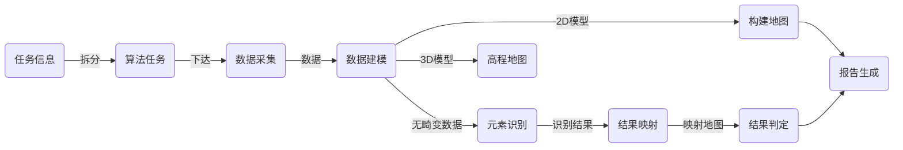

title: Boeye 算法设计说明

speaker:   张逸为

css:

 - css/style.css

plugins:

 - echarts: {theme: infographic}
 - mermaid: {theme: forest}
 - katex

<slide class=" bg-apple aligncenter" >

## Boeye 算法设计说明{.text-landing}

---

---

张逸为

2025.1.16

<slide class="bg-white aligncenter">

:::{.content-left}

### **简介**{.text-landing}

---

Boeye 算法适用于以**可编程控制的 DJI 无人机数据采集系统**为依托，在一块**指定区域内**完成**数据采集、数据处理、数据管理、数据分析**任务，按照用户需求**输出分析结果**的任务体系框架。

用于解决通过无人机数据可以获取、识别、重建出有效目标信息的问题。

:::

:::{.content-right}

:::

<slide class="bg-white aligncenter">

### **输入输出**{.text-landing}

---

:::{.content-left}

#### **系统输入**

---

1. 任务ID

   ---

2. 任务类型列表

   ---

3. 区域范围

   ---

4. 任务时间

:::

:::{.content-right}

#### **系统输出**

---

1. 消息反馈：
   - 任务执行结果报告
   
   - 执行过程中的心跳状态信息（开发中）
   
   ---
2. 数据库：
   - 2D 地图
   
   - 高程地图（开发中）
   
   - 3D 模型
   
   - 任务识别结果

:::

<slide class="bg-apple alignleft">

### 设计理念{.text-subtitle}

---

:::shadowbox

#### 代码复用

---

#### 模块解藕

---

#### 原子结果

---

#### 生产者消费者模式

---

#### 未来扩展  数据库硬盘可扩展, 局域网内分布式计算 

<slide class="bg-white slide-bottom">

### 工作流程

---

<slide class="bg-white">

### 算法模块

| 序号 | 模块           | 模块名称            | SSH Port | 说明                                                         |
| ---- | -------------- | ------------------- | -------- | ------------------------------------------------------------ |
| 0    | 筑基模块       | BaseModules         | —        | 通用仓库： vvdutils, boeye 通用仓库： boeyeutils, 数据库管理模块, 算法 docker 基础镜像, 模块执行者 |
| 1    | 任务管理者     | TaskManager         | 2223     | 接受软件输入，建立 task info 数据条目                        |
| 2    | 任务分配者     | TaskAssigner        | 2224     | 将 task_info 内容拆分为 alg_task_info 条目信息               |
| 3    | 无人机控制者   | DroneController     | 2225     | 从 Alg Task Info 中获取数据条目，创建无人机任务获取数据      |
| 4    | 原始数据归档者 | DataArchiver        | 2225     | 将无人机采集到的数据归档到数据库中                           |
| 5    | 算法任务拆分者 | TaskSpliter         | 2226     | 将算法任务拆分为规模较小的子任务                             |
| 6    | BDM 执行者     | BDMWorker           | 2227     | 运行算法子任务                                               |
| 7    | 2D 地图执行者  | 2DMapBuilder        | 2228     | 运行地图算法                                                 |
| 8    | 模型运行者     | ModelRunner         | 2229     | 执行 AI 识别算法                                             |
| 9    | 结果映射者     | ResultMapper        | 2230     | 将图像AI识别结果映射到世界地图                               |
| 10   | 元素识别者     | ItemRecoginser      | 2231     | 将识别结果映射到具体元素中                                   |
| 11   | 任务进度管理者 | TaskProgressManager | 2232     | 管理任务进度，负责子任务和算法任务之间的数据关，负责填写各个 result 信息 |
| 12   | 报告者         | Reporter            | 2233     | 生成任务报告                                                 |
| 13   | 数据标注者     | DataLabeler         | 2234     | 标注现场数据                                                 |
| 14   | 通信者         | Messenger           | 2235     | 用于软算通信的模块，管理两条消息队列                         |
| 15   | 高程构建者     | AltitudeMaker       | 2236     | 构建高程地图信息                                             |

<slide class="bg-white  alignleft">

#### 模块协作流程

<slide class="bg-white">

### **任务获取**{.text-subtitle} 

 相关模块:  `通信者` `任务管理者`

:::column

#### **系统输入**{.text-subtitle}

- 任务ID

- 任务类型列表

- 区域范围

- 任务时间

---

#### **算法流程**{.text-subtitle}

- 飞行高度
- 任务时间
- 任务类型（面、线）
- UTM zone 分片

:::

| 任务码 | 业务名称  | 业务内容             | 飞行高度 | 模型名称 | 业务编码 | 备注         |
| ------ | --------- | -------------------- | -------- | -------- | -------- | ------------ |
| 1      | pile      | 光伏组件打桩施工统计 | 60       | module   | 144      | 面状航线任务 |
| 2      | carrier   | 光伏组件支架施工统计 | 60       | module   | 152      | 面状航线任务 |
| 3      | module    | 光伏组件施工统计     | 90       | module   | 160      | 面状航线任务 |
| 4      | road      | 道路施工统计         | 90       | road     | 24       | 线状航线任务 |
| 5      | building  | 建筑统计             | 90       | building | 64       | 点状航线任务 |
| 6      | boundary  | 围栏统计             | 90       | boundary | 48       | 线状航线任务 |
| 7      | earthwork | 土方量统计           | 90       |          |          | 面状航线任务 |
| 8      | groove    | 沟槽统计             | 90       | groove   | 128      | 线状航线任务 |
| 9      | model_2D  | 2D  建模             | 90       |          |          | 面状航线任务 |
| 10     | model_3D  | 3D 建模              | 90       |          |          | 面状航线任务 |

<slide class="bg-apple alignleft">

### **任务管理**

 相关模块: `任务分配者` `算法任务拆分者`

#### **任务拆分**

:::column

Task

---

AlgTask

:::

<slide class="bg-apple alignright">

### **任务管理**

 相关模块: `任务分配者` `算法任务拆分者`

#### 航线生成

:::column

1. 面状航线

   

---

2. 线状航线

   

:::

<slide class="bg-apple alignright">

:::{.content-left}

### **数据采集**

 相关模块: `无人机控制者`

---

#### 

---

:::shadowbox

#### 控制无人机执行航线

---

#### 断点续飞

---

#### 数据录入 MinIO 数据库

---

#### 数据下载到本地，原始数据归档

---

#### 建立算法子任务

:::

:::{.content-right}

:::

<slide class="bg-white ">

### **数据建模**{.text-subtitle}

 相关模块: `BDM 执行者`

---

:::{.content-left}

:::shadowbox

##### 特征提取

---

##### 特征匹配

---

##### 去畸变

---

##### sfm

---

##### 生成点云

---

##### 3D 建模

---

##### 2D 建模

---

##### 相关结果文件写入数据库

:::

:::

:::{.content-right}

:::

<slide class="bg-white aligncenter">

### **构建地图**

 相关模块: `2D 地图执行者`

---

:::{.content-left}

:::

:::{.content-right}

#### **算法流程**

:::shadowbox

#### 确定 UTM 分区

---

#### 将 2D 模型划分到 UTM 地图的标准地块

---

#### 构建 0 - 8 级地图

:::

:::

<slide class="bg-white">

### **AI 识别**

 相关模块: `模型运行者`

---

:::{.content-left}

#### 算法流程

:::shadowbox

##### 获取当前任务字符串

---

##### 获取当前子任务图片的去畸变数据

---

##### 根据任务加载识别模型

---

##### 运行模型识别结果

---

##### 将识别结果写入图像数据表

:::

:::

:::{.content-right}

:::

<slide class="bg-white">

### 识别结果映射

 相关模块: `结果映射者`

---

:::{.content-right}

#### 算法流程

:::shadowbox

**加载相机内参**

---

**加载图像识别结果，获取图像拍摄外参**

---

**加载图像深度图**

---

**将像素识别结果转换到世界坐标**

---

**将映射完成的 2D 地图写入数据库**

:::

:::

:::{.content-left}

:::

<slide class="bg-apple alignright">

### **元素判定**

 相关模块: `元素识别者`

---

#### 算法流程

:::shadowbox

加载任务相关2D 地图

---

加载区域内规划信息

---

匹配比对判定元素施工状态

---

将元素施工状态写入数据库

:::

<slide class="bg-black">

:::{.content-left}

### 高程地图 （开发中）

 相关模块: `高程构建者`

---

#### 算法流程

:::shadowbox

#### 获取 3D 模型

---

#### 提取模型点云数据

---

#### 构建高程地图，写入数据库

:::

:::

:::{.content-right}

:::{.content-center}

:::

:::

<slide class="bg-apple ">

:::{.content-right}

### **报告生成**

 相关模块: `报告者`

---

算法流程

:::shadowbox

根据任务信息统计区域内元素数据

---

加载任务区域内地图

---

绘制元素识别结果

---

绘制无人机航线信息

---

报告写入数据库

---

发送任务完成信息给软件端

:::

:::

:::{.content-left}

:::

<slide class="bg-white ">

:::{.content-right}

### **报告生成**

 相关模块: `报告者`

---

算法流程

:::shadowbox

根据任务信息统计区域内元素数据

---

加载任务区域内地图

---

绘制元素识别结果

---

绘制无人机航线信息

---

报告写入数据库

---

发送任务完成信息给软件端

:::

:::

:::{.content-left}

:::

<slide class="bg-blue alignright">

### **结果反馈** （开发中）

 相关模块: `无人机控制者`

---

#### 算法流程

:::shadowbox

#### 获取机场信息

---

#### 获取无人机飞行信息

---

#### 定期发送收集的信息到软件

:::

<slide class="bg-white aligncenter">

:::{.content-left}

### **数据标注** （开发中）

 相关模块: `数据标注者`

---

#### **算法流程**

:::shadowbox

##### 获取子任务 2D 地图、高程地图

---

##### 获取区域内规划组件

---

**获取当前区域建模重建信息**

---

**根据任务类型与高程信息建立真实元素 3D 点云模型**

---

**将模型点云投影到无畸变图像，完成图像标注**

---

**标注微调**

---

**将标注信息写入数据库**

:::

:::

:::{.content-right}

:::

<slide class="bg-black aligncenter">

### **部署方式**

 相关模块: `docker 基础镜像模块`

---

<slide :class="size-80 bg-blue">

### **算法总结**

---

:::column

#### **当前能力**

1. **无人机控制**

2. **规划元素识别**

3. **2D 模型构建
**

4. **2D 地图构建**

5. **3D 模型构建**

6. **项目数据管理**

---

#### **框架拓展**

1. **数据中心硬盘扩展**

2. **分布式计算**

3. **数据同步**

:::

<slide :class="bg-blue">

### **待讨论**

---

1. **2D 地图使用方式**

2. **通信方式**  是否应答（结果信息、状态信息），分布式部署时如何通信 

3. **无人机控制**

4. **数据需求**

5. **3D 模型需求**

6. **boeye 产品使用逻辑**

7. **分布式结果汇总逻辑**
